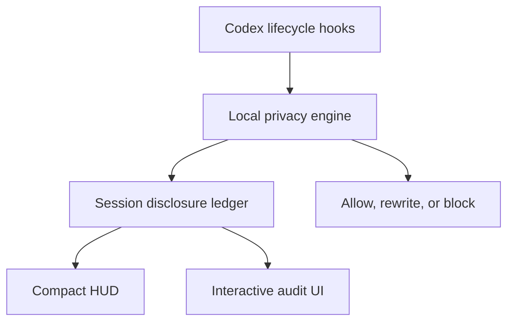

# Codex Privacy HUD — Product Requirements Document

**Status:** Draft v0.1 · **Date:** 2026-09-03 · **Track:** Agentic AI — Making Privacy Native to Personal Agents

**Current contract — #54 Phase 4 and #44 guard-target audit (0.10.0).**

New sessions observed from a genuine SessionStart use evidence-based accounting. Existing sessions and sessions attached after their start retain legacy accounting. Observations, finding outcomes, disclosure identities, and charges are separate. Current hooks do not confirm model-context admission, transmission, or host application of interventions; unresolved evidence withholds the percentage. Historical records remain unchanged. Recipient identity does not establish delivery, inherited subagent content, or causal multi-hop flows. All shell-derived accounting file identities remain unresolved in 0.9.0, including ordinary `cat .env` reads. Observation-local opaque subjects preserve separate events without establishing distinct files or naming the denied file. #43 is addressed for new version-2 sessions only; legacy sessions and historical rows retain their limitations. Version 0.10.0 adds separate guard-target metadata for newly recorded, keyed version-2 local shell read-guard denials. A random session-scoped target ID and fixed rule ID describe the path representation evaluated by Privacy HUD. "Same evaluated target as event #N" means exact equality of that evaluated representation, including existing home collapse; it does not mean the same filesystem object. The matching HMAC map exists only in daemon memory. SessionEnd discards it, and key loss disables new target correlation for that session. Stored IDs, rule metadata and prior links remain. No candidate path, command, basename or suffix is stored. Execution file subjects and accounting counts are unchanged. #44 remains open for filesystem identity and independently recognizable historical filenames.

Runtime selection, writer ownership, read-only readers, daemon policy RPC, and the fenced ledger layout remain required. Accounting activation runs under the daemon's current writer lease and does not change the runtime activation epoch. Generation 5402 requires the activated-accounting implementation introduced in Privacy HUD 0.9.0. A live client must also match the selected runtime build and activation epoch. Snapshot version remains 2; the native HUD does not authenticate runtime alignment.

---

## 1. One-line definition

> **Codex Privacy HUD is a local-first plugin that maintains a live disclosure ledger for every Codex session, minimizes sensitive context before tool execution, and lets users inspect exactly what data reached the model, subagents, MCP tools, or external services.**

*(Product intent, and two clauses of it are not built — do not read this as current behavior. What a subagent inherited is never observed, and a destination is a boundary category rather than a recipient, so "MCP tools" is one destination however many servers are called: `docs/known-limits.md` #19 and #20. The shipped equivalent of this sentence is `README.md`'s, which says "what it observed crossing each boundary".)*

**Tagline:** See what your agent knows. Control where it goes.

**Product shape:** A Codex plugin with a local privacy runtime and a progressive session-audit UI. Not a status bar. Not an after-the-fact compliance dashboard. The HUD is the *entry point*; the product is the **session-level disclosure ledger + upstream enforcement**.

### The core analogy

```text
Token HUD:    How much context has been consumed?
Privacy HUD:  How much sensitive context has been disclosed?
```

---

## 2. Problem

Coding agents now read the filesystem, run shell commands, call MCP servers, and spawn subagents on the user's behalf. Every one of those actions can move sensitive data across a trust boundary — and the user has no visibility into it.

Today a Codex user can answer *"how much of my context window is used?"* but cannot answer any of:

- Which of my files' contents actually entered the model context this session?
- Did that GitHub MCP call carry a customer email in its arguments?
- Did the subagent I spawned inherit the `.env` I read twenty minutes ago?
- Did that `curl` pipe my support log to an external host?

Existing tooling fails in three ways:

1. **Secret scanners are pre-commit, not pre-inference.** They stop secrets reaching a *repo*, not a *model*.
2. **DLP products are server-side and enterprise-gated.** They require shipping the very data you want to protect.
3. **Agent permission prompts are about capability, not content.** "Allow this command?" tells you nothing about *what data it carries*.

The gap: **there is no per-session, content-aware, local record of what an agent disclosed and where.**

---

## 3. Goals and non-goals

### Goals

- **G1 — Visibility.** A truthful, always-available account of what sensitive data crossed which boundary, in this session.
- **G2 — Upstream enforcement.** Intervene *before* execution (block or rewrite), not after.
- **G3 — Local-first.** Detection, ledger, and UI run entirely on the user's machine. No raw data leaves it.
- **G4 — Honest accounting.** Never conflate "a scanner saw an email" with "an email was disclosed." The distinction is the product.
- **G5 — Low friction.** Ambient by default; deep only on demand. Latency budget under 150 ms on the fast path.

### Non-goals

- **Not a compliance/audit-of-record product.** No SOC2 evidence, no tamper-proof logging, no retention guarantees.
- **Not a claim of complete enforcement.** Hosted tools (e.g. WebSearch) bypass local hook paths — see §9.
- **Not a data-recall mechanism.** Once bytes are in model context, they are disclosed. The UI must say so.
- **Not a network proxy or kernel agent.** Enforcement is at the Codex tool boundary only.
- **Not an org policy console.** Single-user scope for v1.

---

## 4. Users

| Persona | Pain | What they use |
|---|---|---|
| **Solo dev on a client codebase** | Agent reads logs/`.env`; unclear what left the machine | Level 1 HUD, `$privacy` before pasting a bug report |
| **Support/ops engineer** | Triages logs full of real customer PII | `Prevented` tab, minimization on outbound MCP/HTTP |
| **Privacy-conscious individual** | Personal agent touches personal files | Level 3 detail; browser `Save mask rule for detected <type>` |
| **Team lead evaluating agents** | Needs an answer to "what does it send?" | Session privacy receipt at `SessionEnd` |

### Primary scenario (historical design narrative)

The scenario below is an unbuilt product target, not an acceptance script for 0.7.8. The HUD now labels legacy scores, current hooks do not prove delivery or host enforcement, and no surface offers `Minimize & retry`.

A support engineer asks Codex to triage `support.log` and file a GitHub issue.

1. Codex reads `support.log` → **12 customer emails enter model context.** The corresponding current HUD example is `Privacy legacy 28%`.
2. Codex prepares a GitHub MCP call whose body contains those emails → **blocked**, exposure detail shown.
3. User picks **Minimize & retry** → PII is replaced by stable pseudonyms; the call succeeds.
4. In 0.9.2, a recognized `curl` command with a visible `.env` reference receives a default-on denial. Accounting records `prevented` evidence with zero additional charge; host enforcement remains unconfirmed.
5. `SessionEnd` emits a privacy receipt: 4 exposures, 2 destinations, 17 prevented.

---

## 5. The disclosure model (the intellectual core)

Most "privacy for AI" tooling alarms on *detection*. Detection is cheap and misleading. Privacy HUD accounts for **disclosure**: a sensitive value crossing a trust boundary.

### 5.1 Event taxonomy

| Event | Classification | Counts toward disclosure budget |
|---|---|---|
| Codex discovers a sensitive file path locally | `local_access` | No |
| Local scanner detects an email in a file | `detected` (representable; no production writer) | No |
| File content enters model context | `exposed` | **Yes** |
| Data is passed to a subagent | `exposed` (new destination) | **Yes** (destination delta) |
| Arguments sent to an MCP tool | `exposed` | **Yes** |
| Shell command sends data to an external host | `exposed` | **Yes** |
| Content redacted/minimized before send | `prevented` | No |
| Call blocked before execution | `prevented` | No |
| Sensitive content read by a local tool only | `local_access` | No (tracked, not billed) |
| Session transcript persisted to disk | `retention` (representable; no production writer) | Transcript retention is outside this ledger's account |

### 5.2 Trust boundaries

```text
B0  local filesystem / process        (no disclosure)
B1  model context                     (disclosure — leaves the machine)
B2  subagent context                  (disclosure — new destination, data propagation)
B3  MCP tool / external service       (disclosure — third party)
B4  arbitrary network egress (shell)  (disclosure — unbounded third party)
```

The audit presents finding-event rows with explicit outcome evidence. Version-2 accounting separates observations, subjects, intended recipients and confirmed disclosures. A repeated subject across observations does not establish causal transfer between them. Aggregated causal multi-hop chains are withdrawn from the current requirements; no flow writer or cross-observation history view is shipped. Legacy rows retain their historical classifications and limitations.

### 5.3 Disclosure budget formula

`legacy_percent = min(100, round(100 × legacy_score / legacy_cap))`

This section records the legacy arithmetic and its original design rationale. Phase 1 preserves the stored score and cap; the result is not a confirmed-disclosure percentage. Dedupe can collapse outcomes, and boundary categories are not concrete recipients (limits 17–20).

```text
score = Σ_over_exposures  severity(data_type) × volume(n) × destination_multiplier(boundary)

severity:      credential/API key 50 · financial/health 12 · direct PII (email, phone,
               name, address, SSN) 6 · quasi-identifier (hostname, path, IP, repo) 2
volume(n):     1 + ln(n)      # n = distinct values of that type from that source
destination:   model_context 1.0 · subagent 0.3 · mcp_tool 1.5 · external_network 2.0
budget_cap:    120 points (policy-configurable)
```

**Invariants (must hold, and are tested):**

- Prevented events contribute **zero**.
- The budget is monotonic within a session — it never decreases, because disclosure is irreversible.
- Re-disclosing the *same* value to the *same* destination does not double-count; a *new destination* does.
- A single leaked credential alone must never read as safe: reaching model context it lands in amber (50 × 1.0 / 120 = 42%); reaching an external host it lands in red (50 × 2.0 / 120 = 83%).

**Bands:** 0–33 green · 34–66 amber · 67–100 red.

---

## 6. UX — three levels

### Level 1 — Ambient HUD

```text
Privacy legacy 28% · 2 prevented rows
```

The current HUD is bar-free and labels the legacy score and prevented-row count. Unknown accounting is unavailable, never zero. Python uses the complete width candidates in `design.md` §4; Rust supplies the full line for Codex to lay out.

Intervention messages say that the plugin issued a denial or returned rewritten input. They do not confirm host application.

### Level 2 — Session Audit (`$privacy`)

```text
Privacy Audit
Session session_123

28%  legacy permitted-crossing score
4    legacy permitted-crossing rows
2    legacy boundary kinds
17   legacy prevented rows

Historical accounting includes permitted crossings and may collapse different outcomes. It does not establish confirmed disclosure.

Legacy permitted crossings 4 · Legacy prevented rows 17 · All legacy events 24
```

The legacy wire keys are `legacy_percent`, `legacy_permitted_crossing_rows`, `legacy_boundary_kinds`, and `legacy_prevented_rows`. API tab arguments remain `Exposed`, `Prevented`, and `All events`. Unrecorded summaries return `percent=null` and no numeric score or counts.

### Level 3 — Exposure Detail

A detail view shows one public legacy row, its recorded source/destination association, masked exemplar, timestamps, legacy intervention, and legacy contribution. Its accounting note does not establish delivery or host enforcement.

The terminal detail view does not save policy rules. The local audit browser has buttons that POST to `/api/policy`; the MCP `privacy.update_policy` tool is a separate policy-writing surface. Report a rule as saved only after that surface returns success, and include its returned conditions. Host application of a later denial or rewritten input is not confirmed.

Mask scope is session-wide by detected data type, without a source restriction. If a matching mask rule selects an otherwise eligible outbound call, the rewriter receives all findings from that call, including findings of other types; it does not restrict rewriting to the selected type. An origin-rule denial takes precedence, and a mask rule does not weaken the built-in handling of hard-blocked types. Saving a rule does not confirm detection on a later call or host application of rewritten input. Already disclosed data cannot be recalled from this session.

`Already disclosed data cannot be recalled from this session.` remains required copy.

---

## 7. Architecture



### 7.1 Plugin package

```text
codex-privacy-hud/
├── .codex-plugin/
│   └── plugin.json          # name, version, description, skills, hooks, mcpServers
├── hooks/
│   ├── hooks.json           # event → command matchers
│   └── handler.py           # single entrypoint, dispatches on hook_event_name
├── skills/
│   └── privacy/SKILL.md     # the $privacy skill
├── engine/                  # detection, policy, rewrite
├── ledger/                  # SQLite store + budget math
├── mcp/                     # local MCP server (privacy.* tools)
├── ui/                      # local audit web UI (served on 127.0.0.1)
└── hud/                     # optional terminal companion renderer
```

Codex sets `PLUGIN_ROOT` and `PLUGIN_DATA` for plugin-bundled hooks; the ledger lives under `PLUGIN_DATA`.

### 7.2 Hook mapping

| Codex event | Privacy HUD behavior |
|---|---|
| `SessionStart` | Create or resume session ledger; load policy |
| `UserPromptSubmit` | Scan prompt before submission; record `exposed → model_context` |
| `PreToolUse` | Inspect Bash / `apply_patch` / MCP / local function-tool args; allow, rewrite, or deny |
| `PermissionRequest` | Contribute privacy verdict to the approval decision |
| `PostToolUse` | Record actual result; classify tool output entering context |
| `SubagentStart` / `SubagentStop` | Track propagation to subagent destination |
| `PreCompact` | No compaction timeline event is written; the stored ledger remains. `PostCompact` is not registered. |
| `SessionEnd` | End the session and return a text receipt in hook `systemMessage`; no Markdown receipt file is saved |

Verified hook payload fields (stdin JSON): `session_id`, `transcript_path`, `cwd`, `hook_event_name`, `model`, `permission_mode`, plus `turn_id`, `prompt`, `tool_name`, `tool_use_id`, `tool_input`, `tool_response`, `agent_id`, `agent_type` depending on the event.

### 7.3 Local privacy engine

The shipped detector stack is `PathDetector`, `SecretDetector` and `ModelDetector`. Paths and credentials use cheap local checks. Shell destination classification is a separate heuristic step. Presidio and a separate contextual entity-resolution stage are not shipped.

`ModelDetector` uses `openai/privacy-filter` through `transformers`. Installing its dependencies and weights is optional, but detection is reduced without them: the model-owned categories, including names, addresses and email addresses, are unavailable. Runtime loads only local weights and never downloads replacements.

Cheap detectors scan the observation text. Deep scanning applies to non-local destinations, including outbound B3/B4 calls, without requiring a cheap-detector hit or a PII-shaped prefilter. Payloads above 8192 characters skip the deep scan entirely. An applicable deep scan that supplies no accepted result records a scan gap; that is not a clean scan.

Outbound deep scanning uses the admission and deadline rules in `architecture.md` §4. Those rules do not guarantee wall-clock completion. The hook client separately applies its shared request deadline: unchecked ingress receives an unverified warning, and unchecked outbound calls receive a denial. These are plugin responses, not confirmation of host enforcement.

### 7.4 Session disclosure ledger

Metadata only. Never stores prompts, file contents, secrets, or raw PII.

```json
{
  "session_id": "session_123",
  "source": "support.log",
  "data_types": ["email"],
  "destination": "model_context",
  "count": 12,
  "status": "exposed",
  "timestamp": "12:41:08"
}
```

Detail views show a **masked exemplar** (`jo•••@acme.com`) derived at detection time and stored pre-masked — the raw value is never written to disk. Value identity for dedupe uses a per-session salted hash, discarded at `SessionEnd`.

Storage: SQLite at `$PLUGIN_DATA/ledger.db`. Tables: `sessions`, `events`, `flows`, `policy`, `policy_tokens`.

### 7.5 MCP server (local)

```text
privacy.get_session_summary
privacy.list_exposures
privacy.get_exposure_detail
privacy.read_guard_status
privacy.update_policy
```

`privacy.allow_once`, `privacy.read_guard_set` and `privacy.hud_toggle` are
deliberately not exposed here: an MCP tool is called by the model, and none
of the three may loosen what the plugin enforces. `privacy.update_policy` is
exposed although it writes, because no rule it can write reaches the plugin's
one unconditional deny: `Engine.observe` skips user `mask` rules altogether on
an observation carrying a hard-blocked data type, whatever the rule's selector
says, and decides it by the matrix default instead. That is a property of the
engine, not a restriction on the tool's arguments — a mask rule with a
perfectly ordinary selector can still land on a call that also carries a
credential, which is why refusing selectors at the mint site was never enough.
`mcp_tools.apply_policy` does still refuse a `mask` rule whose selector is
itself a hard-blocked type, which is now an honesty matter (the rule would be
inert) rather than an enforcement one; see `architecture.md` §9. See
`CLAUDE.md` §5 for the
rule that every user-facing action claim must trace to the surface that
performs it, and `architecture.md` §9 for the full tool list and withheld
set.

### 7.6 Consent flow — historical proposal, not shipped

The proposed deny → review → consent token → retry workflow is not available in the shipped product. Neither the audit browser, the `$privacy` skill nor the exposed MCP tools offer `Allow once`, `Minimize & retry`, a minimization preview or a consent-driven retry.

Internal token primitives exist: `mcp_tools.allow_once` can mint a token, and `Engine.observe` can consume one. These functions do not establish a reachable consent workflow. No shipped user-facing surface issues the token, and a saved origin-rule denial is evaluated before the token-consumption branch.

The available actions are those in the Level 3 policy section: the browser and `privacy.update_policy` can save conditional policy rules. They do not authorize a blocked call once, replay it or establish that the host applied a later denial or rewrite. `$privacy` opens the session audit; it does not deep-link a denial to an event.

Already disclosed data cannot be recalled from this session.

### 7.7 What minimization rewrites

Minimization operates on detected spans in the tool arguments supplied to the hook. It can return rewritten command text or structured MCP arguments. It does not open files referenced by shell commands, rewrite an upload through a helper executable, or offer a preview-and-retry action.

For example, a detected email in an MCP argument can be replaced with a session-stable pseudonym when the engine selects a rewrite. The returned `updatedInput` is not evidence that the host applied it or that the recipient received it. See `architecture.md` §8.

---

UserPromptSubmit credential confirmation is a separate shipped path in 0.9.1: a supported credential format can hold the prompt, and a later eligible resubmission allows it. It does not issue a tool-consent token, rewrite a prompt, or establish model-context admission. See docs/known-limits.md, limit 22.

## 8. Where the UI actually lives

The native Privacy status item is supplied by a separately patched Codex build. Stock Codex does not gain a plugin-owned status item merely by installing this plugin.

On supported macOS installations, `install.sh` downloads a matching patched build, creates a forwarder, adjusts PATH when needed and adds `privacy` to the Codex status-line configuration. It does not modify the official Codex binary. The forwarder selects a matching installed patched build and otherwise runs the official binary. Matching Codex version numbers alone do not establish snapshot-reader compatibility; the installation notes describe that separate requirement.

| Level | Shipped delivery |
|---|---|
| L1 ambient HUD | Privacy item in a compatible patched Codex; a separate terminal companion pane is the fallback |
| Hook notices | Hook output returned to the host; delivery or display is not confirmed by the plugin |
| L2 session audit | `$privacy` invokes the installed bundle's runtime launcher to print an ASCII audit and start a local browser UI |
| L3 event detail | Browser row selection, or the existing detail launcher with separate session and event IDs |

The browser binds to `127.0.0.1` on an OS-assigned port. The skill's audit path does not call the MCP server. The exposed MCP tools are a separate interface to the underlying audit and policy operations.

The native status item displays accounting snapshots; it does not verify runtime alignment. No delivery surface establishes complete monitoring, confirmed disclosure or host enforcement.

---

## 9. Platform limitations (state these in the demo)

1. **Hosted tools bypass hooks.** WebSearch and similar hosted tools do not trigger local function-tool hook paths. Privacy HUD is a practical guardrail, not a mathematically complete enforcement boundary.
2. **No interactive tool-call consent surface.** The proposed consent workflow is not shipped. Internal token primitives exist, but no browser button, `$privacy` branch or exposed MCP tool issues consent tokens (§7.6).
3. **Stock Codex has no plugin-owned Privacy status item.** The native item requires a compatible separately patched build; the companion pane is the fallback (§8).
4. **Model-context accounting is inferential for file reads.** A tool result does not establish admission into model context. Phase 1 retains the legacy charge and labels it; evidence-based accounting is not activated.
5. **Prompt-injection resistance is out of scope.** A hostile repo could try to talk the agent out of using the tool; the hook layer is not bypassable by the model, which is precisely why enforcement lives there.

---

## 10. Privacy of the privacy tool

Non-negotiable properties, and the first thing a judge will ask:

- Detection runs **locally**; no content is sent anywhere for classification.
- The ledger is **metadata-only** — types, counts, sources, destinations, timestamps, masked exemplars.
- No telemetry or analytics. Plugin runtime makes no outbound network requests, regardless of inherited environment values.
- A session's salt is discarded at `SessionEnd`, and its stored value hashes are nulled then.
- Ledger DB is `0600`, under `PLUGIN_DATA`.
- The tool must survive its own audit, on stated inputs: the committed self-audit corpus's clean half produces zero findings and its planted half is found (`docs/self-audit.md`). **This is an acceptance requirement, not a description of current behaviour** — four entries fail it today and are recorded as such. *(The unconditional "running Privacy HUD on Privacy HUD produces zero exposures" was measured false — 88%, 100% and 100% of budget on three read-only source reviews.)*

---

## 11. Scope

### Must (one-day MVP)

- [ ] Codex plugin package (`plugin.json`, bundled `hooks/hooks.json`)
- [ ] Hooks: `SessionStart`, `UserPromptSubmit`, `PreToolUse`, `PostToolUse`, `SubagentStart/Stop`, `SessionEnd`
- [ ] Fast path: secret regex + entropy, sensitive path rules, shell destination parser
- [x] Local detector stack: path and credential checks, with `openai/privacy-filter` as the optional installed deep detector; missing dependencies or weights leave deep detection unavailable.
- [ ] Metadata-only SQLite ledger + budget math with the §5.3 invariants tested
- [ ] `$privacy` skill
- [ ] Local interactive audit UI: `Exposed / Prevented / All events` + exposure detail
- [ ] Historical action target: masking, one-shot consent, and origin rules. Current browser/MCP writers save conditional `mask`, `block_path`, or `block_command` rules; terminal labels do not write, and no surface offers `Allow once`.
- [ ] One real MCP outbound minimization demo, end to end

### Should

- [ ] Terminal companion HUD renderer
- [ ] Session privacy receipt at `SessionEnd`
- [ ] Cross-session privacy preferences

### Won't (v1)

- Presidio integration, org policy presets, App Server native client, multi-user/team sync

### Historical build order

The original build sequence is historical, not an implementation plan for the current release:

1. Legacy ledger and budget functions.
2. Cheap detectors and the local `openai/privacy-filter` detector.
3. Hook client, plugin packaging and daemon integration.
4. Session audit and conditional policy-writing surfaces.
5. Tool-argument rewriting and internal token primitives. No interactive consent workflow was delivered.
6. Patched-Codex status item, companion pane and text receipt.

Accounting activation is governed by the current contract at the top of this document.

---

## 12. Success criteria

**Historical demo targets (not achieved or claimed by Phase 1):**

1. A controlled legacy fixture can move the HUD from `Privacy legacy 0%` to `Privacy legacy 28%`; the recorded association `support.log → model_context` does not prove admission into model context.
2. GitHub MCP call carrying PII is blocked; audit UI explains why; `Minimize & retry` makes it succeed with pseudonymized values.
3. 0.9.2 acceptance: `curl -d "$(cat .env)"` and the supported visible-path network forms receive a denial by default, independently of the local read guard. Matched path rules land in `Prevented` with zero additional charge. Shell-derived file identities remain unresolved, and current hooks do not confirm host enforcement. An unavailable percentage must not be rendered as 0%.
4. `$privacy` shows all three tabs with real data from a real session.
5. Judge asks "where does my data go?" → answer is "nowhere; here is the metadata-only ledger."

**Historical quality targets, not current measurements or guarantees:** fast path < 15 ms p50, < 150 ms p99 including deep scan · zero false blocks in the demo path · ledger survives `PreCompact`. Current scan scheduling and deadline limits are described in `architecture.md` §§4 and 10.

---

## 13. Open questions

1. **Language decision:** Python with a persistent daemon and a stdlib-only hook client. The shipped deep detector is local `openai/privacy-filter` through `transformers`; Presidio is not part of the runtime.
2. **Audit UI stack:** static HTML + vanilla JS served from a tiny local server (fast, zero build) vs a bundled framework. Recommendation: **static + vanilla**, matching the terminal aesthetic of the mockup.
3. **Ambient delivery decision:** both the patched-Codex status item and the separate companion renderer ship. The latter is the fallback when a compatible patched build is unavailable.
4. **Budget cap default (120)** — needs a calibration pass against a real session so a normal working session doesn't hit 100% in ten minutes.

---

## 14. Pitch

> Codex can tell you how much context it has consumed, but not *what sensitive context* it has consumed.
>
> Privacy HUD gives every Codex session a live disclosure budget. It tracks what sensitive data entered the model, subagents, and external tools, minimizes risky requests before execution, and gives users an inspectable privacy audit without storing their raw data.

---

## References

- Codex Hooks — https://learn.chatgpt.com/docs/hooks
- Build plugins — https://learn.chatgpt.com/docs/build-plugins
- Plugins overview — https://learn.chatgpt.com/docs/plugins
- Codex configuration reference (`tui.status_line`) — https://learn.chatgpt.com/docs/config-file/config-reference
- Codex App Server — https://learn.chatgpt.com/docs/app-server
- MCP Apps inline UI not rendered in Codex Desktop — https://github.com/openai/codex/issues/21019
- Prior art: token HUD for Claude Code — https://github.com/jarrodwatts/claude-hud
