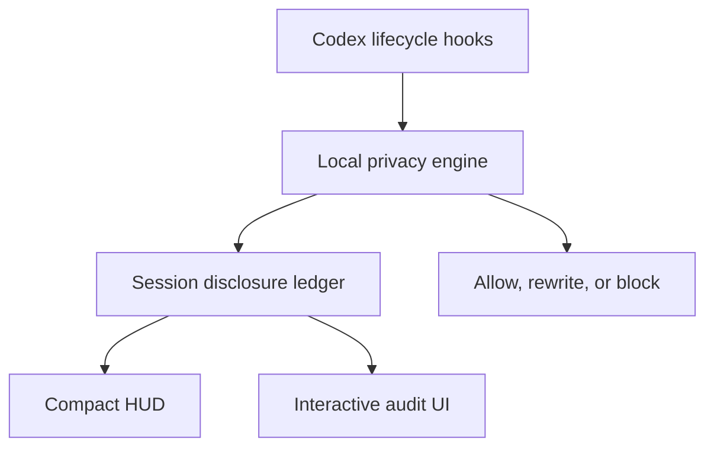

# Codex Privacy HUD — Product Requirements Document

**Status:** Draft v0.1 · **Date:** 2026-09-03 · **Track:** Agentic AI — Making Privacy Native to Personal Agents

---

## 1. One-line definition

> **Codex Privacy HUD is a local-first plugin that maintains a live disclosure ledger for every Codex session, minimizes sensitive context before tool execution, and lets users inspect exactly what data reached the model, subagents, MCP tools, or external services.**

**Tagline:** See what your agent knows. Control where it goes.

**Product shape:** A Codex plugin with a local privacy runtime and a progressive session-audit UI. Not a status bar. Not an after-the-fact compliance dashboard. The HUD is the *entry point*; the product is the **session-level disclosure ledger + upstream enforcement**.

### The core analogy

```text
Token HUD:    How much context has been consumed?
Privacy HUD:  How much sensitive context has been disclosed?
```

---

## 2. Problem

Coding agents now read the filesystem, run shell commands, call MCP servers, and spawn subagents on the user's behalf. Every one of those actions can move sensitive data across a trust boundary — and the user has no visibility into it.

Today a Codex user can answer *"how much of my context window is used?"* but cannot answer any of:

- Which of my files' contents actually entered the model context this session?
- Did that GitHub MCP call carry a customer email in its arguments?
- Did the subagent I spawned inherit the `.env` I read twenty minutes ago?
- Did that `curl` pipe my support log to an external host?

Existing tooling fails in three ways:

1. **Secret scanners are pre-commit, not pre-inference.** They stop secrets reaching a *repo*, not a *model*.
2. **DLP products are server-side and enterprise-gated.** They require shipping the very data you want to protect.
3. **Agent permission prompts are about capability, not content.** "Allow this command?" tells you nothing about *what data it carries*.

The gap: **there is no per-session, content-aware, local record of what an agent disclosed and where.**

---

## 3. Goals and non-goals

### Goals

- **G1 — Visibility.** A truthful, always-available account of what sensitive data crossed which boundary, in this session.
- **G2 — Upstream enforcement.** Intervene *before* execution (block or rewrite), not after.
- **G3 — Local-first.** Detection, ledger, and UI run entirely on the user's machine. No raw data leaves it.
- **G4 — Honest accounting.** Never conflate "a scanner saw an email" with "an email was disclosed." The distinction is the product.
- **G5 — Low friction.** Ambient by default; deep only on demand. Latency budget under 150 ms on the fast path.

### Non-goals

- **Not a compliance/audit-of-record product.** No SOC2 evidence, no tamper-proof logging, no retention guarantees.
- **Not a claim of complete enforcement.** Hosted tools (e.g. WebSearch) bypass local hook paths — see §9.
- **Not a data-recall mechanism.** Once bytes are in model context, they are disclosed. The UI must say so.
- **Not a network proxy or kernel agent.** Enforcement is at the Codex tool boundary only.
- **Not an org policy console.** Single-user scope for v1.

---

## 4. Users

| Persona | Pain | What they use |
|---|---|---|
| **Solo dev on a client codebase** | Agent reads logs/`.env`; unclear what left the machine | Level 1 HUD, `$privacy` before pasting a bug report |
| **Support/ops engineer** | Triages logs full of real customer PII | `Prevented` tab, minimization on outbound MCP/HTTP |
| **Privacy-conscious individual** | Personal agent touches personal files | Level 3 detail, `Block this source` |
| **Team lead evaluating agents** | Needs an answer to "what does it send?" | Session privacy receipt at `SessionEnd` |

### Primary scenario (demo narrative)

A support engineer asks Codex to triage `support.log` and file a GitHub issue.

1. Codex reads `support.log` → **12 customer emails enter model context.** HUD moves to 28%.
2. Codex prepares a GitHub MCP call whose body contains those emails → **blocked**, exposure detail shown.
3. User picks **Minimize & retry** → PII is replaced by stable pseudonyms; the call succeeds.
4. Codex attempts `curl` of `.env` to an external endpoint → **blocked**, logged as `Prevented`.
5. `SessionEnd` emits a privacy receipt: 4 exposures, 2 destinations, 17 prevented.

---

## 5. The disclosure model (the intellectual core)

Most "privacy for AI" tooling alarms on *detection*. Detection is cheap and misleading. Privacy HUD accounts for **disclosure**: a sensitive value crossing a trust boundary.

### 5.1 Event taxonomy

| Event | Classification | Counts toward disclosure budget |
|---|---|---|
| Codex discovers a sensitive file path locally | `local_access` | No |
| Local scanner detects an email in a file | `detected` | No |
| File content enters model context | `exposed` | **Yes** |
| Data is passed to a subagent | `exposed` (new destination) | **Yes** (destination delta) |
| Arguments sent to an MCP tool | `exposed` | **Yes** |
| Shell command sends data to an external host | `exposed` | **Yes** |
| Content redacted/minimized before send | `prevented` | No |
| Call blocked before execution | `prevented` | No |
| Sensitive content read by a local tool only | `local_access` | No (tracked, not billed) |
| Session transcript persisted to disk | `retention` | Tracked separately |

### 5.2 Trust boundaries

```text
B0  local filesystem / process        (no disclosure)
B1  model context                     (disclosure — leaves the machine)
B2  subagent context                  (disclosure — new destination, data propagation)
B3  MCP tool / external service       (disclosure — third party)
B4  arbitrary network egress (shell)  (disclosure — unbounded third party)
```

A single sensitive value can generate multiple disclosure events, one per boundary crossed. The audit UI therefore renders **flows**, not findings:

```text
support.log → main agent → github MCP
```

### 5.3 Disclosure budget formula

`disclosure% = min(100, round(100 × score / budget_cap))`

```text
score = Σ_over_exposures  severity(data_type) × volume(n) × destination_multiplier(boundary)

severity:      credential/API key 50 · financial/health 12 · direct PII (email, phone,
               name, address, SSN) 6 · quasi-identifier (hostname, path, IP, repo) 2
volume(n):     1 + ln(n)      # n = distinct values of that type from that source
destination:   model_context 1.0 · subagent 0.3 · mcp_tool 1.5 · external_network 2.0
budget_cap:    120 points (policy-configurable)
```

**Invariants (must hold, and are tested):**

- Prevented events contribute **zero**.
- The budget is monotonic within a session — it never decreases, because disclosure is irreversible.
- Re-disclosing the *same* value to the *same* destination does not double-count; a *new destination* does.
- A single leaked credential alone must never read as safe: reaching model context it lands in amber (50 × 1.0 / 120 = 42%); reaching an external host it lands in red (50 × 2.0 / 120 = 83%).

**Bands:** 0–33 green · 34–66 amber · 67–100 red.

---

## 6. UX — three levels

### Level 1 — Ambient HUD

```text
PRIVACY  Disclosure ███░░░░░░░ 28%  ›
```

Environmental awareness only; never interrupts. `28%` = consumed budget, excluding anything successfully prevented.

Real-time interruption happens only via hook `systemMessage` when a call is blocked.

### Level 2 — Session Audit (`$privacy`)

```text
Privacy Audit
Current session · 41 min

  28%          4              2               17
  disclosure   exposed items  destinations    prevented

[Exposed 4]  Prevented 17   All events 24

SENSITIVE DATA        SOURCE          DESTINATION      STATUS
Customer email ×12    support.log     model context    EXPOSED
Full name ×1          user prompt     model context    EXPOSED
Repository path ×4    tool input      GitHub MCP       EXPOSED
Internal hostname ×3  terminal output model context    MASKED
```

Tabs: **Exposed** (crossed a boundary) · **Prevented** (blocked/redacted/minimized) · **All events** (full timeline).

### Level 3 — Exposure Detail

```text
Customer email ×12
support.log → model context

First seen   12:41:08
Protection   none
Example      jo•••@acme.com

[ Protect future occurrences ]
[ Block this source ]

Already disclosed data cannot be recalled from this session.
```

Actions write policy, they do not rewrite history. The irreversibility notice is **required copy**, not decoration.

---

## 7. Architecture



### 7.1 Plugin package

```text
codex-privacy-hud/
├── .codex-plugin/
│   └── plugin.json          # name, version, description, skills, hooks, mcpServers
├── hooks/
│   ├── hooks.json           # event → command matchers
│   └── handler.py           # single entrypoint, dispatches on hook_event_name
├── skills/
│   └── privacy/SKILL.md     # the $privacy skill
├── engine/                  # detection, policy, rewrite
├── ledger/                  # SQLite store + budget math
├── mcp/                     # local MCP server (privacy.* tools)
├── ui/                      # local audit web UI (served on 127.0.0.1)
└── hud/                     # optional terminal companion renderer
```

Codex sets `PLUGIN_ROOT` and `PLUGIN_DATA` for plugin-bundled hooks; the ledger lives under `PLUGIN_DATA`.

### 7.2 Hook mapping

| Codex event | Privacy HUD behavior |
|---|---|
| `SessionStart` | Create or resume session ledger; load policy |
| `UserPromptSubmit` | Scan prompt before submission; record `exposed → model_context` |
| `PreToolUse` | Inspect Bash / `apply_patch` / MCP / local function-tool args; allow, rewrite, or deny |
| `PermissionRequest` | Contribute privacy verdict to the approval decision |
| `PostToolUse` | Record actual result; classify tool output entering context |
| `SubagentStart` / `SubagentStop` | Track propagation to subagent destination |
| `PreCompact` / `PostCompact` | Ledger survives compaction — it is not derived from the transcript |
| `SessionEnd` | Emit session privacy receipt |

Verified hook payload fields (stdin JSON): `session_id`, `transcript_path`, `cwd`, `hook_event_name`, `model`, `permission_mode`, plus `turn_id`, `prompt`, `tool_name`, `tool_use_id`, `tool_input`, `tool_response`, `agent_id`, `agent_type` depending on the event.

### 7.3 Local privacy engine (two-tier, for latency)

```text
Fast path  (<15 ms, always)
├─ sensitive file path patterns  (.env, *.pem, id_rsa, credentials.json, ~/.aws)
├─ secret / API-key regex + entropy check
├─ shell command parser → destination extraction (curl/wget/scp/ssh/nc/git remote)
└─ MCP destination policy lookup

Deep scan  (only on fast-path hit or ambiguity)
├─ Microsoft Presidio PII detection
├─ contextual entity resolution
└─ optional privacy-filter model
```

Fail-open vs fail-closed: the engine **fails open with a `systemMessage`** on timeout for reads, and **fails closed** for outbound egress (B3/B4). A privacy tool that hangs the agent gets uninstalled; a privacy tool that silently leaks is worse.

### 7.4 Session disclosure ledger

Metadata only. Never stores prompts, file contents, secrets, or raw PII.

```json
{
  "session_id": "session_123",
  "source": "support.log",
  "data_types": ["email"],
  "destination": "model_context",
  "count": 12,
  "status": "exposed",
  "timestamp": "12:41:08"
}
```

Detail views show a **masked exemplar** (`jo•••@acme.com`) derived at detection time and stored pre-masked — the raw value is never written to disk. Value identity for dedupe uses a per-session salted hash, discarded at `SessionEnd`.

Storage: SQLite at `$PLUGIN_DATA/ledger.db`. Tables: `sessions`, `events`, `flows`, `policy`, `policy_tokens`.

### 7.5 MCP server (local)

```text
privacy.get_session_summary
privacy.list_exposures
privacy.get_exposure_detail
privacy.update_policy
privacy.allow_once
privacy.start_clean_session
```

### 7.6 The `ask` workaround

Codex `PreToolUse` supports `deny`, `allow`, and `allow + updatedInput` — but **not** `permissionDecision: "ask"`. So an interactive three-button prompt cannot come from a single hook response. The flow becomes:

1. Risky call is **denied** by the hook, with a `permissionDecisionReason` pointing at the audit UI.
2. UI shows the exposure detail.
3. User chooses `Allow once` or `Minimize & retry`.
4. `privacy.allow_once` writes a **single-use policy token** (scoped to tool + argument hash, TTL 120 s).
5. Codex retries; the hook consumes the token and allows or rewrites.

### 7.7 Minimization example

Original:

```bash
curl sentry.example.com -d "$(cat support.log)"
```

Rewritten via `updatedInput`:

```bash
privacy-minimize support.log | curl sentry.example.com -d @-
```

Pseudonymization is **stable within a session** (`jo•••@acme.com` → `user_7f3a@example.invalid` consistently), so the agent's reasoning survives minimization.

---

## 8. Where the UI actually lives

Verified constraints force this decision:

- `tui.status_line` accepts an **ordered list of built-in status-item identifiers** (default `["spinner", "project"]`); arbitrary scripts/custom items are **not** documented as supported. Unlike Claude Code's statusline, we cannot inject a custom footer segment today.
- Codex Desktop does **not currently render MCP Apps inline iframe UI resources** ([openai/codex#21019](https://github.com/openai/codex/issues/21019)), so an MCP-returned HTML widget is not a reliable delivery surface.

**Therefore:**

| Level | Delivery in v1 | Future |
|---|---|---|
| L1 ambient HUD | Optional terminal companion renderer (separate pane/process) | Native footer item if Codex opens custom status items |
| L1 alerts | Hook `systemMessage` — native, always works | — |
| L2/L3 audit UI | `$privacy` skill → MCP tool → **local web UI on `127.0.0.1`**, plus an ASCII fallback rendered in-terminal | MCP Apps UI when Codex renders it; App Server client for a fully native always-on HUD |

**Pitch honesty rule:** do not claim the plugin injects a native Codex footer. Claim: hooks + policy + ledger + audit UI, with the ambient HUD as an optional companion.

---

## 9. Platform limitations (state these in the demo)

1. **Hosted tools bypass hooks.** WebSearch and similar hosted tools do not trigger local function-tool hook paths. Privacy HUD is a practical guardrail, not a mathematically complete enforcement boundary.
2. **No `ask` decision.** Interactive consent requires the deny → token → retry dance (§7.6).
3. **No custom status item.** See §8.
4. **Model-context accounting is inferential for file reads.** We know a tool returned content and that content entered context; we attribute exposure at that point.
5. **Prompt-injection resistance is out of scope.** A hostile repo could try to talk the agent out of using the tool; the hook layer is not bypassable by the model, which is precisely why enforcement lives there.

---

## 10. Privacy of the privacy tool

Non-negotiable properties, and the first thing a judge will ask:

- Detection runs **locally**; no content is sent anywhere for classification.
- The ledger is **metadata-only** — types, counts, sources, destinations, timestamps, masked exemplars.
- No telemetry, no analytics, no network calls from the plugin itself except to `127.0.0.1`.
- `privacy.start_clean_session` wipes session-scoped state and salt.
- Ledger DB is `0600`, under `PLUGIN_DATA`.
- The tool must survive its own audit: running Privacy HUD on Privacy HUD produces zero exposures.

---

## 11. Scope

### Must (one-day MVP)

- [ ] Codex plugin package (`plugin.json`, bundled `hooks/hooks.json`)
- [ ] Hooks: `SessionStart`, `UserPromptSubmit`, `PreToolUse`, `PostToolUse`, `SubagentStart/Stop`, `SessionEnd`
- [ ] Fast path: secret regex + entropy, sensitive path rules, shell destination parser
- [ ] Deep scan: Presidio PII detection
- [ ] Metadata-only SQLite ledger + budget math with the §5.3 invariants tested
- [ ] `$privacy` skill
- [ ] Local interactive audit UI: `Exposed / Prevented / All events` + exposure detail
- [ ] Actions: `Block this source`, `Protect future occurrences`, `Allow once`
- [ ] One real MCP outbound minimization demo, end to end

### Should

- [ ] Terminal companion HUD renderer
- [ ] Session privacy receipt at `SessionEnd`
- [ ] Cross-session privacy preferences

### Won't (v1)

- Hugging Face `privacy-filter` model, org policy presets, App Server native client, multi-user/team sync

### Build order

1. Ledger + budget math (pure, testable, no Codex needed)
2. Detection engine (fast path first, Presidio behind an interface)
3. Hook handler + plugin package — verify against a real Codex session early
4. `$privacy` skill + audit UI
5. Minimization/rewrite path + `allow_once` token loop
6. Companion HUD, receipt, polish

Risk note: step 3 is the only step with unknown platform behavior. Do it **third, not last** — a smoke test of one hook firing end-to-end should happen within the first two hours.

---

## 12. Success criteria

**Demo (must all work live):**

1. HUD shows 0% → reads `support.log` → jumps to 28% with a visible flow `support.log → model agent`.
2. GitHub MCP call carrying PII is blocked; audit UI explains why; `Minimize & retry` makes it succeed with pseudonymized values.
3. `.env` exfil via `curl` is blocked and lands in `Prevented`, contributing **0%** to the budget.
4. `$privacy` shows all three tabs with real data from a real session.
5. Judge asks "where does my data go?" → answer is "nowhere; here is the metadata-only ledger."

**Quality bars:** fast path < 15 ms p50, < 150 ms p99 including deep scan · zero false blocks in the demo path · ledger survives `PreCompact`.

---

## 13. Open questions

1. **Language:** Python (Presidio is native, hook startup cost ~200 ms) vs TypeScript (fast startup, Presidio via subprocess/port). Recommendation: **Python with a persistent daemon** — hooks become thin clients over a unix socket, avoiding per-hook interpreter startup.
2. **Audit UI stack:** static HTML + vanilla JS served from a tiny local server (fast, zero build) vs a bundled framework. Recommendation: **static + vanilla**, matching the terminal aesthetic of the mockup.
3. **Does the companion HUD ship in v1** or is `systemMessage` + `$privacy` enough for the demo?
4. **Budget cap default (120)** — needs a calibration pass against a real session so a normal working session doesn't hit 100% in ten minutes.

---

## 14. Pitch

> Codex can tell you how much context it has consumed, but not *what sensitive context* it has consumed.
>
> Privacy HUD gives every Codex session a live disclosure budget. It tracks what sensitive data entered the model, subagents, and external tools, minimizes risky requests before execution, and gives users an inspectable privacy audit without storing their raw data.

---

## References

- Codex Hooks — https://learn.chatgpt.com/docs/hooks
- Build plugins — https://learn.chatgpt.com/docs/build-plugins
- Plugins overview — https://learn.chatgpt.com/docs/plugins
- Codex configuration reference (`tui.status_line`) — https://learn.chatgpt.com/docs/config-file/config-reference
- Codex App Server — https://learn.chatgpt.com/docs/app-server
- MCP Apps inline UI not rendered in Codex Desktop — https://github.com/openai/codex/issues/21019
- Prior art: token HUD for Claude Code — https://github.com/jarrodwatts/claude-hud
