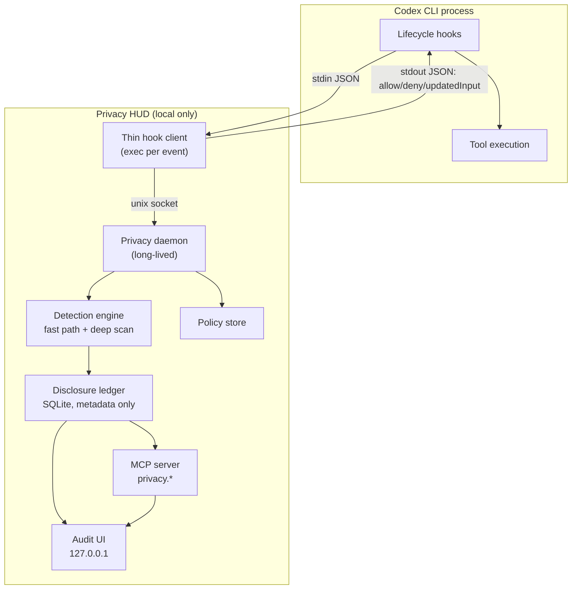
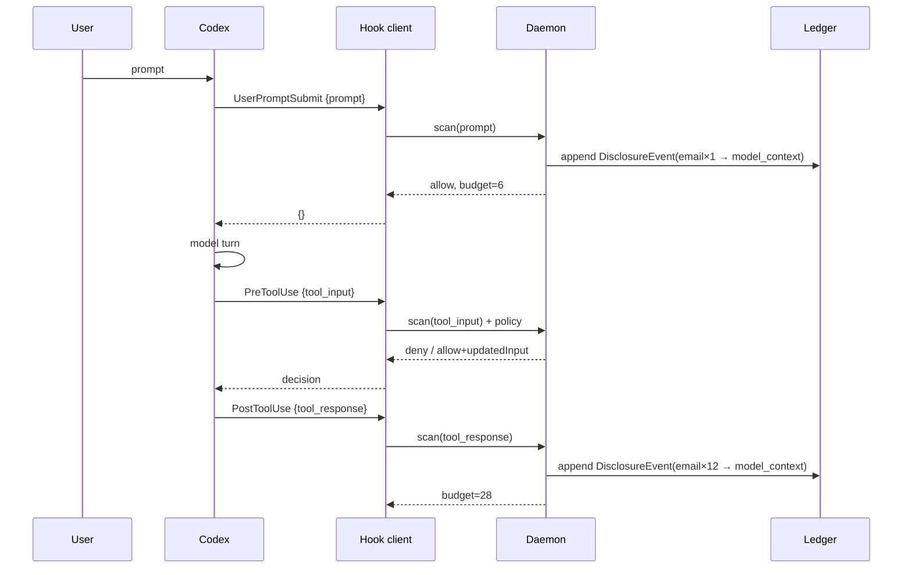
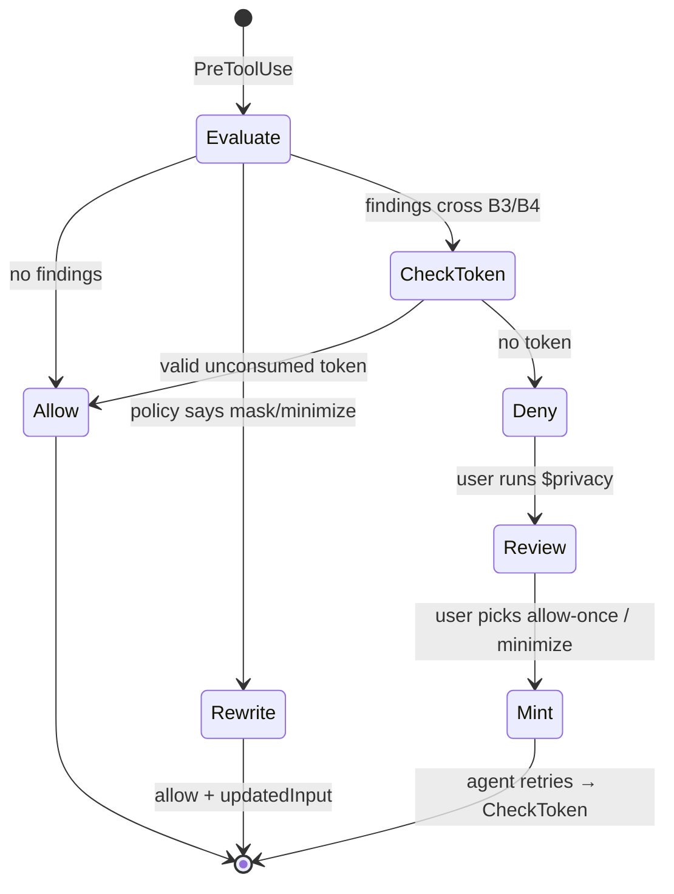

# Codex Privacy HUD — Architecture

**Status:** Draft v0.1 · **Date:** 2026-09-03 · **Companion to:** `PRD.md`, `design.md`

---

## 1. Component map



Everything inside `plugin` is local. The only sockets that exist are a unix domain socket and a loopback HTTP listener.

---

## 2. Process model

**Problem.** Hooks are `exec`'d per event. A Python interpreter with Presidio loaded costs 1.5–3 s of cold start. Paying that on every `PreToolUse` makes the agent unusable.

**Solution.** Split into a **thin client** and a **long-lived daemon**.

```text
hooks/handler.py     ~40 lines, stdlib only, no imports beyond json/socket/sys
                     → reads stdin, writes to socket, reads reply, writes stdout
                     → cold start ≈ 25 ms

daemon               started lazily by the first SessionStart hook
                     → holds Presidio models, regex set, SQLite conn, policy cache
                     → one process per user, serves all concurrent sessions
                     → idle-exits after 30 min with no clients
```

**Socket protocol.** Newline-delimited JSON over `$PLUGIN_DATA/daemon.sock` (mode `0600`).

```json
→ {"v":1,"op":"event","payload":{ ...verbatim Codex hook JSON... }}
← {"v":1,"decision":"deny","reason":"...","systemMessage":"...","budget":28}
```

The client is deliberately dumb: it forwards the hook payload unmodified and relays whatever the daemon returns. All policy lives in one place, and the client has no dependencies that could break a user's session.

**Failure behavior** (matters more than the happy path):

| Failure | Client behavior |
|---|---|
| Socket missing | Spawn daemon detached, then apply per-boundary default below |
| Daemon timeout (> 120 ms) | Ingress: allow + `systemMessage` "unverified". Egress (B3/B4): **deny** |
| Daemon crash mid-request | Same as timeout |
| Client itself throws | `exit 0` with empty stdout — never block Codex on our own bug |

Fail-open on reads, fail-closed on egress. A privacy tool that hangs the agent gets uninstalled; one that silently leaks is worse.

---

## 3. Context accounting — how the ledger stays correct

This is the core mechanism and the most common place to get the design wrong.

### 3.1 The approach we reject

> "Every time the user sends a request to the LLM, send a parallel audit request that asks a model what sensitive data is now in context."

This fails on three independent grounds:

1. **It is self-defeating.** The audit request would carry the very sensitive data being audited to a model. The audit becomes a disclosure event. A privacy tool cannot be the largest exposure in the session.
2. **It is quadratic.** Context grows monotonically; re-auditing the whole context each turn costs `O(Σ context_size)` — roughly `O(n²)` in turns. A 60-turn session re-reads the same early file contents 60 times.
3. **It is non-deterministic.** A ledger whose entries change between runs on identical input is not an audit. Users cannot act on it, and we cannot test the budget invariants.

### 3.2 The approach we take: event-sourced boundary accounting

**Key insight: we never inspect the context. We observe the edges that write to it.**

The model context is an *account balance*. The ledger records *transactions*. You reconstruct a balance by replaying transactions — you never need to interrogate the account.

Every byte that can enter model context passes through a small, enumerable set of chokepoints, each of which is a hook:

| Direction | Chokepoint | Hook | What it carries |
|---|---|---|---|
| Ingress | User's own text | `UserPromptSubmit` | `prompt` |
| Ingress | Tool results (file reads, command output, MCP responses) | `PostToolUse` | `tool_response` |
| Propagation | Data handed to a subagent | `SubagentStart` | agent context reference |
| Egress | Arguments leaving to a tool or the network | `PreToolUse` | `tool_input` |

Those four edges form a **cut of the data-flow graph**. Nothing reaches the model without crossing one — with the documented exception of hosted tools (§11). So the ledger is complete with respect to the enforceable boundary, and it is built from deterministic local scanning, with zero additional model calls.



### 3.3 Incremental update algorithm

Each event is processed in one pass:

```python
def on_event(ev):
    obs = normalize(ev)                    # → {turn_id, direction, boundary, source, text}
    if cached := chunk_cache.get(hash(obs.text)):
        findings = cached                  # re-read of an unchanged file costs nothing
    else:
        findings = engine.scan(obs.text)   # fast path, deep scan only if needed
        chunk_cache.put(hash(obs.text), findings)

    delta = 0
    for f in findings:                     # f = {type, value_hash, masked_exemplar}
        key = (f.value_hash, obs.destination)
        if key in disclosed_set:           # same value, same destination
            ledger.bump_count(key)         # count += 1, budget delta = 0
        else:
            disclosed_set.add(key)
            ledger.append(DisclosureEvent(f, obs))
            delta += severity(f.type) * volume(count) * dest_mult(obs.boundary)

    return ledger.budget_add(delta)        # monotonic, never decreases
```

**Why this satisfies the PRD invariants:**

- *Prevented events score zero* — a denied `PreToolUse` never produces an ingress observation, so no event is appended.
- *Monotonic* — `budget_add` only ever adds; there is no removal path, because disclosure is irreversible.
- *Same value + same destination does not double-count* — the `disclosed_set` membership check.
- *New destination does count* — the key includes `destination`, so `support.log → subagent` is a distinct entry from `support.log → model_context`.

**Cost.** `O(bytes crossing a boundary)`, not `O(context size × turns)`. Combined with the chunk cache, re-reading an unchanged file is `O(1)`.

### 3.4 Value identity without storing values

Dedupe needs to know "is this the same email I saw before?" without ever writing the email to disk.

```text
value_hash = HMAC-SHA256(key = session_salt, msg = normalized_value)[:16]
session_salt = 32 random bytes, generated at SessionStart,
               held in daemon memory only, destroyed at SessionEnd
```

Consequences, all intentional: hashes are not comparable across sessions, are useless if the DB is stolen, and cannot be brute-forced into the original value without the salt, which never touches disk. Cross-session correlation is therefore impossible by construction — a feature, not a limitation.

The **masked exemplar** (`jo•••@acme.com`) is computed at detection time by a type-specific masker and is the only human-readable residue stored. Maskers are unit-tested to guarantee the original is unrecoverable (e.g. emails keep 2 leading chars + full domain; credentials store *nothing* but their type).

### 3.5 Compaction

Compaction shrinks the context. It does **not** un-disclose anything — those bytes already reached the model.

Because the ledger is event-sourced from hooks rather than derived from the transcript, compaction is a no-op for correctness. `PreCompact`/`PostCompact` write a marker row so the timeline can show it, and nothing else. This is the concrete payoff of not deriving state from the transcript: a transcript-scraping design would silently lose history here, exactly as `claude-hud` would if the transcript were truncated.

### 3.6 Known imprecision

| Case | Effect | Mitigation |
|---|---|---|
| Codex truncates a large `tool_response` before adding to context | Over-counting | Apply the same truncation heuristic before scanning |
| Model paraphrases PII into its own output | Undetected | Out of scope; documented |
| Tool result discarded by Codex without entering context | Over-counting | Accept — conservative direction is the correct one |
| Hosted tools (WebSearch) | Not covered | Documented in §11 and in the UI |

Where we are imprecise, we are deliberately imprecise **toward over-reporting exposure**. An audit that under-reports is worse than useless.

---

## 4. Detection engine

```text
scan(text) →
  ┌─ Tier 0: path/context rules      ~0.1 ms   .env, *.pem, id_rsa, ~/.aws, credentials.json
  ├─ Tier 1: regex + entropy          ~2 ms    API keys, tokens, JWTs, connection strings
  ├─ Tier 2: structural parse         ~3 ms    shell AST → destination extraction
  └─ Tier 3: Presidio NER            ~40 ms    names, addresses, phones, orgs  [conditional]
```

Tier 3 runs only when Tier 1 hits, when the payload crosses B3/B4, or when the text contains PII-shaped tokens that Tier 1 could not classify. Roughly 10–15% of events in practice.

**Shell destination extraction (Tier 2)** is what makes egress detection real. Parse the command, walk the AST, and classify each sink:

```text
curl/wget/http     → external host from URL
scp/rsync/sftp     → remote host
ssh <host> <cmd>   → remote host
nc/netcat          → host:port
git push           → remote URL from config
> /dev/tcp/...     → host:port
pipes              → follow the chain; the last sink wins
```

Anything unparseable crossing B4 is treated as an unknown external destination and fails closed.

**Interfaces.** Each tier implements `Detector.scan(text, ctx) -> list[Finding]`. Presidio sits behind this interface so it can be swapped for a local privacy-filter model without touching the ledger, and stubbed in tests.

---

## 5. Ledger schema

SQLite at `$PLUGIN_DATA/ledger.db`, mode `0600`, WAL enabled.

```sql
CREATE TABLE sessions (
  session_id   TEXT PRIMARY KEY,
  started_at   INTEGER NOT NULL,
  ended_at     INTEGER,
  cwd          TEXT,
  model        TEXT,
  budget_score REAL NOT NULL DEFAULT 0,
  budget_cap   REAL NOT NULL DEFAULT 120
);

CREATE TABLE events (                     -- append-only; never UPDATE except count
  id            INTEGER PRIMARY KEY,
  session_id    TEXT NOT NULL REFERENCES sessions,
  turn_id       TEXT,
  ts            INTEGER NOT NULL,
  kind          TEXT NOT NULL,            -- exposed|prevented|local_access|detected|retention
  data_type     TEXT NOT NULL,            -- email|credential|person|hostname|path|...
  source        TEXT NOT NULL,            -- support.log | user prompt | tool input
  destination   TEXT NOT NULL,            -- model_context|subagent:<id>|mcp:<server>|net:<host>
  boundary      TEXT NOT NULL,            -- B0..B4
  count         INTEGER NOT NULL DEFAULT 1,
  value_hash    BLOB,                     -- salted, session-scoped; NULL after SessionEnd
  masked_example TEXT,                    -- 'jo•••@acme.com'; NULL for credentials
  budget_delta  REAL NOT NULL DEFAULT 0,
  protection    TEXT,                     -- none|masked|minimized|blocked
  tool_name     TEXT,
  UNIQUE(session_id, value_hash, destination)
);

CREATE TABLE flows (                      -- multi-hop chains for the L3 flow line
  id         INTEGER PRIMARY KEY,
  session_id TEXT NOT NULL,
  value_hash BLOB NOT NULL,
  hop_index  INTEGER NOT NULL,
  node       TEXT NOT NULL
);

CREATE TABLE policy (
  id         INTEGER PRIMARY KEY,
  scope      TEXT NOT NULL,               -- global|session:<id>
  rule_type  TEXT NOT NULL,               -- mask|block_source|allow_dest
  selector   TEXT NOT NULL,               -- data_type / path glob / destination
  created_at INTEGER NOT NULL
);

CREATE TABLE policy_tokens (              -- one-shot consent, §8
  token      TEXT PRIMARY KEY,
  session_id TEXT NOT NULL,
  tool_name  TEXT NOT NULL,
  args_hash  BLOB NOT NULL,
  mode       TEXT NOT NULL,               -- allow_once|minimize
  expires_at INTEGER NOT NULL,
  consumed   INTEGER NOT NULL DEFAULT 0
);
```

**What is deliberately absent:** no `content`, no `prompt`, no `raw_value`, no `file_snippet` column anywhere. The schema is the privacy guarantee — a column that does not exist cannot leak.

At `SessionEnd`: `UPDATE events SET value_hash = NULL WHERE session_id = ?` and the in-memory salt is destroyed.

---

## 6. Budget engine

Pure functions over ledger rows, no I/O, fully unit-testable without Codex:

```python
SEVERITY = {"credential": 50, "financial": 12, "health": 12,
            "email": 6, "phone": 6, "person": 6, "address": 6, "ssn": 6,
            "hostname": 2, "path": 2, "ip": 2, "repo": 2}
DEST_MULT = {"B1": 1.0, "B2": 0.3, "B3": 1.5, "B4": 2.0}

def volume(n):      return 1 + math.log(n)
def contribution(t, n, b): return SEVERITY[t] * volume(n) * DEST_MULT[b]
def percent(score, cap):   return min(100, round(100 * score / cap))
```

The four invariants from `PRD.md` §5.3 are encoded as property tests. This module is built first because it needs nothing else, and it is the piece a judge is most likely to challenge.

---

## 7. Hook dispatch

`hooks/hooks.json`, bundled in the plugin:

```json
{
  "description": "Codex Privacy HUD — local disclosure ledger and enforcement",
  "hooks": {
    "SessionStart":      [{ "hooks": [{ "type": "command", "command": "$PLUGIN_ROOT/hooks/handler.py", "timeout": 5 }] }],
    "UserPromptSubmit":  [{ "hooks": [{ "type": "command", "command": "$PLUGIN_ROOT/hooks/handler.py", "timeout": 5 }] }],
    "PreToolUse":        [{ "matcher": ".*", "hooks": [{ "type": "command", "command": "$PLUGIN_ROOT/hooks/handler.py", "timeout": 5, "statusMessage": "privacy check" }] }],
    "PostToolUse":       [{ "matcher": ".*", "hooks": [{ "type": "command", "command": "$PLUGIN_ROOT/hooks/handler.py", "timeout": 5, "async": true }] }],
    "SubagentStart":     [{ "hooks": [{ "type": "command", "command": "$PLUGIN_ROOT/hooks/handler.py", "timeout": 5 }] }],
    "SubagentStop":      [{ "hooks": [{ "type": "command", "command": "$PLUGIN_ROOT/hooks/handler.py", "timeout": 5 }] }],
    "PreCompact":        [{ "hooks": [{ "type": "command", "command": "$PLUGIN_ROOT/hooks/handler.py", "timeout": 5, "async": true }] }],
    "SessionEnd":        [{ "hooks": [{ "type": "command", "command": "$PLUGIN_ROOT/hooks/handler.py", "timeout": 10 }] }]
  }
}
```

One entrypoint for all events; the daemon dispatches on `hook_event_name`. `PostToolUse` and `PreCompact` are `async: true` — they only record and can never block the agent. `PreToolUse` is synchronous because it must be able to deny.

Codex provides `PLUGIN_ROOT` and `PLUGIN_DATA` for plugin-bundled hooks; the ledger and socket live under `PLUGIN_DATA`.

---

## 8. Enforcement and the consent loop

Codex `PreToolUse` supports `deny`, `allow`, and `allow + updatedInput`, but **not** `permissionDecision: "ask"`. Consent is therefore a state machine across turns rather than a modal.



**Token binding.** `args_hash = SHA256(canonical_json(tool_input))`, so a token authorizes exactly one call with exactly those arguments. TTL 120 s, single use, deleted on consumption. A token cannot be replayed, cannot authorize a different payload, and cannot outlive the user's attention.

**Rewrite path.** For Bash and `apply_patch`, `updatedInput` requires a string `command`; for MCP tools it is a replacement arguments object. Two rewrite strategies:

```text
Bash    curl sentry.example.com -d "$(cat support.log)"
     →  privacy-minimize support.log | curl sentry.example.com -d @-

MCP     {"body": "contact jordan@acme.com about 4412"}
     →  {"body": "contact user_7f3a@example.invalid about 4412"}
```

**Pseudonymization is stable per session** — the same input value always maps to the same pseudonym via `HMAC(session_salt, value)` reduced into a readable token. The agent's cross-references survive minimization, which is the difference between minimization and breaking the task.

---

## 9. MCP server and UI delivery

Local stdio MCP server declared in `plugin.json`:

```text
privacy.get_session_summary   → tiles + budget
privacy.list_exposures        → rows for a tab
privacy.get_exposure_detail   → L3 payload for one flow
privacy.update_policy         → write mask / block rules
privacy.allow_once            → mint a one-shot token
privacy.start_clean_session   → wipe session state and salt
```

**UI delivery.** Codex Desktop does not currently render MCP Apps inline iframe resources ([openai/codex#21019](https://github.com/openai/codex/issues/21019)), and `tui.status_line` accepts only built-in item identifiers. So:

- **L2/L3** — daemon serves static HTML + vanilla JS on `127.0.0.1:<ephemeral>`; the `$privacy` skill prints the URL and an ASCII table fallback, so the demo works even with no browser.
- **L1** — optional terminal companion renderer.
- **Alerts** — hook `systemMessage`, which is native and always available.

The MCP tools return structured JSON regardless, so when Codex renders MCP UI the same data powers it with no rework.

---

## 10. Concurrency and performance

- **One daemon, many sessions.** State is keyed by `session_id` throughout; there is no global mutable session state.
- **Writes serialized** through a single SQLite connection in WAL mode; the UI reads on a separate read-only connection.
- **Chunk cache** is content-hash keyed and bounded (LRU, 64 MB), shared across sessions — safe because it maps content hash to *findings*, never to content.

**Latency budget** (p99, `PreToolUse` on the critical path):

```text
client cold start        25 ms
socket round trip         2 ms
tier 0-2 scan             6 ms
tier 3 (when it runs)    40 ms
policy + ledger write     5 ms
                        ──────
                    38 / 78 ms
```

Comfortably under the 150 ms target. `PostToolUse` is `async` and off the critical path entirely, which matters because tool responses are the largest payloads we scan.

---

## 11. Threat model and limits

**In scope.** Accidental disclosure by a well-intentioned agent acting on a user's instructions — the overwhelmingly common case.

**Out of scope, and stated plainly in the demo:**

1. **Hosted tools bypass hooks.** WebSearch and similar do not trigger local function-tool hook paths. Practical guardrail, not a complete enforcement boundary.
2. **A malicious user** can uninstall the plugin. We defend the user, not against them.
3. **Prompt injection** can try to talk the agent out of cooperating — but enforcement lives in the hook layer, which the model cannot bypass. This is the main argument for hooks over prompt-based guardrails.
4. **Side channels** — a determined agent could encode data to evade regex/NER. Detection is heuristic.
5. **Model memorization** — nothing recalls data once disclosed.

**Self-audit requirement.** The plugin makes no network calls except to `127.0.0.1`. Running Privacy HUD on its own development session must yield zero exposures; this is a test, not an aspiration.

---

## 12. Testing strategy

| Layer | Approach | Needs Codex? |
|---|---|---|
| Budget engine | Property tests for the four invariants | No |
| Detectors | Golden corpus of synthetic PII + secrets; precision/recall thresholds | No |
| Shell parser | Table-driven over ~40 egress command shapes | No |
| Ledger | Idempotency: replay the same event 100× → one row, one delta | No |
| Hook client | Fixture hook payloads on stdin → assert stdout JSON | No |
| Consent loop | Token mint → consume → replay must fail | No |
| End-to-end | Scripted Codex session; assert receipt matches expectation | Yes |
| Self-audit | Run the plugin on its own session; assert zero exposures | Yes |

Everything except the last two rows runs without Codex, which is what makes the build order in `PRD.md` §11 viable — the hard platform integration is isolated to one thin, fixture-testable client.

---

## 13. Build order

1. **Budget engine + ledger** — pure, testable, no platform dependency.
2. **Detection engine** — fast path first; Presidio behind the `Detector` interface.
3. **Hook client + plugin package** — smoke-test one real hook firing end-to-end **within the first two hours**. This is the only step with unknown platform behavior; discovering a surprise here on hour seven is the project's biggest risk.
4. **Daemon + socket** — once the client contract is proven.
5. **`$privacy` skill + audit UI.**
6. **Rewrite path + consent tokens** — the demo's centerpiece.
7. **Companion HUD, receipt, polish.**

---

## References

- Codex Hooks — https://learn.chatgpt.com/docs/hooks
- Build plugins — https://learn.chatgpt.com/docs/build-plugins
- Codex configuration reference — https://learn.chatgpt.com/docs/config-file/config-reference
- Codex App Server — https://learn.chatgpt.com/docs/app-server
- MCP Apps inline UI not rendered in Codex Desktop — https://github.com/openai/codex/issues/21019
