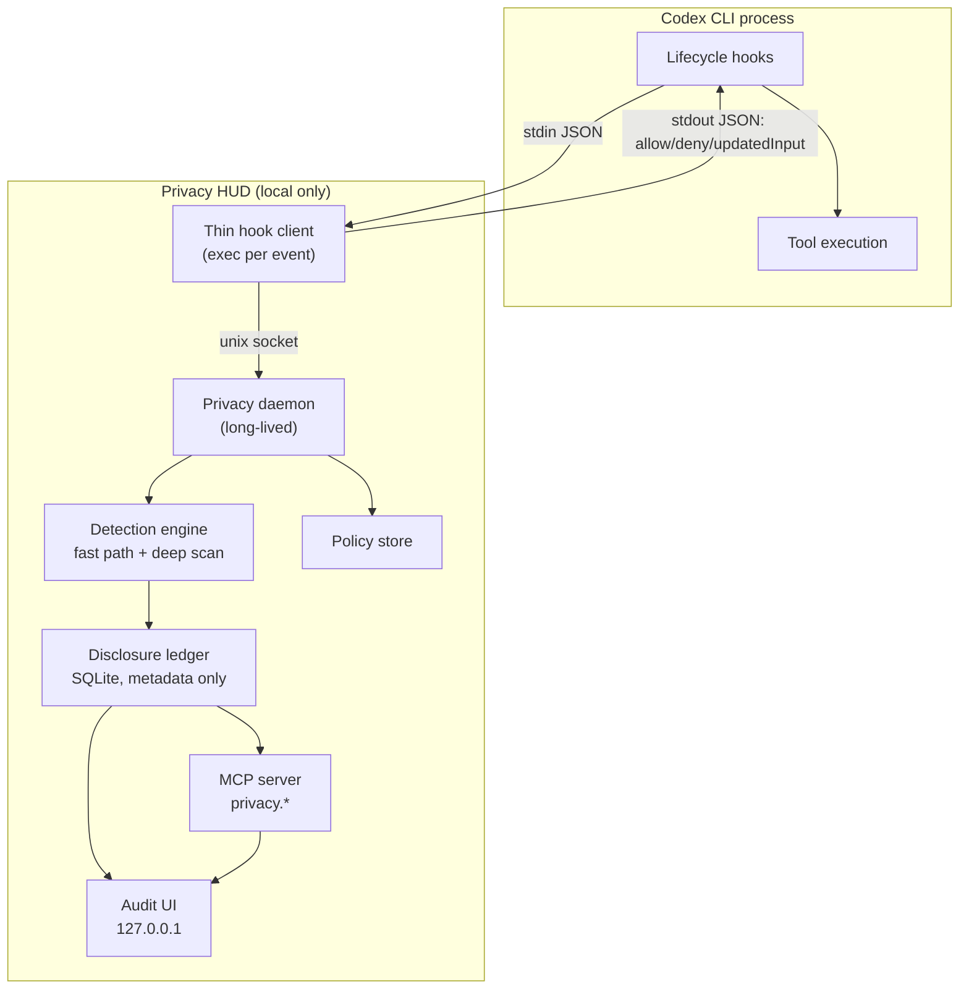
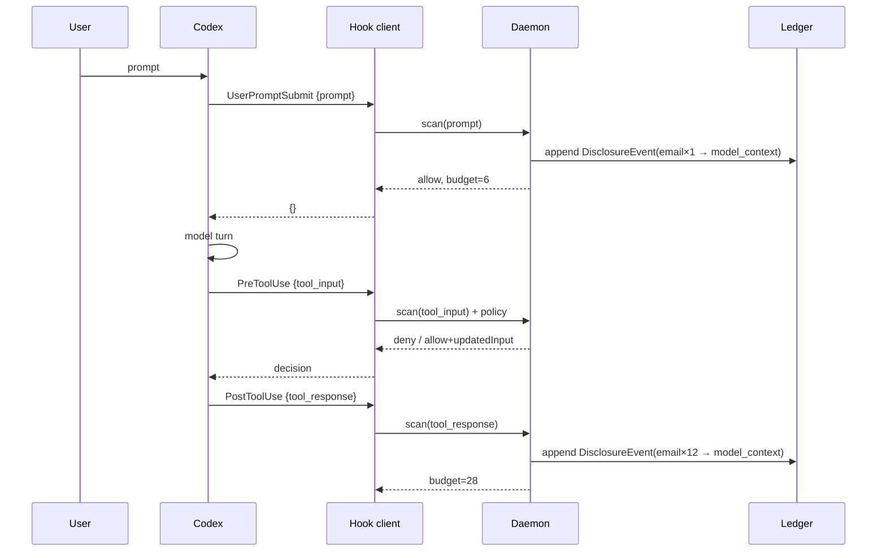
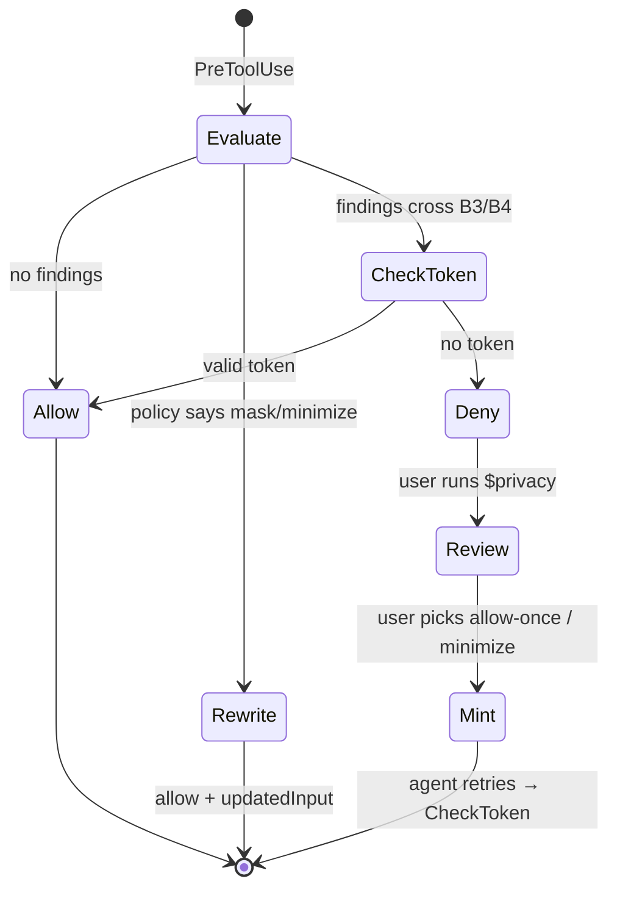

# Codex Privacy HUD — Architecture

**Status:** Draft v0.1 · **Date:** 2026-09-03 · **Companion to:** `PRD.md`, `design.md`

**Current contract — #54 Phase 2 (0.7.9).**

The daemon prepares the new accounting schema at a new-session boundary. Production sessions still use legacy accounting. Migration preserves every stored legacy value and performs no backfill or rescoring. Readers do not migrate the ledger. The new observations, identities, evidence, and disclosure charges are not active. #43, #44, and the related #47 accounting limitations remain unresolved.

---

## 1. Component map



Everything inside `plugin` is local. The only sockets that exist are a unix domain socket and a loopback HTTP listener.

---

## 2. Process model

**Problem.** Hooks are `exec`'d per event. A Python interpreter with Presidio loaded costs 1.5–3 s of cold start. Paying that on every `PreToolUse` makes the agent unusable.

**Solution.** Split into a **thin client** and a **long-lived daemon**.

```text
hooks/handler.py     ~40 lines, stdlib only, no imports beyond json/socket/sys
                     → reads stdin, writes to socket, reads reply, writes stdout
                     → cold start ≈ 25 ms

daemon               [NOT IMPLEMENTED] designed to start lazily on first
                     use; this build requires starting it manually — see
                     README.md "Using it in Codex" §2. Accepted for this
                     hackathon's scope rather than built.
                     → holds Presidio models, regex set, SQLite conn, policy cache
                     → one process per user, serves all concurrent sessions
                     → reference-counts live sessions (SessionStart /
                       SessionEnd, and any hook event as a keep-alive) and
                       exits 5 min after the LAST one ends — never on a
                       single SessionEnd, since one daemon serves them all.
                       Fallbacks for a SessionEnd that never arrives: a
                       session idle 4 h stops counting, and 4 h with no
                       connection at all exits regardless of the count.
```

**Socket protocol.** Newline-delimited JSON over `$PLUGIN_DATA/daemon.sock` (mode `0600`).

```json
→ {"v":1,"op":"event","payload":{ ...verbatim Codex hook JSON... }}
← {"v":1,"decision":"deny","reason":"...","systemMessage":"...","budget":28}
```

The client is deliberately dumb: it forwards the hook payload unmodified and relays whatever the daemon returns. All policy lives in one place, and the client has no dependencies that could break a user's session.

`op` is the discriminator, and there is a second value on it, used by the `$privacy` skill and by nothing on the hook path:

```json
→ {"v":1,"op":"active_sessions"}
← {"v":1,"op":"active_sessions","sessions":[{"session_id":"…","age":0.04}, …]}
```

Most recently active first; `age` is seconds since that session's last hook event (an age and not a timestamp, because a monotonic clock means nothing in another process). **Why the daemon has to be asked:** Codex exposes no session id to a skill, and neither question the ledger can answer is the right one — "most recently started" names the wrong session as soon as a second window is open, and "most recently disclosing" (`MAX(events.ts)`) skips a session that has disclosed nothing, which is precisely the clean session this tool must get right. The daemon's session reference count (`dispatch.State.live`) is updated for *every* hook carrying a session id, including the ones that write no ledger row, so it covers both. Running `$privacy` fires a hook in the asking session, which is what makes "most recently active" mean "the caller". `hooks/handler.py` is deliberately not taught this op: stdlib-only, hot path, no reason to ask. An unknown `op` is answered with silence, which every client on this socket already treats as "no useful answer" — never with an error object, which would reach Codex as hook output.

**Failure behavior** (matters more than the happy path):

| Failure | Client behavior |
|---|---|
| Socket missing | Apply per-boundary default below. (Designed to also spawn the daemon detached at this point — **not implemented in this build**; the daemon must be started manually. See README.md "Known limits".) |
| Daemon timeout (> 2 s) | Ingress: allow + `systemMessage` "unverified". Egress (B3/B4): **deny** |
| Daemon crash mid-request | Same as timeout |
| Client itself throws | `exit 0` with empty stdout — never block Codex on our own bug |

Fail-open on reads, fail-closed on egress. A privacy tool that hangs the agent gets uninstalled; one that silently leaks is worse.

---

## 3. Context accounting — how the ledger stays correct

This is the core mechanism and the most common place to get the design wrong.

### 3.1 The approach we reject

> "Every time the user sends a request to the LLM, send a parallel audit request that asks a model what sensitive data is now in context."

This fails on three independent grounds:

1. **It is self-defeating.** The audit request would carry the very sensitive data being audited to a model. The audit becomes a disclosure event. A privacy tool cannot be the largest exposure in the session.
2. **It is quadratic.** Context grows monotonically; re-auditing the whole context each turn costs `O(Σ context_size)` — roughly `O(n²)` in turns. A 60-turn session re-reads the same early file contents 60 times.
3. **It is non-deterministic.** A ledger whose entries change between runs on identical input is not an audit. Users cannot act on it, and we cannot test the budget invariants.

### 3.2 The approach we take: event-sourced boundary accounting

**Key insight: we never inspect the context. We observe the edges that write to it.**

The model context is an *account balance*. The ledger records *transactions*. You reconstruct a balance by replaying transactions — you never need to interrogate the account.

Every byte that can enter model context passes through a small, enumerable set of chokepoints, each of which is a hook:

| Direction | Chokepoint | Hook | What it carries |
|---|---|---|---|
| Ingress | User's own text | `UserPromptSubmit` | `prompt` |
| Ingress | Tool results (file reads, command output, MCP responses) | `PostToolUse` | `tool_response` |
| Propagation | Data handed to a subagent | `SubagentStart` | agent context reference |
| Egress | Arguments leaving to a tool or the network | `PreToolUse` | `tool_input` |

Those four edges form a **cut of the data-flow graph**. Nothing reaches the model without crossing one — with the documented exception of hosted tools (§11). So the ledger is complete with respect to the enforceable boundary, and it is built from deterministic local scanning, with zero additional model calls.



### 3.3 Incremental update algorithm

Each event is processed in one pass:

```python
def on_event(ev):
    obs = normalize(ev)                    # → {turn_id, direction, boundary, source, text}
    if cached := chunk_cache.get(hash(obs.text)):
        findings = cached                  # re-read of an unchanged file costs nothing
    else:
        findings = engine.scan(obs.text)   # fast path, deep scan only if needed
        chunk_cache.put(hash(obs.text), findings)

    delta = 0
    for f in findings:                     # f = {type, value_hash, masked_exemplar}
        key = (f.value_hash, obs.destination)
        if key in disclosed_set:           # same value, same destination
            ledger.bump_count(key)         # count += 1, budget delta = 0
        else:
            disclosed_set.add(key)
            ledger.append(DisclosureEvent(f, obs))
            delta += severity(f.type) * volume(count) * dest_mult(obs.boundary)

    return ledger.budget_add(delta)        # monotonic, never decreases
```

**Why this satisfies the PRD invariants:**

- *Prevented events score zero* — a denied `PreToolUse` never produces an ingress observation, so no event is appended.
- *Monotonic* — `budget_add` only ever adds; there is no removal path, because disclosure is irreversible.
- *Same value + same destination does not double-count* — the `disclosed_set` membership check.
- *New destination does count* — the key includes `destination`, so `support.log → subagent` is a distinct entry from `support.log → model_context`.

**Cost.** `O(bytes crossing a boundary)`, not `O(context size × turns)`. Combined with the chunk cache, re-reading an unchanged file is `O(1)`.

### 3.4 Value identity without storing values

Dedupe needs to know "is this the same email I saw before?" without ever writing the email to disk.

```text
value_hash = HMAC-SHA256(key = session_salt, msg = normalized_value)[:16]
session_salt = 32 random bytes, generated at SessionStart,
               held in daemon memory only, destroyed at SessionEnd
```

Consequences, all intentional: hashes are not comparable across sessions, are useless if the DB is stolen, and cannot be brute-forced into the original value without the salt, which never touches disk. Cross-session correlation is therefore impossible by construction — a feature, not a limitation.

The **masked exemplar** (`jo•••@acme.com`) is computed at detection time by a type-specific masker and is the only human-readable residue stored. Maskers are unit-tested to guarantee the original is unrecoverable (e.g. emails keep 2 leading chars + full domain; credentials store *nothing* but their type).

### 3.5 Compaction

Compaction shrinks the context. It does **not** un-disclose anything — those bytes already reached the model.

Because the ledger is event-sourced from hooks rather than derived from the transcript, compaction is a no-op for correctness. `PreCompact`/`PostCompact` write a marker row so the timeline can show it, and nothing else. This is the concrete payoff of not deriving state from the transcript: a transcript-scraping design would silently lose history here, exactly as `claude-hud` would if the transcript were truncated.

### 3.6 Known imprecision

| Case | Effect | Mitigation |
|---|---|---|
| Codex truncates a large `tool_response` before adding to context | Over-counting | Apply the same truncation heuristic before scanning |
| Model paraphrases PII into its own output | Undetected | Out of scope; documented |
| Tool result discarded by Codex without entering context | Over-counting | Accept — conservative direction is the correct one |
| Hosted tools (WebSearch) | Not covered | Documented in §11 and in the UI |

Where we are imprecise, we are deliberately imprecise **toward over-reporting exposure**. An audit that under-reports is worse than useless.

---

## 4. Detection engine

```text
scan(text) →
  ┌─ Tier 0: path/context rules      ~0.1 ms   .env, *.pem, id_rsa, ~/.aws, credentials.json
  ├─ Tier 1: regex + entropy          ~2 ms    API keys, tokens, JWTs, connection strings
  ├─ Tier 2: structural parse         ~3 ms    shell AST → destination extraction
  └─ Tier 3: Presidio NER            ~40 ms    names, addresses, phones, orgs  [conditional]
```

Tier 3 runs only when Tier 1 hits, when the payload crosses B3/B4, or when the text contains PII-shaped tokens that Tier 1 could not classify. Roughly 10–15% of events in practice.

**What ships, on the B3/B4 half of that sentence.** The engine did the opposite for most of this project's life — it excluded B3/B4 outright — so the types tier 3 owns (`person`, `address`, `email`, `phone`, `url`, `date`, `account`) could not appear on any outbound row (#47 item 1). The exclusion is gone, and the reason it could not simply be deleted is what the rest of this section has to account for: an outbound call is a `PreToolUse`, `hooks/handler.py` gives the daemon 2.0 s per socket operation, and I6 turns a missed deadline into a **deny** of a call that should have been allowed.

On B3/B4, `engine.TIER3_EGRESS_BUDGET` is a duration (1.0 s) used to construct an absolute monotonic deadline. Egress uses a requested timeout based on the remaining budget and an inclusive completion cutoff; neither guarantees elapsed time. See `engine.TIER3_EGRESS_BUDGET`, which states the exact acceptance condition; this summary must agree with it. At most one egress scan worker is admitted at a time. Admission is nonblocking; the worker retains its slot until it exits, including after caller abandonment. Ingress does not use the egress deadline.

A scan gap means an applicable deep scan supplied no accepted result; the call is then decided on tiers 0-2. Each observed scan gap is recorded per observation and counted per session, including observations with no event row — see §10 below and `docs/known-limits.md` #21.

**Shell destination extraction (Tier 2)** is what makes egress detection real. Parse the command, walk the AST, and classify each sink:

```text
curl/wget/http     → external host from URL
scp/rsync/sftp     → remote host
ssh <host> <cmd>   → remote host
nc/netcat          → host:port
git push           → remote URL from config
> /dev/tcp/...     → host:port
pipes              → follow the chain; the last sink wins
```

Anything unparseable crossing B4 is treated as an unknown external destination and fails closed.

**Interfaces.** Each tier implements `Detector.scan(text, ctx) -> list[Finding]`. Presidio sits behind this interface so it can be swapped for a local privacy-filter model without touching the ledger, and stubbed in tests.

---

## 5. Ledger schema

SQLite at `$PLUGIN_DATA/ledger.db`, mode `0600`, WAL enabled.

```sql
CREATE TABLE sessions (
  session_id   TEXT PRIMARY KEY,
  started_at   INTEGER NOT NULL,
  ended_at     INTEGER,
  cwd          TEXT,
  model        TEXT,
  budget_score REAL NOT NULL DEFAULT 0,
  budget_cap   REAL NOT NULL DEFAULT 120
);

-- Legacy schema; #54's replacement is approved but not implemented here.
-- CLAUDE.md §4 governs the scoped atomic rebuild and preservation of history.
CREATE TABLE events (                     -- legacy UPDATEs: count increments; value_hash NULL at session end
  id            INTEGER PRIMARY KEY,
  session_id    TEXT NOT NULL REFERENCES sessions,
  turn_id       TEXT,
  ts            INTEGER NOT NULL,
  kind          TEXT NOT NULL,            -- exposed|prevented|local_access|detected|retention
  data_type     TEXT NOT NULL,            -- email|credential|person|hostname|path|...
  source        TEXT NOT NULL,            -- support.log | user prompt | tool input
  destination   TEXT NOT NULL,            -- model_context|subagent:<id>|mcp:<server>|net:<host>
  boundary      TEXT NOT NULL,            -- B0..B4
  count         INTEGER NOT NULL DEFAULT 1,
  value_hash    BLOB,                     -- salted, session-scoped; NULL after SessionEnd
  masked_example TEXT,                    -- 'jo•••@acme.com'; NULL for credentials
  budget_delta  REAL NOT NULL DEFAULT 0,
  protection    TEXT,                     -- none|masked|minimized|blocked
  tool_name     TEXT,
  UNIQUE(session_id, value_hash, destination)
);

CREATE TABLE flows (                      -- multi-hop chains for the L3 flow line
  id         INTEGER PRIMARY KEY,
  session_id TEXT NOT NULL,
  value_hash BLOB NOT NULL,
  hop_index  INTEGER NOT NULL,
  node       TEXT NOT NULL
);

CREATE TABLE policy (
  id         INTEGER PRIMARY KEY,
  scope      TEXT NOT NULL,               -- session:<id>
  rule_type  TEXT NOT NULL,               -- mask|block_path|block_command
  selector   TEXT NOT NULL,               -- data_type / destination / origin (#40)
  created_at INTEGER NOT NULL
);

CREATE TABLE policy_tokens (              -- one-shot consent, §8
  token      TEXT PRIMARY KEY,
  session_id TEXT NOT NULL,
  tool_name  TEXT NOT NULL,
  args_hash  BLOB NOT NULL,
  mode       TEXT NOT NULL,               -- allow_once|minimize
  expires_at INTEGER NOT NULL
);
```

**What is deliberately absent:** no `content`, no `prompt`, no `raw_value`, no `file_snippet` column anywhere. The schema is the privacy guarantee — a column that does not exist cannot leak.

At `SessionEnd`: `UPDATE events SET value_hash = NULL WHERE session_id = ?` and the in-memory salt is destroyed. After the Phase 2 rebuild the same update targets `events_legacy_v1`.

### 5.1 Prepared storage (#54 Phase 2, 0.7.9)

Prepared storage: these tables exist from the first genuine new-session boundary after upgrading, and no production writer uses them yet. `PRAGMA user_version` records the generation: `0` legacy, `5401` prepared, `5402` activated (#54 Phase 4). The exact DDL, including every guard trigger, is `src/privacy_hud/ledger_schema.py`; its structural statements are:

```sql
ALTER TABLE events RENAME TO events_legacy_v1;

CREATE TABLE scoring_profiles (
    profile_id TEXT NOT NULL PRIMARY KEY
        CHECK (
            length(profile_id) = 64
            AND profile_id NOT GLOB '*[^0-9a-f]*'
        ),
    format_version INTEGER NOT NULL CHECK (format_version = 1),
    matrix_version TEXT NOT NULL,
    created_at INTEGER NOT NULL CHECK (typeof(created_at) = 'integer'),
    budget_cap REAL NOT NULL
        CHECK (budget_cap > 0 AND budget_cap < 1.0e100),
    parameters_json TEXT NOT NULL
        CHECK (
            json_valid(parameters_json)
            AND json_type(parameters_json) = 'object'
        )
);

ALTER TABLE sessions
    ADD COLUMN accounting_version INTEGER NOT NULL DEFAULT 1
        CHECK (accounting_version IN (1, 2));

ALTER TABLE sessions
    ADD COLUMN accounting_status TEXT NOT NULL DEFAULT 'legacy'
        CHECK (accounting_status IN ('legacy', 'available', 'unavailable'));

ALTER TABLE sessions
    ADD COLUMN profile_id TEXT REFERENCES scoring_profiles(profile_id);

CREATE TABLE observations (
    observation_id TEXT NOT NULL PRIMARY KEY,
    session_id TEXT NOT NULL REFERENCES sessions(session_id),
    delivery_key TEXT NOT NULL,
    action_id TEXT NOT NULL,
    turn_id TEXT,
    ts INTEGER NOT NULL CHECK (typeof(ts) = 'integer'),
    hook_event TEXT NOT NULL CHECK (hook_event IN (
        'SessionStart', 'SessionEnd', 'UserPromptSubmit',
        'PreToolUse', 'PostToolUse', 'SubagentStart',
        'SubagentStop', 'PreCompact'
    )),
    phase TEXT NOT NULL CHECK (phase IN ('pre', 'post', 'lifecycle')),
    action_kind TEXT NOT NULL CHECK (action_kind IN (
        'read', 'tool', 'prompt', 'subagent', 'lifecycle', 'other'
    )),
    boundary TEXT NOT NULL CHECK (boundary IN ('B0', 'B1', 'B2', 'B3', 'B4')),
    decision TEXT NOT NULL CHECK (decision IN ('none', 'allow', 'deny', 'rewrite')),
    evidence INTEGER NOT NULL
        CHECK (typeof(evidence) = 'integer' AND evidence BETWEEN 0 AND 2047),
    resolution_scope TEXT NOT NULL DEFAULT 'none'
        CHECK (resolution_scope IN ('none', 'pairs', 'boundary')),
    potential_crossing INTEGER NOT NULL
        CHECK (potential_crossing IN (0, 1)),
    scan_gap TEXT CHECK (scan_gap IN ('oversize', 'unavailable', 'busy', 'timeout')),
    UNIQUE (session_id, delivery_key),
    UNIQUE (session_id, observation_id),
    CHECK ((evidence & 2) = 0 OR decision = 'deny'),
    CHECK ((evidence & 8) = 0 OR decision = 'rewrite'),
    CHECK ((evidence & 1) = 0 OR decision IN ('allow', 'rewrite')),
    CHECK (resolution_scope = 'none' OR (evidence & 212) <> 0),
    CHECK (scan_gap IS NULL OR phase <> 'lifecycle')
);

CREATE INDEX observations_action
    ON observations(session_id, action_id, boundary, ts, observation_id);

CREATE TABLE subjects (
    subject_id TEXT NOT NULL PRIMARY KEY,
    session_id TEXT NOT NULL REFERENCES sessions(session_id),
    subject_kind TEXT NOT NULL CHECK (subject_kind IN ('value', 'file')),
    resolution TEXT NOT NULL CHECK (resolution IN ('resolved', 'unresolved')),
    identity_hash BLOB CHECK (
        identity_hash IS NULL
        OR (typeof(identity_hash) = 'blob' AND length(identity_hash) = 32)
    ),
    label TEXT NOT NULL,
    unresolved_observation_id TEXT,
    UNIQUE (session_id, subject_id),
    FOREIGN KEY (session_id, unresolved_observation_id)
        REFERENCES observations(session_id, observation_id),
    CHECK (
        (resolution = 'resolved' AND unresolved_observation_id IS NULL)
        OR
        (resolution = 'unresolved'
         AND identity_hash IS NULL
         AND unresolved_observation_id IS NOT NULL)
    )
);

CREATE UNIQUE INDEX subjects_identity
    ON subjects(session_id, subject_kind, identity_hash)
    WHERE identity_hash IS NOT NULL;

CREATE TABLE recipients (
    recipient_id TEXT NOT NULL PRIMARY KEY,
    session_id TEXT NOT NULL REFERENCES sessions(session_id),
    destination_kind TEXT NOT NULL CHECK (destination_kind IN (
        'local', 'model_context', 'subagent', 'mcp_tool', 'external_net'
    )),
    resolution TEXT NOT NULL CHECK (resolution IN ('resolved', 'unresolved')),
    identity_hash BLOB CHECK (
        identity_hash IS NULL
        OR (typeof(identity_hash) = 'blob' AND length(identity_hash) = 32)
    ),
    label TEXT NOT NULL,
    unresolved_observation_id TEXT,
    UNIQUE (session_id, recipient_id),
    FOREIGN KEY (session_id, unresolved_observation_id)
        REFERENCES observations(session_id, observation_id),
    CHECK (
        (resolution = 'resolved' AND unresolved_observation_id IS NULL)
        OR
        (resolution = 'unresolved'
         AND identity_hash IS NULL
         AND unresolved_observation_id IS NOT NULL)
    )
);

CREATE UNIQUE INDEX recipients_identity
    ON recipients(session_id, destination_kind, identity_hash)
    WHERE identity_hash IS NOT NULL;

CREATE TABLE events (
    id INTEGER PRIMARY KEY,
    session_id TEXT NOT NULL REFERENCES sessions(session_id),
    observation_id TEXT NOT NULL,
    subject_id TEXT NOT NULL,
    recipient_id TEXT NOT NULL,
    kind TEXT NOT NULL CHECK (kind IN (
        'detected', 'local_access', 'permitted',
        'exposed', 'prevented', 'retention'
    )),
    evidence INTEGER NOT NULL
        CHECK (typeof(evidence) = 'integer' AND evidence BETWEEN 0 AND 2047),
    data_type TEXT NOT NULL CHECK (data_type IN (
        'credential', 'financial', 'health', 'email', 'phone',
        'person', 'address', 'ssn', 'account', 'url', 'date',
        'hostname', 'path', 'ip', 'repo'
    )),
    rule_id TEXT,
    occurrences INTEGER NOT NULL DEFAULT 1
        CHECK (typeof(occurrences) = 'integer' AND occurrences >= 1),
    source_label TEXT NOT NULL,
    source_kind TEXT CHECK (source_kind IN ('path', 'command')),
    boundary TEXT NOT NULL CHECK (boundary IN ('B0', 'B1', 'B2', 'B3', 'B4')),
    masked_example TEXT,
    FOREIGN KEY (session_id, observation_id)
        REFERENCES observations(session_id, observation_id),
    FOREIGN KEY (session_id, subject_id)
        REFERENCES subjects(session_id, subject_id),
    FOREIGN KEY (session_id, recipient_id)
        REFERENCES recipients(session_id, recipient_id),
    UNIQUE (observation_id, subject_id, recipient_id, kind),
    UNIQUE (session_id, id, subject_id, recipient_id),
    CHECK (kind <> 'exposed' OR (boundary <> 'B0' AND (evidence & 64) <> 0)),
    CHECK (kind <> 'permitted' OR (evidence & 1) <> 0),
    CHECK (kind <> 'prevented' OR (evidence & 150) <> 0),
    CHECK (kind <> 'local_access' OR (boundary = 'B0' AND (evidence & 32) <> 0)),
    CHECK (kind <> 'detected' OR (evidence & 256) <> 0),
    CHECK (kind <> 'retention' OR (evidence & 512) <> 0),
    CHECK (data_type NOT IN ('credential', 'path') OR masked_example IS NULL)
);

CREATE INDEX events_session_kind
    ON events(session_id, kind, id);

CREATE INDEX events_session_subject_recipient
    ON events(session_id, subject_id, recipient_id, id);

CREATE TABLE disclosures (
    disclosure_id INTEGER PRIMARY KEY,
    session_id TEXT NOT NULL REFERENCES sessions(session_id),
    subject_id TEXT NOT NULL,
    recipient_id TEXT NOT NULL,
    first_event_id INTEGER NOT NULL,
    charged_data_type TEXT NOT NULL CHECK (charged_data_type IN (
        'credential', 'financial', 'health', 'email', 'phone',
        'person', 'address', 'ssn', 'account', 'url', 'date',
        'hostname', 'path', 'ip', 'repo'
    )),
    profile_id TEXT NOT NULL REFERENCES scoring_profiles(profile_id),
    group_n INTEGER NOT NULL
        CHECK (typeof(group_n) = 'integer' AND group_n >= 1),
    budget_delta REAL NOT NULL
        CHECK (budget_delta >= 0 AND budget_delta < 1.0e100),
    FOREIGN KEY (session_id, subject_id)
        REFERENCES subjects(session_id, subject_id),
    FOREIGN KEY (session_id, recipient_id)
        REFERENCES recipients(session_id, recipient_id),
    FOREIGN KEY (session_id, first_event_id, subject_id, recipient_id)
        REFERENCES events(session_id, id, subject_id, recipient_id),
    UNIQUE (session_id, subject_id, recipient_id),
    UNIQUE (session_id, charged_data_type, recipient_id, group_n),
    UNIQUE (first_event_id)
);
```

Guards: scoring profiles are immutable; a session's accounting version, profile, cap and start time are frozen and its score is monotonic; `observations`, `events`, `disclosures`, `coverage` and `scan_gaps` are append-only; identity metadata is immutable, and an identity hash can only be erased, and only after its session ended.

**Genuine-start procedure.**

1. Acquire `State.lock`.
2. `BEGIN IMMEDIATE`.
3. Re-read the session ID and schema marker.
4. If the ID exists, preserve it; do not rebuild merely because its start was replayed.
5. For an absent ID and legacy schema, execute the Phase 2 migration.
6. Insert the triggering session as version 1 and insert its coverage row.
7. Commit.
8. Create/use its legacy engine state and publish its legacy snapshot.

Any error rolls back the complete boundary operation. The triggering session is not left half-created.

**Legacy writes after migration.**

Keep the public `Ledger.record(...) -> float` signature. It checks the session version and dispatches only version 1 to `_record_legacy`.

Within one write transaction:

- Discover the legacy table.
- Select its actual columns.
- Preserve the existing dedupe key and `contribution(..., 1, ...)` arithmetic.
- Omit `source_kind` from inserts if the historical table lacks it.
- Commit insertion/count increment and score increment together.

`record` refuses any session that is not legacy-accounted. A late record for an ended session is kept with a NULL value hash and zero contribution; the ended session's score stays frozen, and dispatch enforces the call with a temporary engine whose salt never becomes session state.

Readers open with `initialize=False` and never run the rebuild. `scripts/check-issue54-ledger.py` rehearses it on a private copy of a real ledger.


---

## 6. Budget engine

Pure functions over ledger rows, no I/O, fully unit-testable without Codex:

```python
SEVERITY = {"credential": 50, "financial": 12, "health": 12,
            "email": 6, "phone": 6, "person": 6, "address": 6, "ssn": 6,
            "hostname": 2, "path": 2, "ip": 2, "repo": 2}
DEST_MULT = {"B1": 1.0, "B2": 0.3, "B3": 1.5, "B4": 2.0}

def volume(n):      return 1 + math.log(n)
def contribution(t, n, b): return SEVERITY[t] * volume(n) * DEST_MULT[b]
def percent(score, cap):   return min(100, round(100 * score / cap))
```

The four invariants from `PRD.md` §5.3 are encoded as property tests. This module is built first because it needs nothing else, and it is the piece a judge is most likely to challenge.

---

## 7. Hook dispatch

`hooks/hooks.json`, bundled in the plugin:

```json
{
  "description": "Codex Privacy HUD — local disclosure ledger and enforcement",
  "hooks": {
    "SessionStart":      [{ "hooks": [{ "type": "command", "command": "$PLUGIN_ROOT/hooks/handler.py", "timeout": 5 }] }],
    "UserPromptSubmit":  [{ "hooks": [{ "type": "command", "command": "$PLUGIN_ROOT/hooks/handler.py", "timeout": 5 }] }],
    "PreToolUse":        [{ "matcher": ".*", "hooks": [{ "type": "command", "command": "$PLUGIN_ROOT/hooks/handler.py", "timeout": 5, "statusMessage": "privacy check" }] }],
    "PostToolUse":       [{ "matcher": ".*", "hooks": [{ "type": "command", "command": "$PLUGIN_ROOT/hooks/handler.py", "timeout": 5 }] }],
    "SubagentStart":     [{ "hooks": [{ "type": "command", "command": "$PLUGIN_ROOT/hooks/handler.py", "timeout": 5 }] }],
    "SubagentStop":      [{ "hooks": [{ "type": "command", "command": "$PLUGIN_ROOT/hooks/handler.py", "timeout": 5 }] }],
    "PreCompact":        [{ "hooks": [{ "type": "command", "command": "$PLUGIN_ROOT/hooks/handler.py", "timeout": 5 }] }],
    "SessionEnd":        [{ "hooks": [{ "type": "command", "command": "$PLUGIN_ROOT/hooks/handler.py", "timeout": 3 }] }]
  }
}
```

One entrypoint for all events; the daemon dispatches on `hook_event_name`. All hooks are synchronous — see the platform note below for why `PostToolUse`/`PreCompact` are no longer marked `async: true`, and §10 for the latency consequence and its mitigation. `PreToolUse` was always synchronous because it must be able to deny.

Codex provides `PLUGIN_ROOT` and `PLUGIN_DATA` for plugin-bundled hooks; the ledger and socket live under `PLUGIN_DATA`. (Observed in practice as aliases of `CLAUDE_PLUGIN_ROOT`/`CLAUDE_PLUGIN_DATA` — see the platform note.)

**Plugin manifest location.** The plugin manifest lives at `.codex-plugin/plugin.json`, with a matching `.agents/plugins/marketplace.json` for installation (`codex plugin marketplace add <dir-or-owner/repo>` requires a marketplace manifest at the install root). These are the first two paths Codex 0.154 checks (`core-plugins/src/marketplace.rs` lists `.agents/plugins/marketplace.json`, `.agents/plugins/api_marketplace.json`, `.claude-plugin/marketplace.json`, `.cursor-plugin/marketplace.json`, in that order; the plugin manifest's primary path is `.codex-plugin/plugin.json` with `.claude-plugin/plugin.json` as the compatibility alternate). There is exactly one manifest location — do not also ship a `.claude-plugin/` directory; a second manifest means one of them is stale and nobody can tell which by looking. Switched from `.claude-plugin/` on 2026-09-15 after installing the new layout through `codex plugin marketplace add` + `codex plugin add` against Codex 0.154.0.

> **Platform note (Task 9 smoke test, Codex CLI 0.145.0, observed 2026-09-03):** two things in this section were corrected after live testing against a real Codex install and are recorded here so they are not silently re-derived (and gotten wrong again) from an older draft of this doc or from first principles:
>
> 1. **Manifest directory.** An earlier draft of this doc, and the brief for Task 9, specified `.codex-plugin/plugin.json`. Against real Codex CLI 0.145.0, a directory containing only `.codex-plugin/plugin.json` is rejected by `codex plugin marketplace add` with `marketplace root does not contain a supported manifest`. Every plugin actually installed and working on the test machine (including OpenAI's own `openai-codex` plugin) uses `.claude-plugin/plugin.json` + `.claude-plugin/marketplace.json` — the same layout Claude Code plugins use. This doc and the shipped plugin used `.claude-plugin/` from then until 2026-09-15. *Superseded:* the rejection was about the missing marketplace manifest, not about `.codex-plugin/`; with `.agents/plugins/marketplace.json` beside it, `.codex-plugin/plugin.json` is the native layout and installs on 0.154.0 (see the paragraph above).
> 2. **`async: true` is not implemented.** Codex CLI 0.145.0 logs `skipping async hook ...: async hooks are not supported yet` for any hook entry marked `async: true`, and never executes it — confirmed by installing a `hooks.json` with `PostToolUse` marked async (it never ran, no error surfaced to the user) versus an identical fixture without the flag (it ran and completed on every tool call). `hooks.json` above no longer sets `async` anywhere; see §10 for what synchronous `PostToolUse` costs and how that cost is bounded.
>
> Both were reproduced directly (install failure / success, and hook-fired / hook-skipped) against a live Codex install, not inferred from documentation. If a future Codex release changes either behavior, update this note with the version observed rather than deleting it — the failure mode this note prevents is a future reader re-deriving the wrong answer from the official docs.

---

## 8. Enforcement and the consent loop

Codex `PreToolUse` supports `deny`, `allow`, and `allow + updatedInput`, but **not** `permissionDecision: "ask"`. Consent is therefore a state machine across turns rather than a modal.



**Token binding.** `args_hash = SHA256(canonical_json(tool_input))`, so a token authorizes exactly one call with exactly those arguments. TTL 120 s, single use, deleted on consumption; minting again for the same call replaces the earlier token. A token cannot be replayed, cannot authorize a different payload, and cannot outlive the user's attention.

**Rewrite path.** For Bash and `apply_patch`, `updatedInput` requires a string `command`; for MCP tools it is a replacement arguments object. Two rewrite strategies:

```text
Bash    curl sentry.example.com -d "$(cat support.log)"
     →  privacy-minimize support.log | curl sentry.example.com -d @-

MCP     {"body": "contact jordan@acme.com about 4412"}
     →  {"body": "contact user_7f3a@example.invalid about 4412"}
```

**Pseudonymization is stable per session** — the same input value always maps to the same pseudonym via `HMAC(session_salt, value)` reduced into a readable token. The agent's cross-references survive minimization, which is the difference between minimization and breaking the task.

---

## 9. MCP server and UI delivery

Local stdio MCP server, declared in `.codex-plugin/plugin.json` as `mcpServers`
and launched by Codex as host `python3 ./mcp/server.py`; the script re-executes
itself under the interpreter `runtime.json` pins, because Codex does not expand
`${PLUGIN_ROOT}` in an MCP `command`.

It exposes only tools that cannot loosen what the plugin enforces, because an
MCP tool is called by the model: `privacy.get_session_summary`,
`privacy.list_exposures`, `privacy.get_exposure_detail`,
`privacy.read_guard_status`, `privacy.update_policy`. `privacy.allow_once`,
`privacy.read_guard_set` and `privacy.hud_toggle` are deliberately not exposed
(`mcp/server.py::EXPOSED_TOOLS`).

Withholding three tools is only half of that. `privacy.update_policy` is a
write, and a user `mask` rule used to outrank the plugin's one unconditional
deny: `Engine.observe` reads policy *ahead of* its own matrix defaults, and
the default deny only runs while the action is still `allow`. What makes
"cannot loosen" a property of the code is that the mask branch is now skipped
whenever the observation carries a finding of a
`matrix.loader.HARD_BLOCKED_DATA_TYPES` type, whatever the rule's selector
says — the observation falls through to `Matrix.default_action(destination)`,
which is `block` for `mcp_tool`/`external_net` and `mask` for
`model_context`/`subagent`, so the rule never yields to anything weaker than
it asked for. Observations carrying no hard-blocked finding are decided by
the rule exactly as before.

The guard is in that branch and not at the rule's mint site because the
branch intersects its selectors with *every* finding on the observation, not
with the finding that triggers the block: a `mask` rule on any type that
merely co-occurs with a credential — a path on the same command line, which
is what one click of the audit UI's "Save mask rule for detected <type>" on a path
exposure writes — skipped the block for the whole call. Those selectors are
innocuous, so no refusal keyed on a selector reaches that case.
`mcp_tools.apply_policy` still refuses a `mask` rule whose selector *is* a
hard-blocked type, keyed off the same `HARD_BLOCKED_DATA_TYPES` so the two
cannot drift — now because such a rule would decide nothing while reporting
success, with no path to remove it (known limit 13), and as defence in depth
if the branch's guard is ever lost.
`tests/test_mcp_surface.py::test_no_exposed_tool_can_turn_a_deny_into_an_allow`
checks the property as behaviour, with a co-occurring finding in its payload.

`read_guard_set` returns the same shape `read_guard_status` does, plus an `error` string when `settings.json` could not be written — the caller is the `$privacy` skill's heredoc, where a raised `PermissionError` would be a traceback and no statement of what the setting now says. Reads still fail open: this is not a hook path (I6).

**UI delivery.** Codex Desktop does not currently render MCP Apps inline iframe resources ([openai/codex#21019](https://github.com/openai/codex/issues/21019)), and `tui.status_line` accepts only built-in item identifiers. So:

- **L2/L3** — daemon serves static HTML + vanilla JS on `127.0.0.1:<ephemeral>`; the `$privacy` skill prints the URL and an ASCII table fallback, so the demo works even with no browser.
  - **Which session either surface shows** is resolved by `mcp_tools.resolve_audit_session`: an explicit `$privacy <id>` wins, otherwise the daemon's `active_sessions` op (§2) names the session that fired a hook most recently, and only if the daemon cannot be asked does it fall back to the ledger's most-recently-*started* session — labelled as that, never as the caller's own. The skill reports concurrent active sessions; the browser labels the selected session by its full ID. `local_ui_server`'s default (`/api/session` with no `session_id`) goes through the same function but separately timed resolutions can select different sessions; the skill therefore pins its selected ID in the browser URL, and so does `ambient` — on its own much slower clock (`ambient.RESOLVE_INTERVAL`, ~30 s, against a 2 s redraw), because the identity question is the one thing the ledger cannot answer while the ambient *reading* stays a snapshot-file poll. All three surfaces therefore name one session at a time. See README known limit 8, including why the ambient line carries no marker for session ambiguity: `⚠unverified` means the record has a hole, not "I am unsure whose record this is", and one glyph cannot carry both.
  - **What the skill's terminal audit header claims** follows from its resolution: `render.audit(..., resolved=)` writes the subtitle from `ResolvedSession.basis` (`Current session` only for a single daemon-named live session; `Session <id>`, `Most recently active session`, `Most recently started session`, `No session on record` otherwise). The browser and its ASCII view pass `session_id` and show `Session <full ID>`. Without either an ID or a resolution, the renderer shows `Session ID unknown`.
- **L1** — `privacy_hud.ambient` (entry point `privacy_hud.ambient:main`, console script `privacy-hud-ambient`): a standalone process the user runs in a second terminal pane, which reads the contract A snapshot `$PLUGIN_DATA/hud/<session_id>.json` (written by the daemon) and redraws `render.hud_line()` in place. The fallback when no patched build matches the installed Codex version; not a Codex status item itself.
- **Alerts** — hook `systemMessage`, which is native and always available.

The MCP tools return structured JSON regardless, so when Codex renders MCP UI the same data powers it with no rework.

**Native status-line item.** The patched Codex TUI and ambient pane read contract A from `$PLUGIN_DATA/hud/<session_id>.json`. In 0.7.8 `HudPublisher.publish(session_id, summary=..., unverified=...)` writes snapshot v2 with an accounting discriminator and nullable quantities. Production publishes only unrecorded accounting 0 or legacy accounting 1. Both updated readers accept v1 as legacy; old patched readers reject v2. `_daemon.json` remains independently versioned at 1. Snapshot writes are atomic, age greater than 30 seconds is stale, and `SessionEnd` retires the snapshot. `hud_line(reading, width)` uses complete bar-free candidates such as `Privacy legacy 28% · 2 prevented rows`; the Rust item returns the full line. Contract B changes hidden/timestamp on valid readings and does nothing for missing or malformed snapshots. `$privacy hud` invokes Python helpers through the skill; it is not an exposed MCP tool. Contract C is the install manifest reversed by uninstall. The user's official binary remains unchanged; version matching by the forwarder does not establish snapshot compatibility. See the patched-status-line spec and `patches/README.md` for rollout and test limits.

---

## 10. Concurrency and performance

- **One daemon, many sessions.** State is keyed by `session_id` throughout; there is no global mutable session state.
- **Writes serialized** through a single SQLite connection in WAL mode; the UI reads on a separate read-only connection.
- **Chunk cache** is content-hash keyed and bounded (LRU, 64 MB), shared across sessions — safe because it maps content hash to *findings*, never to content.

**Latency budget** — the table below was a design-time estimate, never empirically verified until real weights actually loaded (every prior dev/CI environment had `ModelDetector.available == False`, so tier 3 silently never ran and this budget was never truly exercised):

```text
client cold start        25 ms
socket round trip         2 ms
tier 0-2 scan              6 ms
tier 3 (measured, real weights, short text)  ~280 ms
policy + ledger write     5 ms
                        ──────
                    ~40 / ~320 ms
```

The original 40 ms tier-3 estimate was roughly 7x too low. The 150 ms
target and `hooks/handler.py`'s original 120 ms client timeout were both
calibrated against that estimate; the client timeout is now 2 s (see
`hooks/handler.py`'s own comment for the measurement and reasoning), and
the "comfortably under 150 ms" claim below no longer holds for any call
that actually reaches tier 3 — those now cost several hundred ms, still
comfortably inside Codex's own hook timeout ceiling but no longer
imperceptible. `Engine._scan()`'s shape pre-filter (which used to skip
tier 3 for text that didn't look email/phone/SSN-shaped) was removed
because it silently prevented tier 3 from ever running on the categories
it exists to catch (address, person, date, account number) — see engine.py's
fix commit. That correctness fix is what makes this latency real rather
than theoretical.

**`PostToolUse` is synchronous, and that is the honest cost.** §7's platform note explains why: Codex CLI 0.145.0 does not implement `async: true` on hooks — an event marked async is silently never executed, not deferred. So `PostToolUse` sits on the same critical path as `PreToolUse`, and it is the hook that scans the *largest* payloads in the system: tool results, meaning file contents, command output, and MCP responses — the primary ingress chokepoint described in §3.2. An unbounded synchronous scan of a large `tool_response` (a multi-hundred-KB file read, say) run through tier 3 (Presidio NER, superlinear-ish in practice) could blow past both the 150 ms budget and the hook's own 5 s hard timeout (`hooks.json`'s `"timeout": 5`), and a timed-out `PostToolUse` fails open per §2's table — meaning the largest disclosures would be exactly the ones most likely to go unrecorded if scanning were left unbounded.

**Mitigation (binding on Task 10's implementation): bounded tier 3 on `PostToolUse`.**

```text
on PostToolUse(tool_response):
  tiers 0-2 (path rules, regex+entropy, structural parse)  → always run on the FULL payload
                                                               (cheap: ~8 ms combined per §4,
                                                               roughly linear in size)
  tier 3 (the NER model)                                    → skipped entirely above
                                                               8192 characters

  if len(tool_response) > 8192 chars:
      record the event as usual, and record a scan gap (`oversize`) for the
      observation: inference is not attempted
      → the same "Scan gap — fast-path results only." state design.md §5 defines;
        every scan gap is treated alike, because from the ledger's point of view
        the effect is the same: an applicable deep scan supplied no accepted result.
```

**What ships, on truncation.** This section specified scanning the first 8 KB and marking the remainder. The engine skips the deep scan **entirely** above `MAX_TIER3_CHARS` (8192 characters) rather than scanning a prefix, and `Engine._scan` says why: a prefix scan reports a clean result for a payload it mostly did not read, and the resulting row looks the same as a fully scanned one. Skip-and-record was chosen over truncate-and-scan for that reason, and the paragraphs below are kept because the sizing argument is still the sizing argument.

**Why 8 KB.** It is sized to keep tier 3's synchronous cost close to the ~40 ms figure this budget already assumes (§4's Tier 3 estimate), which was measured against a typical small-to-medium chunk, not a large file read — capping the input size is what keeps that estimate honest at any payload size, rather than letting cost scale with whatever the tool happened to return. It also comfortably clears the 150 ms target with room for tiers 0-2, the socket round trip, and the ledger write, while leaving wide margin below the 5 s hook timeout even under a slow/cold-cache tier 3 run. This is a starting point, not a tuned constant — Task 10 should treat it as adjustable pending a real measurement of tier 3 latency vs. input size on this machine, but it must ship with *some* concrete bound rather than an unbounded scan, because unbounded is the failure mode this section exists to rule out.

Tiers 0-2 are deliberately left unbounded (full payload, every time): they are cheap enough not to need a cap, and skipping them on the tail of a large payload would silently reintroduce the exact "large disclosure goes unrecorded" gap tier 3's bound is meant to close for the cheap, deterministic checks (credential patterns, path rules) that do not need a model to run.

This connects directly to a piece of UI that already exists for a different reason: design.md §5's degraded-state banner was designed for deep-scanner *timeout*. It now covers every scan gap — an applicable deep scan supplied no accepted result — under one string, "Scan gap — fast-path results only.", one fewer state for the UI layer to invent.

**What ships, on where that is recorded.** This section says "mark the affected event degraded". The implementation records the *scan* instead, in an append-only `scan_gaps` table counted per session by `Ledger.coverage`, and the reason is the case a per-event mark cannot reach: an observation whose cheap tiers found nothing and which had a scan gap writes **no event row at all**, and is otherwise indistinguishable from a clean scan. Each observed scan gap is recorded per observation and counted per session, including observations with no event row. The cost of that choice is real and is stated in `docs/known-limits.md` #21: the audit can say a session had three scan gaps and cannot say which calls they were.

---

## 11. Threat model and limits

**In scope.** Accidental disclosure by a well-intentioned agent acting on a user's instructions — the overwhelmingly common case.

**Out of scope, and stated plainly in the demo:**

1. **Hosted tools bypass hooks.** WebSearch and similar do not trigger local function-tool hook paths. Practical guardrail, not a complete enforcement boundary.
2. **A malicious user** can uninstall the plugin. We defend the user, not against them.
3. **Prompt injection** can try to talk the agent out of cooperating — but enforcement lives in the hook layer, which the model cannot bypass. This is the main argument for hooks over prompt-based guardrails.
4. **Side channels** — a determined agent could encode data to evade regex/NER. Detection is heuristic.
5. **Model memorization** — nothing recalls data once disclosed.

**Self-audit requirement.** The plugin runtime makes no outbound network requests: offline settings override inherited values, model loading is local-only, and an unsafe preloaded ML stack disables tier 3 rather than permitting network access. On the committed self-audit corpus, the clean half must yield zero exposures and the planted half must be found (`tests/test_self_audit.py`). *(This said "running Privacy HUD on its own development session must yield zero exposures; this is a test, not an aspiration". It was neither: three read-only source reviews measured 88%, 100% and 100% of budget, and no test existed. `docs/self-audit.md` has the replacement, and why the old form was an invalid requirement rather than an untestable one.)*

---

## 12. Testing strategy

| Layer | Approach | Needs Codex? |
|---|---|---|
| Budget engine | Property tests for the four invariants | No |
| Detectors | Golden corpus of synthetic PII + secrets; precision/recall thresholds | No |
| Shell parser | Table-driven over ~40 egress command shapes | No |
| Ledger | Idempotency: replay the same event 100× → one row, one delta | No |
| Hook client | Fixture hook payloads on stdin → assert stdout JSON | No |
| Consent loop | Token mint → consume → replay must fail | No |
| End-to-end | Scripted Codex session; assert receipt matches expectation | Yes |
| Self-audit (corpus) | `tests/fixtures/self_audit/`; clean half silent, planted half found | No |
| Self-audit (session) | Run the plugin on a real session and record what it scored | Yes |

Everything except the two `Yes` rows runs without Codex, which is what makes the build order in `PRD.md` §11 viable — the hard platform integration is isolated to one thin, fixture-testable client. The self-audit is split across both because the corpus half needs no session and the session half cannot be faked by one.

---

## 13. Build order

1. **Budget engine + ledger** — pure, testable, no platform dependency.
2. **Detection engine** — fast path first; Presidio behind the `Detector` interface.
3. **Hook client + plugin package** — smoke-test one real hook firing end-to-end **within the first two hours**. This is the only step with unknown platform behavior; discovering a surprise here on hour seven is the project's biggest risk.
4. **Daemon + socket** — once the client contract is proven.
5. **`$privacy` skill + audit UI.**
6. **Rewrite path + consent tokens** — the demo's centerpiece.
7. **Companion HUD, receipt, polish.**

---

## References

- Codex Hooks — https://learn.chatgpt.com/docs/hooks
- Build plugins — https://learn.chatgpt.com/docs/build-plugins
- Codex configuration reference — https://learn.chatgpt.com/docs/config-file/config-reference
- Codex App Server — https://learn.chatgpt.com/docs/app-server
- MCP Apps inline UI not rendered in Codex Desktop — https://github.com/openai/codex/issues/21019
