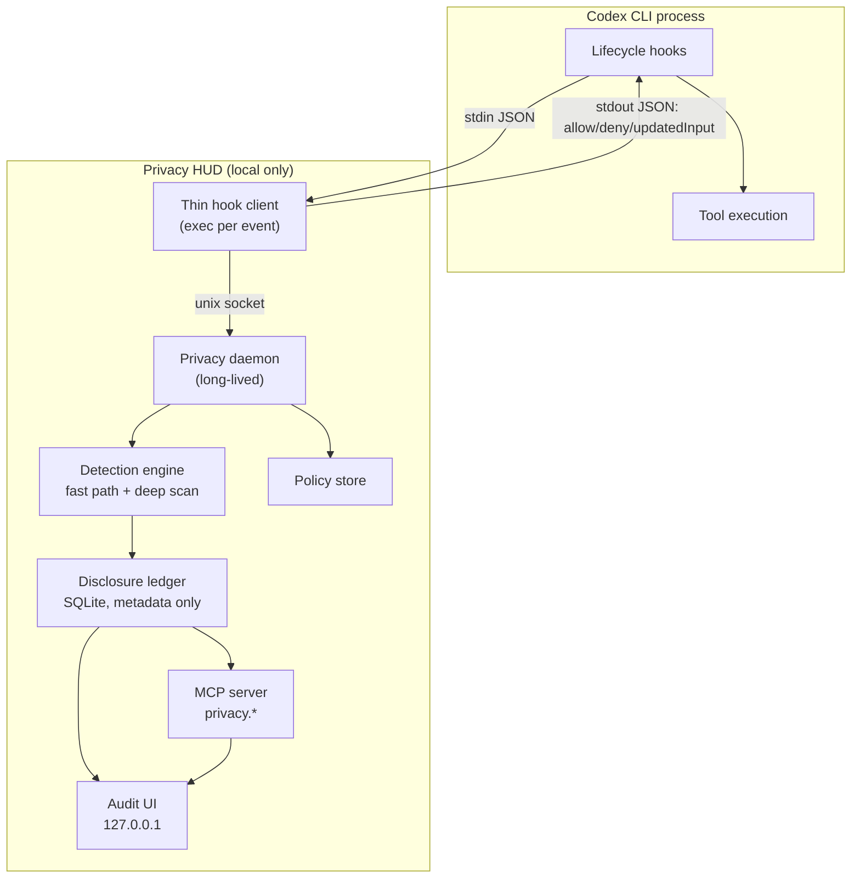
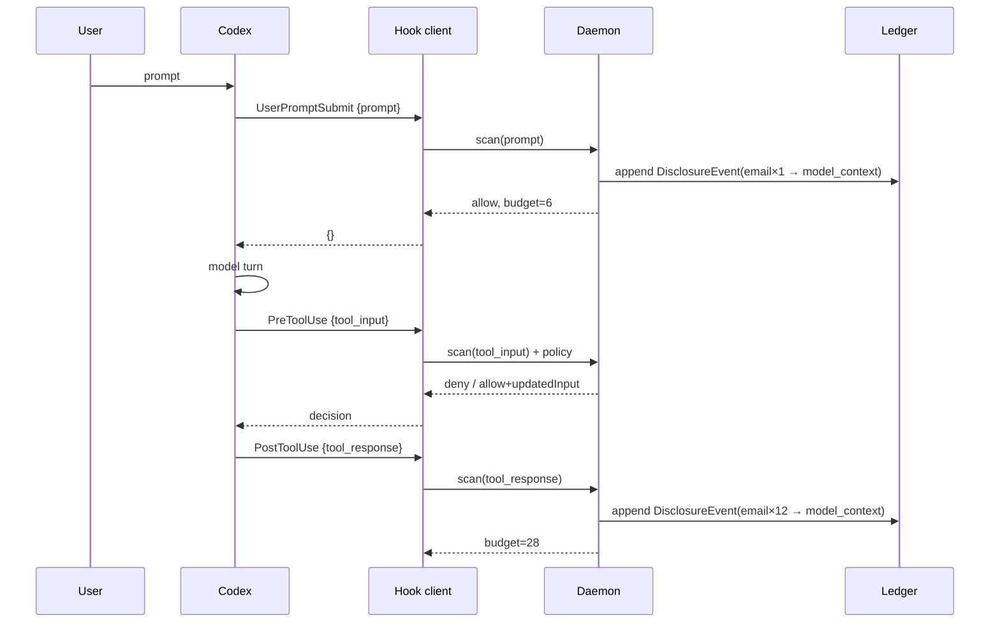

# Codex Privacy HUD — Architecture

**Status:** Draft v0.1 · **Date:** 2026-09-03 · **Companion to:** `PRD.md`, `design.md`

**Current contract — #54 Phase 4 (0.9.0).**

New sessions observed from a genuine SessionStart use evidence-based accounting. Existing sessions and sessions attached after their start retain legacy accounting. Observations, finding outcomes, disclosure identities, and charges are separate. Current hooks do not confirm model-context admission, transmission, or host application of interventions; unresolved evidence withholds the percentage. Historical records remain unchanged. Recipient identity does not establish delivery, inherited subagent content, or causal multi-hop flows.

Runtime selection, writer ownership, read-only readers, daemon policy RPC, and the fenced ledger layout remain required. Accounting activation runs under the daemon's current writer lease and does not change the runtime activation epoch. Generation 5402 requires the activated-accounting implementation introduced in Privacy HUD 0.9.0. A live client must also match the selected runtime build and activation epoch. Snapshot version remains 2; the native HUD does not authenticate runtime alignment.

---

## 1. Component map



Everything inside `plugin` is local. The only sockets that exist are a unix domain socket and a loopback HTTP listener.

---

## 2. Process model

Hooks execute a thin stdlib-only client for each event. Detection and ledger ownership live in a long-running daemon so the model is not loaded in each hook process. The client imports spawn-related modules only on the spawn path.

**Startup.** After validating that receipt v2 selects this bundle, the hook client attempts to connect to `$PLUGIN_DATA/daemon.sock`. A failed connection can trigger a detached daemon launch through the selected bundle's bootstrap and recorded Python interpreter. Auto-spawn can be disabled, and a cooldown limits repeated launch attempts. An absent or unusable runtime selection does not authorize spawning another bundle.

The hook does not wait for the new daemon to become ready. Initial hooks can therefore go unchecked while the model loads. They receive the boundary-specific unavailable response; their missing observations cannot be reconstructed. A handshake failure or a timeout after connection does not trigger a replacement daemon.

**Ownership and lifetime.** The daemon serves concurrent sessions within its plugin-data directory, with state keyed by session ID. Startup ownership and the runtime writer lease prevent cooperating processes from becoming competing writers. One session ending does not stop a daemon still serving another. The lifetime policy uses a five-minute grace after the last live session ends, a four-hour stale-session interval and a four-hour idle timeout.

**Socket protocol.** Communication uses newline-delimited JSON over the local Unix-domain socket. Protocol 2 requires a matching `hello` on the same connection before the client sends a hook payload. Runtime identity includes the selected build and activation epoch. The client forwards only the validated event reply's `output` object to the host; protocol errors are not hook output.

One 2.0-second monotonic deadline covers connection, hello, event transmission and reply. It is not a fresh two seconds for each socket operation. An event whose reply is lost has an unknown outcome and is not replayed.

The daemon's `active_sessions` operation supplies session IDs and ages since their last hook activity. Audit resolution uses an explicit session ID when supplied, otherwise daemon activity when available, and otherwise the ledger's most recently started session. These bases are labelled separately; ledger history alone does not prove which session is currently active.

| Condition | Hook-client response |
|---|---|
| No usable runtime selection | No spawn; an unavailable response, or the initial setup hint when applicable |
| Connection failure after valid selection | Attempt eligible detached startup; return without waiting for readiness |
| Incompatible runtime or handshake | Runtime refusal; no hook payload is sent to an unverified daemon |
| Unchecked ingress | Allow with an unverified warning |
| Unchecked outbound call | Return a denial |
| Lost reply after sending an event | Report unverified; do not replay the event |
| Client-level exception | Exit successfully with empty output |

A returned denial does not establish host enforcement. This process description does not establish that runtime repair can stop every historical daemon or explain every quiescence refusal; #70 and #71 track those separate repair defects.

---

## 3. Context accounting — how the ledger stays correct

This is the core mechanism and the most common place to get the design wrong.

### 3.1 The approach we reject

> "Every time the user sends a request to the LLM, send a parallel audit request that asks a model what sensitive data is now in context."

This fails on three independent grounds:

1. **It is self-defeating.** The audit request would carry the very sensitive data being audited to a model. The audit becomes a disclosure event. A privacy tool cannot be the largest exposure in the session.
2. **It is quadratic.** Context grows monotonically; re-auditing the whole context each turn costs `O(Σ context_size)` — roughly `O(n²)` in turns. A 60-turn session re-reads the same early file contents 60 times.
3. **It is non-deterministic.** A ledger whose entries change between runs on identical input is not an audit. Users cannot act on it, and we cannot test the budget invariants.

### 3.2 The approach we take: event-sourced boundary accounting

**Key insight: we never inspect the context. We observe the edges that write to it.**

The model context is an *account balance*. The ledger records *transactions*. You reconstruct a balance by replaying transactions — you never need to interrogate the account.

Every byte that can enter model context passes through a small, enumerable set of chokepoints, each of which is a hook:

| Direction | Chokepoint | Hook | What it carries |
|---|---|---|---|
| Ingress | User's own text | `UserPromptSubmit` | `prompt` |
| Ingress | Tool results (file reads, command output, MCP responses) | `PostToolUse` | `tool_response` |
| Propagation | Data handed to a subagent | `SubagentStart` | agent context reference |
| Egress | Arguments leaving to a tool or the network | `PreToolUse` | `tool_input` |

Those four edges form a **cut of the data-flow graph**. Nothing reaches the model without crossing one — with the documented exception of hosted tools (§11). So the ledger is complete with respect to the enforceable boundary, and it is built from deterministic local scanning, with zero additional model calls.



### 3.3 Incremental processing without a chunk cache

Each observation is scanned from its own text. There is no content-hash findings cache and no shared 64 MB LRU. Re-reading unchanged content can repeat detector work.

Dispatch separates scanning from policy and ledger work. It computes one `ScanResult` outside the ledger lock and passes that result into `Engine.observe` while holding the lock. This avoids scanning the same observation twice; it does not reuse results from earlier observations or other sessions.

Legacy-accounted sessions and historical rows keep legacy deduplication. It uses `(session_id, value_hash, destination)` and can increment an existing row's repetition count instead of adding a new contribution. That accounting deduplication happens after detection and is not a computational cache. It can also collapse different outcomes; this section does not resolve #47 items 3, 4 or 8.

Processing is incremental over observed payloads rather than a rescan of the full conversation. There is no O(1) unchanged-file reread guarantee. Detection misses and recorded scan gaps remain possible.

### 3.4 Value identity without storing values

Dedupe needs to know "is this the same email I saw before?" without ever writing the email to disk.

```text
value_hash = HMAC-SHA256(key = session_salt, msg = normalized_value)[:16]
session_salt = 32 random bytes, generated at SessionStart,
               held in daemon memory only, destroyed at SessionEnd
```

Consequences, all intentional: hashes are not comparable across sessions, are useless if the DB is stolen, and cannot be brute-forced into the original value without the salt, which never touches disk. Cross-session correlation is therefore impossible by construction — a feature, not a limitation.

The **masked exemplar** (`jo•••@acme.com`) is computed at detection time by a type-specific masker and is the only human-readable residue stored. Maskers are unit-tested to guarantee the original is unrecoverable (e.g. emails keep 2 leading chars + full domain; credentials store *nothing* but their type).

### 3.5 Compaction and receipts

Compaction does not reverse a disclosure or reduce the stored legacy score. The ledger is not reconstructed from the transcript.

No compaction timeline marker is written. `PreCompact` is registered as a hook, but dispatch creates no disclosure observation for it. `PostCompact` is not registered. A non-observation event can refresh daemon liveness without adding a ledger event.

The legacy `detected` and `retention` classifications remain representable and readable, but no production event writer emits those classifications. Their presence in a taxonomy or renderer does not establish local-scan or transcript-retention evidence.

At `SessionEnd`, dispatch ends the ledger session, discards its in-memory identity state, retires its HUD snapshot and returns a text receipt in hook `systemMessage`. The plugin does not save a Markdown receipt file. Returning the receipt does not confirm that the host displayed it, and transcript retention remains outside this ledger's account.

### 3.6 Known imprecision

| Case | Effect | Mitigation |
|---|---|---|
| Codex truncates a large `tool_response` before adding to context | Over-counting | Apply the same truncation heuristic before scanning |
| Model paraphrases PII into its own output | Undetected | Out of scope; documented |
| Tool result discarded by Codex without entering context | Over-counting | Accept — conservative direction is the correct one |
| Hosted tools (WebSearch) | Not covered | Documented in §11 and in the UI |

Where we are imprecise, we are deliberately imprecise **toward over-reporting exposure**. An audit that under-reports is worse than useless.

---

## 4. Detection engine

The shipped stack contains two cheap detectors and one expensive detector:

| Component | Role |
|---|---|
| `PathDetector` | Tier 0: sensitive path patterns |
| `SecretDetector` | Tier 1: credential patterns and entropy checks |
| Shell destination classification | Tier 2: heuristics over command text, outside the detector list |
| `ModelDetector` | Tier 3: local `openai/privacy-filter` token classification |

Presidio is not shipped. Cheap detectors scan each observation's text. Deep scanning applies to non-local destinations, including B3/B4, without a cheap-hit or PII-shape prerequisite. It is skipped entirely above `MAX_TIER3_CHARS` (8192 characters). Missing weights or an unsuccessful applicable scan produce a scan gap, not evidence of a clean payload.

**Outbound deep scanning.** Before #47 items 1 and 6, the engine excluded B3/B4 from deep scanning. It now attempts the applicable scan under the admission and acceptance rules below. The hook client separately uses one 2.0-second deadline across connection, hello, event transmission and reply; an outbound call that cannot be checked receives a denial.

On B3/B4, `engine.TIER3_EGRESS_BUDGET` is a duration (1.0 s) used to construct an absolute monotonic deadline. Egress uses a requested timeout based on the remaining budget and an inclusive completion cutoff; neither guarantees elapsed time. See `engine.TIER3_EGRESS_BUDGET`, which states the exact acceptance condition; this summary must agree with it. At most one egress scan worker is admitted at a time. Admission is nonblocking; the worker retains its slot until it exits, including after caller abandonment. Ingress does not use the egress deadline.

A scan gap means an applicable deep scan supplied no accepted result; the call is then decided on tiers 0-2. Each observed scan gap is recorded per observation and counted per session, including observations with no event row — see §10 below and `docs/known-limits.md` #21.

**Shell destination classification (Tier 2).** `extract_destinations` uses shell tokenization and heuristic checks for network-command names, URLs, host-like arguments, IP literals and other destination patterns. It returns a boundary category, `local` or `external_net`; it does not build a shell AST, resolve Git remotes from configuration or trace pipeline data flow. A recognized `git push` contributes a `git-remote` marker. Tokenization failure is classified as external. External classification selects the applicable policy path; it does not by itself mean the call is denied.

**Interfaces.** Detectors implement `Detector.scan(text, ctx) -> list[Finding]` and declare a `DetectorProfile` containing tier and cost. The engine schedules cheap and expensive detectors by that declaration; availability is separate runtime state. `ModelDetector` implements the expensive local `openai/privacy-filter` detector, and tests can substitute a detector with the same declared profile.

---

## 5. Ledger schema

SQLite at `$PLUGIN_DATA/ledger.db`, mode `0600`, WAL enabled.

```sql
CREATE TABLE sessions (
  session_id   TEXT PRIMARY KEY,
  started_at   INTEGER NOT NULL,
  ended_at     INTEGER,
  cwd          TEXT,
  model        TEXT,
  budget_score REAL NOT NULL DEFAULT 0,
  budget_cap   REAL NOT NULL DEFAULT 120
);

-- Legacy schema; #54's replacement is approved but not implemented here.
-- CLAUDE.md §4 governs the scoped atomic rebuild and preservation of history.
CREATE TABLE events (                     -- legacy UPDATEs: count increments; value_hash NULL at session end
  id            INTEGER PRIMARY KEY,
  session_id    TEXT NOT NULL REFERENCES sessions,
  turn_id       TEXT,
  ts            INTEGER NOT NULL,
  kind          TEXT NOT NULL,            -- exposed|prevented|local_access|detected|retention
  data_type     TEXT NOT NULL,            -- email|credential|person|hostname|path|...
  source        TEXT NOT NULL,            -- support.log | user prompt | tool input
  destination   TEXT NOT NULL,            -- model_context|subagent:<id>|mcp:<server>|net:<host>
  boundary      TEXT NOT NULL,            -- B0..B4
  count         INTEGER NOT NULL DEFAULT 1,
  value_hash    BLOB,                     -- salted, session-scoped; NULL after SessionEnd
  masked_example TEXT,                    -- 'jo•••@acme.com'; NULL for credentials
  budget_delta  REAL NOT NULL DEFAULT 0,
  protection    TEXT,                     -- none|masked|minimized|blocked
  tool_name     TEXT,
  UNIQUE(session_id, value_hash, destination)
);

CREATE TABLE flows (                      -- multi-hop chains for the L3 flow line
  id         INTEGER PRIMARY KEY,
  session_id TEXT NOT NULL,
  value_hash BLOB NOT NULL,
  hop_index  INTEGER NOT NULL,
  node       TEXT NOT NULL
);

CREATE TABLE policy (
  id         INTEGER PRIMARY KEY,
  scope      TEXT NOT NULL,               -- session:<id>
  rule_type  TEXT NOT NULL,               -- mask|block_path|block_command
  selector   TEXT NOT NULL,               -- data_type / destination / origin (#40)
  created_at INTEGER NOT NULL
);

CREATE TABLE policy_tokens (              -- one-shot consent, §8
  token      TEXT PRIMARY KEY,
  session_id TEXT NOT NULL,
  tool_name  TEXT NOT NULL,
  args_hash  BLOB NOT NULL,
  mode       TEXT NOT NULL,               -- allow_once|minimize
  expires_at INTEGER NOT NULL
);
```

**What is deliberately absent:** no `content`, no `prompt`, no `raw_value`, no `file_snippet` column anywhere. The schema is the privacy guarantee — a column that does not exist cannot leak.

At `SessionEnd`: `UPDATE events SET value_hash = NULL WHERE session_id = ?` and the in-memory salt is destroyed. After the Phase 2 rebuild the same update targets `events_legacy_v1`.

### 5.1 Prepared storage (#54 Phase 2, 0.7.9)

Prepared storage: these tables exist from the first genuine new-session boundary after upgrading, and no production writer uses them yet. `PRAGMA user_version` records the generation: `0` legacy, `5401` prepared, `5402` activated (#54 Phase 4). The exact DDL, including every guard trigger, is `src/privacy_hud/ledger_schema.py`; its structural statements are:

```sql
ALTER TABLE events RENAME TO events_legacy_v1;

CREATE TABLE scoring_profiles (
    profile_id TEXT NOT NULL PRIMARY KEY
        CHECK (
            length(profile_id) = 64
            AND profile_id NOT GLOB '*[^0-9a-f]*'
        ),
    format_version INTEGER NOT NULL CHECK (format_version = 1),
    matrix_version TEXT NOT NULL,
    created_at INTEGER NOT NULL CHECK (typeof(created_at) = 'integer'),
    budget_cap REAL NOT NULL
        CHECK (budget_cap > 0 AND budget_cap < 1.0e100),
    parameters_json TEXT NOT NULL
        CHECK (
            json_valid(parameters_json)
            AND json_type(parameters_json) = 'object'
        )
);

ALTER TABLE sessions
    ADD COLUMN accounting_version INTEGER NOT NULL DEFAULT 1
        CHECK (accounting_version IN (1, 2));

ALTER TABLE sessions
    ADD COLUMN accounting_status TEXT NOT NULL DEFAULT 'legacy'
        CHECK (accounting_status IN ('legacy', 'available', 'unavailable'));

ALTER TABLE sessions
    ADD COLUMN profile_id TEXT REFERENCES scoring_profiles(profile_id);

CREATE TABLE observations (
    observation_id TEXT NOT NULL PRIMARY KEY,
    session_id TEXT NOT NULL REFERENCES sessions(session_id),
    delivery_key TEXT NOT NULL,
    action_id TEXT NOT NULL,
    turn_id TEXT,
    ts INTEGER NOT NULL CHECK (typeof(ts) = 'integer'),
    hook_event TEXT NOT NULL CHECK (hook_event IN (
        'SessionStart', 'SessionEnd', 'UserPromptSubmit',
        'PreToolUse', 'PostToolUse', 'SubagentStart',
        'SubagentStop', 'PreCompact'
    )),
    phase TEXT NOT NULL CHECK (phase IN ('pre', 'post', 'lifecycle')),
    action_kind TEXT NOT NULL CHECK (action_kind IN (
        'read', 'tool', 'prompt', 'subagent', 'lifecycle', 'other'
    )),
    boundary TEXT NOT NULL CHECK (boundary IN ('B0', 'B1', 'B2', 'B3', 'B4')),
    decision TEXT NOT NULL CHECK (decision IN ('none', 'allow', 'deny', 'rewrite')),
    evidence INTEGER NOT NULL
        CHECK (typeof(evidence) = 'integer' AND evidence BETWEEN 0 AND 2047),
    resolution_scope TEXT NOT NULL DEFAULT 'none'
        CHECK (resolution_scope IN ('none', 'pairs', 'boundary')),
    potential_crossing INTEGER NOT NULL
        CHECK (potential_crossing IN (0, 1)),
    scan_gap TEXT CHECK (scan_gap IN ('oversize', 'unavailable', 'busy', 'timeout')),
    UNIQUE (session_id, delivery_key),
    UNIQUE (session_id, observation_id),
    CHECK ((evidence & 2) = 0 OR decision = 'deny'),
    CHECK ((evidence & 8) = 0 OR decision = 'rewrite'),
    CHECK ((evidence & 1) = 0 OR decision IN ('allow', 'rewrite')),
    CHECK (resolution_scope = 'none' OR (evidence & 212) <> 0),
    CHECK (scan_gap IS NULL OR phase <> 'lifecycle')
);

CREATE INDEX observations_action
    ON observations(session_id, action_id, boundary, ts, observation_id);

CREATE TABLE subjects (
    subject_id TEXT NOT NULL PRIMARY KEY,
    session_id TEXT NOT NULL REFERENCES sessions(session_id),
    subject_kind TEXT NOT NULL CHECK (subject_kind IN ('value', 'file')),
    resolution TEXT NOT NULL CHECK (resolution IN ('resolved', 'unresolved')),
    identity_hash BLOB CHECK (
        identity_hash IS NULL
        OR (typeof(identity_hash) = 'blob' AND length(identity_hash) = 32)
    ),
    label TEXT NOT NULL,
    unresolved_observation_id TEXT,
    UNIQUE (session_id, subject_id),
    FOREIGN KEY (session_id, unresolved_observation_id)
        REFERENCES observations(session_id, observation_id),
    CHECK (
        (resolution = 'resolved' AND unresolved_observation_id IS NULL)
        OR
        (resolution = 'unresolved'
         AND identity_hash IS NULL
         AND unresolved_observation_id IS NOT NULL)
    )
);

CREATE UNIQUE INDEX subjects_identity
    ON subjects(session_id, subject_kind, identity_hash)
    WHERE identity_hash IS NOT NULL;

CREATE TABLE recipients (
    recipient_id TEXT NOT NULL PRIMARY KEY,
    session_id TEXT NOT NULL REFERENCES sessions(session_id),
    destination_kind TEXT NOT NULL CHECK (destination_kind IN (
        'local', 'model_context', 'subagent', 'mcp_tool', 'external_net'
    )),
    resolution TEXT NOT NULL CHECK (resolution IN ('resolved', 'unresolved')),
    identity_hash BLOB CHECK (
        identity_hash IS NULL
        OR (typeof(identity_hash) = 'blob' AND length(identity_hash) = 32)
    ),
    label TEXT NOT NULL,
    unresolved_observation_id TEXT,
    UNIQUE (session_id, recipient_id),
    FOREIGN KEY (session_id, unresolved_observation_id)
        REFERENCES observations(session_id, observation_id),
    CHECK (
        (resolution = 'resolved' AND unresolved_observation_id IS NULL)
        OR
        (resolution = 'unresolved'
         AND identity_hash IS NULL
         AND unresolved_observation_id IS NOT NULL)
    )
);

CREATE UNIQUE INDEX recipients_identity
    ON recipients(session_id, destination_kind, identity_hash)
    WHERE identity_hash IS NOT NULL;

CREATE TABLE events (
    id INTEGER PRIMARY KEY,
    session_id TEXT NOT NULL REFERENCES sessions(session_id),
    observation_id TEXT NOT NULL,
    subject_id TEXT NOT NULL,
    recipient_id TEXT NOT NULL,
    kind TEXT NOT NULL CHECK (kind IN (
        'detected', 'local_access', 'permitted',
        'exposed', 'prevented', 'retention'
    )),
    evidence INTEGER NOT NULL
        CHECK (typeof(evidence) = 'integer' AND evidence BETWEEN 0 AND 2047),
    data_type TEXT NOT NULL CHECK (data_type IN (
        'credential', 'financial', 'health', 'email', 'phone',
        'person', 'address', 'ssn', 'account', 'url', 'date',
        'hostname', 'path', 'ip', 'repo'
    )),
    rule_id TEXT,
    occurrences INTEGER NOT NULL DEFAULT 1
        CHECK (typeof(occurrences) = 'integer' AND occurrences >= 1),
    source_label TEXT NOT NULL,
    source_kind TEXT CHECK (source_kind IN ('path', 'command')),
    boundary TEXT NOT NULL CHECK (boundary IN ('B0', 'B1', 'B2', 'B3', 'B4')),
    masked_example TEXT,
    FOREIGN KEY (session_id, observation_id)
        REFERENCES observations(session_id, observation_id),
    FOREIGN KEY (session_id, subject_id)
        REFERENCES subjects(session_id, subject_id),
    FOREIGN KEY (session_id, recipient_id)
        REFERENCES recipients(session_id, recipient_id),
    UNIQUE (observation_id, subject_id, recipient_id, kind),
    UNIQUE (session_id, id, subject_id, recipient_id),
    CHECK (kind <> 'exposed' OR (boundary <> 'B0' AND (evidence & 64) <> 0)),
    CHECK (kind <> 'permitted' OR (evidence & 1) <> 0),
    CHECK (kind <> 'prevented' OR (evidence & 150) <> 0),
    CHECK (kind <> 'local_access' OR (boundary = 'B0' AND (evidence & 32) <> 0)),
    CHECK (kind <> 'detected' OR (evidence & 256) <> 0),
    CHECK (kind <> 'retention' OR (evidence & 512) <> 0),
    CHECK (data_type NOT IN ('credential', 'path') OR masked_example IS NULL)
);

CREATE INDEX events_session_kind
    ON events(session_id, kind, id);

CREATE INDEX events_session_subject_recipient
    ON events(session_id, subject_id, recipient_id, id);

CREATE TABLE disclosures (
    disclosure_id INTEGER PRIMARY KEY,
    session_id TEXT NOT NULL REFERENCES sessions(session_id),
    subject_id TEXT NOT NULL,
    recipient_id TEXT NOT NULL,
    first_event_id INTEGER NOT NULL,
    charged_data_type TEXT NOT NULL CHECK (charged_data_type IN (
        'credential', 'financial', 'health', 'email', 'phone',
        'person', 'address', 'ssn', 'account', 'url', 'date',
        'hostname', 'path', 'ip', 'repo'
    )),
    profile_id TEXT NOT NULL REFERENCES scoring_profiles(profile_id),
    group_n INTEGER NOT NULL
        CHECK (typeof(group_n) = 'integer' AND group_n >= 1),
    budget_delta REAL NOT NULL
        CHECK (budget_delta >= 0 AND budget_delta < 1.0e100),
    FOREIGN KEY (session_id, subject_id)
        REFERENCES subjects(session_id, subject_id),
    FOREIGN KEY (session_id, recipient_id)
        REFERENCES recipients(session_id, recipient_id),
    FOREIGN KEY (session_id, first_event_id, subject_id, recipient_id)
        REFERENCES events(session_id, id, subject_id, recipient_id),
    UNIQUE (session_id, subject_id, recipient_id),
    UNIQUE (session_id, charged_data_type, recipient_id, group_n),
    UNIQUE (first_event_id)
);
```

Guards: scoring profiles are immutable; a session's accounting version, profile, cap and start time are frozen and its score is monotonic; `observations`, `events`, `disclosures`, `coverage` and `scan_gaps` are append-only; identity metadata is immutable, and an identity hash can only be erased, and only after its session ended.

**Genuine-start procedure.**

1. Acquire `State.lock`.
2. `BEGIN IMMEDIATE`.
3. Re-read the session ID and schema marker.
4. If the ID exists, preserve it; do not rebuild merely because its start was replayed.
5. For an absent ID and legacy schema, execute the Phase 2 migration.
6. Insert the triggering session as version 1 and insert its coverage row.
7. Commit.
8. Create/use its legacy engine state and publish its legacy snapshot.

Any error rolls back the complete boundary operation. The triggering session is not left half-created.

**Legacy writes after migration.**

Keep the public `Ledger.record(...) -> float` signature. It checks the session version and dispatches only version 1 to `_record_legacy`.

Within one write transaction:

- Discover the legacy table.
- Select its actual columns.
- Preserve the existing dedupe key and `contribution(..., 1, ...)` arithmetic.
- Omit `source_kind` from inserts if the historical table lacks it.
- Commit insertion/count increment and score increment together.

`record` refuses any session that is not legacy-accounted. A late record for an ended session is kept with a NULL value hash and zero contribution; the ended session's score stays frozen, and dispatch enforces the call with a temporary engine whose salt never becomes session state.

Readers open with `initialize=False` and never run the rebuild. `scripts/check-issue54-ledger.py` rehearses it on a private copy of a real ledger.

### 5.2 Storage layout (#66, 0.8.0)

Storage layout is a separate contract from the accounting generation above. `PRAGMA user_version` still records `0` legacy, `5401` prepared, `5402` activated; the layout version records where those bytes live and who may open them. Layout 1 is:

```text
$PLUGIN_DATA/ledger/active.db          the ledger every surface opens
$PLUGIN_DATA/ledger.db/                a directory: the historical pathname, fenced
$PLUGIN_DATA/legacy-retired/<id>/      the retained original and its sidecars
$PLUGIN_DATA/runtime-transition.json   the transition journal
$PLUGIN_DATA/runtime-transition.lock   transition exclusion
$PLUGIN_DATA/runtime-writer.lock       writer exclusion
```

`codex.ledger_path` answers which of the two states an installation is in: the active store once the historical pathname is a directory, and the historical pathname until then. The two never coexist — the transition retires one as it publishes the other — so this is a question about state, not a search. Nothing else spells the historical basename out; `tests/test_issue66_contract.py` asserts that.

The transition is performed only by explicit repair, never by a hook, and it is journalled stage by stage so an interrupted one can be finished rather than restarted: `validated`, `quiesced`, `backup_verified`, `retirement_started`, `legacy_retired`, `legacy_fenced`, `active_published`. A crash at any of them leaves either the complete old state or the complete new one, and the values in both are the values that were there.

What the fence is and is not: it stops supported legacy entry points opening the historical pathname, because a directory is not a database. It does not revoke a connection something already holds, and it is not a boundary against same-user code that deliberately opens `ledger/active.db`. Before the transition runs, every process holding the database or a sidecar must be gone — asked of the operating system, unknown processes included, and a host that cannot be asked refuses rather than proceeds.

Writes go through the compatible daemon, which holds an exclusive lease on `runtime-writer.lock` for as long as it owns the ledger; every other surface opens `mode=ro`. An unsupported or altered schema is preserved and refused before any writable open, and no downgrade migration exists.

Readers open existing ledgers read-only, without initialization, migration, or activation. Browser and MCP policy actions use the matching daemon's policy RPC. The daemon remains the sole production ledger writer.

`scripts/check-issue66-runtime.py` rehearses the whole transition on a private copy of a real ledger, including a crash at every durable stage and the actual historical initializer against the fence.


---

## 6. Budget engine

Pure functions over ledger rows, no I/O, fully unit-testable without Codex:

```python
SEVERITY = {"credential": 50, "financial": 12, "health": 12,
            "email": 6, "phone": 6, "person": 6, "address": 6, "ssn": 6,
            "hostname": 2, "path": 2, "ip": 2, "repo": 2}
DEST_MULT = {"B1": 1.0, "B2": 0.3, "B3": 1.5, "B4": 2.0}

def volume(n):      return 1 + math.log(n)
def contribution(t, n, b): return SEVERITY[t] * volume(n) * DEST_MULT[b]
def percent(score, cap):   return min(100, round(100 * score / cap))
```

The four invariants from `PRD.md` §5.3 are encoded as property tests. This module is built first because it needs nothing else, and it is the piece a judge is most likely to challenge.

---

## 7. Hook dispatch

`hooks/hooks.json`, bundled in the plugin:

```json
{
  "description": "Codex Privacy HUD — local disclosure ledger and enforcement",
  "hooks": {
    "SessionStart":      [{ "hooks": [{ "type": "command", "command": "$PLUGIN_ROOT/hooks/handler.py", "timeout": 5 }] }],
    "UserPromptSubmit":  [{ "hooks": [{ "type": "command", "command": "$PLUGIN_ROOT/hooks/handler.py", "timeout": 5 }] }],
    "PreToolUse":        [{ "matcher": ".*", "hooks": [{ "type": "command", "command": "$PLUGIN_ROOT/hooks/handler.py", "timeout": 5, "statusMessage": "privacy check" }] }],
    "PostToolUse":       [{ "matcher": ".*", "hooks": [{ "type": "command", "command": "$PLUGIN_ROOT/hooks/handler.py", "timeout": 5 }] }],
    "SubagentStart":     [{ "hooks": [{ "type": "command", "command": "$PLUGIN_ROOT/hooks/handler.py", "timeout": 5 }] }],
    "SubagentStop":      [{ "hooks": [{ "type": "command", "command": "$PLUGIN_ROOT/hooks/handler.py", "timeout": 5 }] }],
    "PreCompact":        [{ "hooks": [{ "type": "command", "command": "$PLUGIN_ROOT/hooks/handler.py", "timeout": 5 }] }],
    "SessionEnd":        [{ "hooks": [{ "type": "command", "command": "$PLUGIN_ROOT/hooks/handler.py", "timeout": 3 }] }]
  }
}
```

One entrypoint for all events; the daemon dispatches on `hook_event_name`. All hooks are synchronous — see the platform note below for why `PostToolUse`/`PreCompact` are no longer marked `async: true`, and §10 for the latency consequence and its mitigation. `PreToolUse` was always synchronous because it must be able to deny.

Codex provides `PLUGIN_ROOT` and `PLUGIN_DATA` for plugin-bundled hooks; the ledger and socket live under `PLUGIN_DATA`. (Observed in practice as aliases of `CLAUDE_PLUGIN_ROOT`/`CLAUDE_PLUGIN_DATA` — see the platform note.)

**Plugin manifest location.** The plugin manifest lives at `.codex-plugin/plugin.json`, with a matching `.agents/plugins/marketplace.json` for installation (`codex plugin marketplace add <dir-or-owner/repo>` requires a marketplace manifest at the install root). These are the first two paths Codex 0.154 checks (`core-plugins/src/marketplace.rs` lists `.agents/plugins/marketplace.json`, `.agents/plugins/api_marketplace.json`, `.claude-plugin/marketplace.json`, `.cursor-plugin/marketplace.json`, in that order; the plugin manifest's primary path is `.codex-plugin/plugin.json` with `.claude-plugin/plugin.json` as the compatibility alternate). There is exactly one manifest location — do not also ship a `.claude-plugin/` directory; a second manifest means one of them is stale and nobody can tell which by looking. Switched from `.claude-plugin/` on 2026-09-15 after installing the new layout through `codex plugin marketplace add` + `codex plugin add` against Codex 0.154.0.

> **Platform note (Task 9 smoke test, Codex CLI 0.145.0, observed 2026-09-03):** two things in this section were corrected after live testing against a real Codex install and are recorded here so they are not silently re-derived (and gotten wrong again) from an older draft of this doc or from first principles:
>
> 1. **Manifest directory.** An earlier draft of this doc, and the brief for Task 9, specified `.codex-plugin/plugin.json`. Against real Codex CLI 0.145.0, a directory containing only `.codex-plugin/plugin.json` is rejected by `codex plugin marketplace add` with `marketplace root does not contain a supported manifest`. Every plugin actually installed and working on the test machine (including OpenAI's own `openai-codex` plugin) uses `.claude-plugin/plugin.json` + `.claude-plugin/marketplace.json` — the same layout Claude Code plugins use. This doc and the shipped plugin used `.claude-plugin/` from then until 2026-09-15. *Superseded:* the rejection was about the missing marketplace manifest, not about `.codex-plugin/`; with `.agents/plugins/marketplace.json` beside it, `.codex-plugin/plugin.json` is the native layout and installs on 0.154.0 (see the paragraph above).
> 2. **`async: true` is not implemented.** Codex CLI 0.145.0 logs `skipping async hook ...: async hooks are not supported yet` for any hook entry marked `async: true`, and never executes it — confirmed by installing a `hooks.json` with `PostToolUse` marked async (it never ran, no error surfaced to the user) versus an identical fixture without the flag (it ran and completed on every tool call). `hooks.json` above no longer sets `async` anywhere; see §10 for what synchronous `PostToolUse` costs and how that cost is bounded.
>
> Both were reproduced directly (install failure / success, and hook-fired / hook-skipped) against a live Codex install, not inferred from documentation. If a future Codex release changes either behavior, update this note with the version observed rather than deleting it — the failure mode this note prevents is a future reader re-deriving the wrong answer from the official docs.

---

## 8. Enforcement and the unshipped consent workflow

The engine can return an allow decision, a denial, or rewritten tool input. Dispatch translates these into the host's hook output. A denial is returned in `hookSpecificOutput.permissionDecision`; a rewrite is returned through `updatedInput`. Neither response confirms that the host applied it.

A saved mask rule selects an outbound call by detected data type, without a source restriction. When that rule selects an otherwise eligible call, the rewriter receives all findings from the call, including other detected types. Origin-rule denials take precedence, and mask rules do not weaken the built-in handling of hard-blocked types.

`minimize_tool_input` rewrites detected spans in the supplied tool arguments. For supported string-command tools it returns rewritten command text; for structured MCP arguments it rewrites the scanned JSON text and parses the result. It does not read files named by a command. No `privacy-minimize` executable is shipped, and no file-upload rewrite through such a helper is implemented.

Pseudonyms are stable within a session for the same data type and value. This describes the returned input, not confirmed delivery or successful completion of the original task.

The proposed deny → review → consent token → retry workflow is not shipped. No browser button, `$privacy` branch or exposed MCP tool offers `Allow once`, `Minimize & retry`, a before/after preview or a consent-driven retry.

Internal token primitives remain implemented and tested. Tokens bind the session, tool and hash of canonical tool arguments, expire after 120 seconds and are single-use. `Engine.observe` can consume them in its built-in block branch, but no shipped user-facing surface mints them. Origin-rule denials are decided before that branch.

Already disclosed data cannot be recalled from this session.

---

## 9. MCP server and UI delivery

Local stdio MCP server, declared in `.codex-plugin/plugin.json` as `mcpServers`
and launched by Codex as host `python3 ./mcp/server.py`; the script re-executes
itself under the interpreter `runtime.json` pins, because Codex does not expand
`${PLUGIN_ROOT}` in an MCP `command`.

It exposes only tools that cannot loosen what the plugin enforces, because an
MCP tool is called by the model: `privacy.get_session_summary`,
`privacy.list_exposures`, `privacy.get_exposure_detail`,
`privacy.read_guard_status`, `privacy.update_policy`. `privacy.allow_once`,
`privacy.read_guard_set` and `privacy.hud_toggle` are deliberately not exposed
(`mcp/server.py::EXPOSED_TOOLS`).

Withholding three tools is only half of that. `privacy.update_policy` is a
write, and a user `mask` rule used to outrank the plugin's one unconditional
deny: `Engine.observe` reads policy *ahead of* its own matrix defaults, and
the default deny only runs while the action is still `allow`. What makes
"cannot loosen" a property of the code is that the mask branch is now skipped
whenever the observation carries a finding of a
`matrix.loader.HARD_BLOCKED_DATA_TYPES` type, whatever the rule's selector
says — the observation falls through to `Matrix.default_action(destination)`,
which is `block` for `mcp_tool`/`external_net` and `mask` for
`model_context`/`subagent`, so the rule never yields to anything weaker than
it asked for. Observations carrying no hard-blocked finding are decided by
the rule exactly as before.

The guard is in that branch and not at the rule's mint site because the
branch intersects its selectors with *every* finding on the observation, not
with the finding that triggers the block: a `mask` rule on any type that
merely co-occurs with a credential — a path on the same command line, which
is what one click of the audit UI's "Save mask rule for detected <type>" on a path
exposure writes — skipped the block for the whole call. Those selectors are
innocuous, so no refusal keyed on a selector reaches that case.
`mcp_tools.apply_policy` still refuses a `mask` rule whose selector *is* a
hard-blocked type, keyed off the same `HARD_BLOCKED_DATA_TYPES` so the two
cannot drift — now because such a rule would decide nothing while reporting
success, with no path to remove it (known limit 13), and as defence in depth
if the branch's guard is ever lost.
`tests/test_mcp_surface.py::test_no_exposed_tool_can_turn_a_deny_into_an_allow`
checks the property as behaviour, with a co-occurring finding in its payload.

`read_guard_set` returns the same shape `read_guard_status` does, plus an `error` string when `settings.json` could not be written — the caller is the `$privacy` skill's heredoc, where a raised `PermissionError` would be a traceback and no statement of what the setting now says. Reads still fail open: this is not a hook path (I6).

**UI delivery.** Codex Desktop does not currently render MCP Apps inline iframe resources ([openai/codex#21019](https://github.com/openai/codex/issues/21019)), and `tui.status_line` accepts only built-in item identifiers. So:

- **L2/L3** — the `$privacy` skill uses the bundled runtime launcher to start a separate `local_ui_server` process serving static HTML + vanilla JS on `127.0.0.1:<ephemeral>`. The hook daemon serves the Unix-domain socket, not HTTP. The skill prints the browser URL and an ASCII audit fallback.
  - **Which session either surface shows** is resolved by `mcp_tools.resolve_audit_session`: an explicit `$privacy <id>` wins, otherwise the daemon's `active_sessions` op (§2) names the session that fired a hook most recently, and only if the daemon cannot be asked does it fall back to the ledger's most-recently-*started* session — labelled as that, never as the caller's own. The skill reports concurrent active sessions; the browser labels the selected session by its full ID. `local_ui_server`'s default (`/api/session` with no `session_id`) goes through the same function but separately timed resolutions can select different sessions; the skill therefore pins its selected ID in the browser URL, and so does `ambient` — on its own much slower clock (`ambient.RESOLVE_INTERVAL`, ~30 s, against a 2 s redraw), because the identity question is the one thing the ledger cannot answer while the ambient *reading* stays a snapshot-file poll. All three surfaces therefore name one session at a time. See README known limit 8, including why the ambient line carries no marker for session ambiguity: `⚠unverified` means the record has a hole, not "I am unsure whose record this is", and one glyph cannot carry both.
  - **What the skill's terminal audit header claims** follows from its resolution: `render.audit(..., resolved=)` writes the subtitle from `ResolvedSession.basis` (`Current session` only for a single daemon-named live session; `Session <id>`, `Most recently active session`, `Most recently started session`, `No session on record` otherwise). The browser and its ASCII view pass `session_id` and show `Session <full ID>`. Without either an ID or a resolution, the renderer shows `Session ID unknown`.
- **L1** — `privacy_hud.ambient` (entry point `privacy_hud.ambient:main`, console script `privacy-hud-ambient`): a standalone process the user runs in a second terminal pane, which reads the contract A snapshot `$PLUGIN_DATA/hud/<session_id>.json` (written by the daemon) and redraws `render.hud_line()` in place. The fallback when no patched build matches the installed Codex version; not a Codex status item itself.
- **Alerts** — hook `systemMessage`, which is native and always available.

The MCP tools return structured JSON regardless, so when Codex renders MCP UI the same data powers it with no rework.

**Native status-line item.** The patched Codex TUI and ambient pane read contract A from `$PLUGIN_DATA/hud/<session_id>.json`. In 0.7.8 `HudPublisher.publish(session_id, summary=..., unverified=...)` writes snapshot v2 with an accounting discriminator and nullable quantities. Production publishes only unrecorded accounting 0 or legacy accounting 1. Both updated readers accept v1 as legacy; old patched readers reject v2. `_daemon.json` remains independently versioned at 1. Snapshot writes are atomic, age greater than 30 seconds is stale, and `SessionEnd` retires the snapshot. `hud_line(reading, width)` uses complete bar-free candidates such as `Privacy legacy 28% · 2 prevented rows`; the Rust item returns the full line. Contract B changes hidden/timestamp on valid readings and does nothing for missing or malformed snapshots. `$privacy hud` invokes Python helpers through the skill; it is not an exposed MCP tool. Contract C is the install manifest reversed by uninstall. The user's official binary remains unchanged; version matching by the forwarder does not establish snapshot compatibility. See the patched-status-line spec and `patches/README.md` for rollout and test limits.

---

## 10. Concurrency and performance

- **One daemon, many sessions.** State is keyed by `session_id` throughout; there is no global mutable session state.
- **Writes serialized** through a single SQLite connection in WAL mode; the UI reads on a separate read-only connection.
- **No chunk cache.** Findings are not reused across observations or sessions. Legacy ledger deduplication can avoid another score contribution, but it does not avoid scanning an unchanged payload again.

**Latency limits.** The original design estimates and measurements on short inputs do not establish current completion bounds. The hook client uses the shared 2.0-second deadline described in §2. Outbound deep scanning uses the admission and result-acceptance rules in §4; ingress does not use the egress deadline. Neither the input cap nor these deadlines guarantee detector wall-clock completion.

**`PostToolUse` is synchronous.** The host behavior recorded in §7 is why these hooks are not configured as asynchronous. Tool results can contain large payloads, and an applicable `openai/privacy-filter` scan can exceed the hook client's waiting budget. A size cap limits the input offered to the model; it does not establish a latency guarantee. If the client cannot obtain a usable ingress reply, it reports the observation as unverified.

**Why the current cap is stated in characters.** `MAX_TIER3_CHARS` is 8192 characters, not a byte limit. Above it, the entire deep scan is skipped and an applicable observation records an `oversize` scan gap. The cap does not establish a 40 ms scan time, a 150 ms completion bound or complete detection. Cheap detectors still inspect the full observation text.

**Cheap scanning and classification.** `PathDetector` and `SecretDetector` scan the full observation text without the deep-scan size cap. Shell destination classification is a separate heuristic over command text, not a structural parse of every tool result. An oversized applicable observation skips the entire deep scan; no prefix is scanned.

**Scan-gap recording.** Each observed scan gap is recorded per observation in the append-only `scan_gaps` table and counted per session by `Ledger.coverage`. An observation with no findings can have a scan gap without producing an event row. The audit reports incomplete scanning through its scan-gap banners; the stored gap count does not identify which calls had gaps. See `design.md` §5 and `docs/known-limits.md` #21.

---

## 11. Threat model and limits

**In scope.** Accidental disclosure by a well-intentioned agent acting on a user's instructions — the overwhelmingly common case.

**Out of scope, and stated plainly in the demo:**

1. **Hosted tools bypass hooks.** WebSearch and similar do not trigger local function-tool hook paths. Practical guardrail, not a complete enforcement boundary.
2. **A malicious user** can uninstall the plugin. We defend the user, not against them.
3. **Prompt injection** can try to talk the agent out of cooperating — but enforcement lives in the hook layer, which the model cannot bypass. This is the main argument for hooks over prompt-based guardrails.
4. **Side channels** — a determined agent could encode data to evade regex/NER. Detection is heuristic.
5. **Model memorization** — nothing recalls data once disclosed.

**Self-audit requirement.** The plugin runtime makes no outbound network requests: offline settings override inherited values, model loading is local-only, and an unsafe preloaded ML stack disables tier 3 rather than permitting network access. On the committed self-audit corpus, the clean half must yield zero exposures and the planted half must be found (`tests/test_self_audit.py`). *(This said "running Privacy HUD on its own development session must yield zero exposures; this is a test, not an aspiration". It was neither: three read-only source reviews measured 88%, 100% and 100% of budget, and no test existed. `docs/self-audit.md` has the replacement, and why the old form was an invalid requirement rather than an untestable one.)*

---

## 12. Testing strategy

| Layer | Approach | Needs Codex? |
|---|---|---|
| Budget engine | Property tests for the four invariants | No |
| Detectors | Golden corpus of synthetic PII + secrets; precision/recall thresholds | No |
| Shell parser | Table-driven over ~40 egress command shapes | No |
| Ledger | Idempotency: replay the same event 100× → one row, one delta | No |
| Hook client | Fixture hook payloads on stdin → assert stdout JSON | No |
| Consent loop | Token mint → consume → replay must fail | No |
| End-to-end | Scripted Codex session; assert receipt matches expectation | Yes |
| Self-audit (corpus) | `tests/fixtures/self_audit/`; clean half silent, planted half found | No |
| Self-audit (session) | Run the plugin on a real session and record what it scored | Yes |

Everything except the two `Yes` rows runs without Codex, which is what makes the build order in `PRD.md` §11 viable — the hard platform integration is isolated to one thin, fixture-testable client. The self-audit is split across both because the corpus half needs no session and the session half cannot be faked by one.

---

## 13. Historical build order

The original implementation sequence was ledger and budget functions, detection, hooks and daemon integration, audit surfaces, tool-argument rewriting, and ambient displays.

The shipped deep detector is local `openai/privacy-filter`, not Presidio. Internal consent-token primitives exist, but no shipped surface issues consent tokens. Both the patched-Codex status item and the companion pane exist. Session receipts are text returned through hook `systemMessage`, not Markdown exports.

This historical sequence is not the release plan for accounting activation. Accounting is governed by the current contract at the top of this document.

---

## References

- Codex Hooks — https://learn.chatgpt.com/docs/hooks
- Build plugins — https://learn.chatgpt.com/docs/build-plugins
- Codex configuration reference — https://learn.chatgpt.com/docs/config-file/config-reference
- Codex App Server — https://learn.chatgpt.com/docs/app-server
- MCP Apps inline UI not rendered in Codex Desktop — https://github.com/openai/codex/issues/21019
