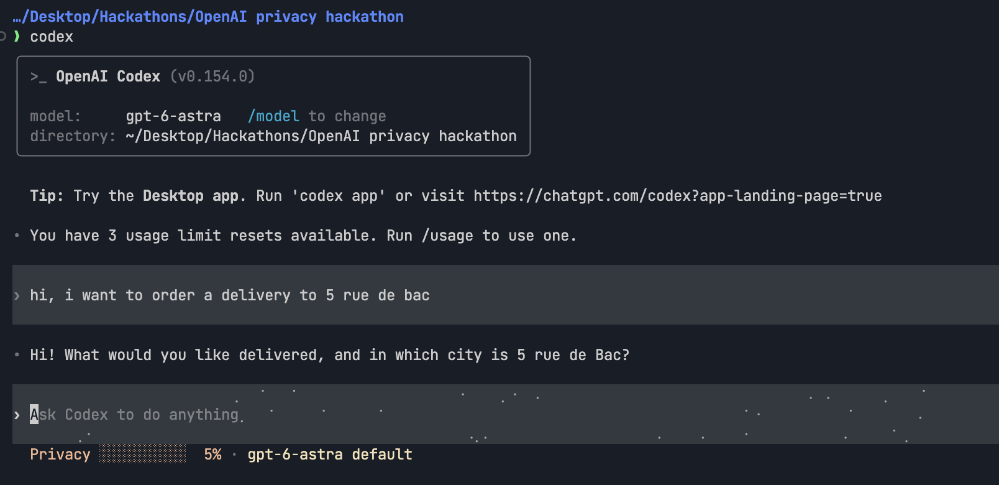
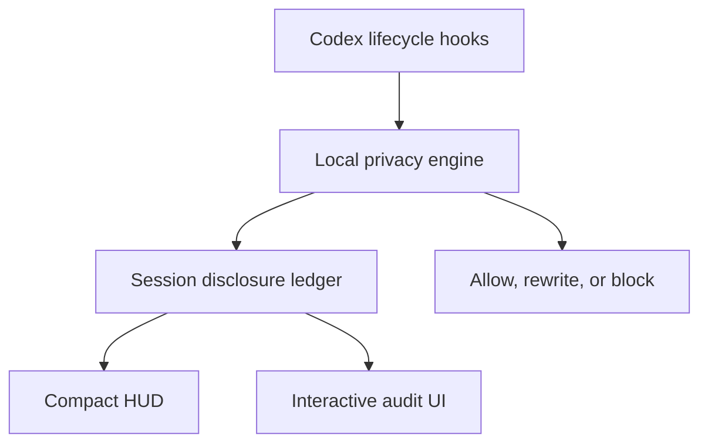

# Codex Privacy HUD



[](https://github.com/inin-zou/codex-privacy-hud/actions/workflows/ci.yml)
[](LICENSE)
[](https://github.com/inin-zou/codex-privacy-hud/stargazers)

English | [简体中文](README.zh-CN.md)

> Trace your privacy disclosure the same way you already trace your token usage — live, in every conversation.

> **See what your agent knows. Control where it goes.**

A local-first Codex plugin that maintains a live **disclosure ledger** for every Codex session, minimizes sensitive context **before** tool execution, and lets you inspect what it observed crossing each boundary — into model context, out to an MCP tool, out to an external host.

Boundary, not recipient: a second MCP server is not a second destination today, and what a subagent inherited is not recorded at all (limits 19 and 20).

Detection runs on your own machine, via [`openai/privacy-filter`](https://huggingface.co/openai/privacy-filter) loaded locally through `transformers` — no prompt, file, or secret is ever sent anywhere to be scanned. The plugin makes no outbound network calls at all; the only socket it opens is a local one to its own daemon on `127.0.0.1`.

```text
Token HUD:    How much context has been consumed?
Privacy HUD:  How much sensitive context has been disclosed?
```


**Before you rely on it:** the start of a session is not monitored while the model loads, hosted tools bypass hooks, and detection is heuristic. The HUD marks a session whose record has a known hole rather than showing it as a clean 0%, but it cannot tell you what it missed. Read the [known limits](#known-limits).

---

- [News](#news)
- [Install](#install)
- [What you see](#what-you-see)
- [How it works](#how-it-works)
- [Known limits](#known-limits)
- [Configuration](#configuration)
- [Troubleshooting](#troubleshooting)
- [Uninstall](#uninstall)
- [Installing by hand](#installing-by-hand)
- [Documentation](#documentation)
- [License](#license)

## News

- 2026-09-15: patched Codex 0.154.0 builds for `aarch64-apple-darwin` and `x86_64-apple-darwin` are published on the GitHub release `codex-0.154.0-hud` and on the rolling `latest`. `install.sh` finds them.
- 2026-09-15: the `privacy` status-line item now renders inside a patched Codex, and the macOS install is one command.
- 2026-09-21: the self-audit claim was withdrawn and replaced. Three read-only source-review sessions measured 88%, 100% and 100% of budget, against an invariant that said zero. What replaces it is a committed corpus with both controls — see [`docs/self-audit.md`](docs/self-audit.md), which also records the three planted values the detectors miss.
- 2026-09-05: verified by hand against Codex CLI 0.153.0 that one session reading `src/privacy_hud/budget.py` recorded zero events, budget 0.0/120.0. That run was real; the general claim drawn from it was not.

## Install

Verified end-to-end against a real Codex CLI install on 0.145.0 and 0.153.0.

### Before you start

- **macOS** on Apple Silicon or Intel. (Linux and Windows are not packaged; see [Installing by hand](#installing-by-hand) for the fallback pane.)
- **Codex CLI** already installed and signed in — `codex --version` prints something like `codex-cli 0.154.0`. The installer needs that number to pick the matching patched build.
- **Python 3.11 or newer** on your `PATH` (`python3 --version`). On a Mac without one: `brew install python@3.12`.
- About **3 GB of disk** if you want name and address detection (that is the size of the `openai/privacy-filter` weights), and a few minutes.

### Run it

```bash
curl -fsSL https://raw.githubusercontent.com/inin-zou/codex-privacy-hud/main/install.sh | sh
```

The script asks exactly one question — whether to download the detection
model. Everything else is automatic. This is what it does, in the order it
prints:

| step | what happens | where it lands |
|---|---|---|
| 1 | Finds your `codex`, reads its version, checks `python3 >= 3.11` | — |
| 2 | Creates a private virtualenv and installs the plugin package into it (a few minutes; this pulls `torch` and `transformers`) | `~/.local/share/codex-privacy-hud/venv/` |
| 3 | **Asks** before downloading the `openai/privacy-filter` weights (~2.8 GB, from Hugging Face, once). Answer `y` for full detection. Answer `n` and you still get credential and path detection, but **names and addresses go undetected** — `privacy-hud-doctor` will say so. | `~/.cache/huggingface/hub/` |
| 4 | Installs the plugin into Codex (`codex plugin marketplace add` + `codex plugin add`) | Codex's plugin directory |
| 5 | Records which Python interpreter the daemon must run in | `~/.codex/plugins/data/codex-privacy-hud-…/runtime.json` |
| 6 | Downloads the patched Codex build for **your exact version**, verifies its SHA-256, unpacks it, and links your official `codex-code-mode-host` beside it (the tarball carries only `codex`; Code Mode needs that sibling, and the official one of the same version is the right one) | `~/.local/share/codex-privacy-hud/<version>/` |
| 7 | Writes a small forwarder named `codex` and, if needed, adds `~/.local/bin` to your shell `PATH` | `~/.local/bin/codex` |
| 8 | Adds `privacy` to `[tui].status_line` in your Codex config, creating the key with Codex's defaults if you never set one | `~/.codex/config.toml` |
| 9 | Runs `privacy-hud-doctor` and prints its table — every line should read `OK` or `WARN`, never `FAIL` | — |

The binary CI publishes is **unsigned and unnotarized**; the installer removes
the quarantine attribute itself, and the SHA-256 it verifies protects against
a corrupted download, not against a compromised release.

Flags: `--yes` answers the model question with yes; `--no-model` skips the
download without asking. Both are useful for scripted installs, and the
script needs one of them when there is no terminal to ask on.

Steps 2, 3, and 6 are the **only network access anything here ever causes**:
the package, the weights, and the patched build, all downloaded by the
installer, once, before any Codex session exists. The runtime itself never
goes online: it sets `HF_HUB_OFFLINE=1` before importing `transformers` and
opens no socket except its own on `127.0.0.1`.

### Plugin only, from the Codex CLI

The plugin itself installs like any other Codex plugin, with nothing to
clone:

```bash
codex plugin marketplace add inin-zou/codex-privacy-hud
codex plugin add codex-privacy-hud@codex-privacy-hud
```

The first command clones this repository into Codex's marketplace store;
the second copies it into the plugin cache,
`~/.codex/plugins/cache/codex-privacy-hud/codex-privacy-hud/<version>/`.
That gives Codex the `$privacy` skill, the hooks, and the MCP server, and
it puts `install.sh` on your machine, but it does not run it: the daemon's
Python environment, the detection model, and the patched Codex build are
still missing, so every hook answers
`Privacy HUD unavailable — disclosure unverified` and `$privacy` reports no
daemon.

From here:

1. Run `codex`. Codex 0.154 opens with **Hooks need review** for the
   plugin's eight hooks; choose **Trust all and continue**. Nothing from
   the plugin runs before that.
2. Send any message. The first turn shows a one-line reminder. Type
   `$privacy setup`: Codex runs the installer from the plugin cache
   (`sh ~/.codex/plugins/cache/codex-privacy-hud/codex-privacy-hud/<version>/install.sh --yes`)
   and asks once for permission to run it outside the sandbox, since it
   writes to your home directory and downloads. Approve, and wait; the
   model download takes a few minutes. The reminder prints the same path,
   so you can also run it in another terminal. It is the same script as
   the one-liner above and is safe to run over an existing plugin install;
   `--yes` downloads the model without asking, `--no-model` skips it.
3. Restart Codex so the patched build and the status item are picked up.

[docs/installing-by-hand.md](docs/installing-by-hand.md) has every step
the script performs, if you would rather do them yourself.

### First launch

Open a new terminal (so the `PATH` change is picked up) and run `codex`.
The status line looks unchanged at first: Codex fires its `SessionStart`
hook with the first turn, not at boot, so nothing reaches the daemon until
you send a message. After your first prompt the item appears under the
composer next to the usual ones, as in the [screenshot below](#what-you-see):

```text
Privacy ░░░░░░░░░░  0% · gpt-5.4 · ~/proj · Context 96% left
```

It is 0% until something sensitive crosses into model context; the number
moves as files, prompts, and tool arguments do. (On a machine where the
daemon is not yet running, that first prompt also starts it, which takes
about seven seconds to load the model — the reply to that first hook says
`Privacy HUD unavailable — disclosure unverified`, the item shows up a
moment later, and that load window is unmonitored: see
[Known limits](#known-limits).) Then:

- `/statusline` — Codex's own picker; tick or untick `privacy` to add or
  remove the item for good. It is saved in `config.toml`.
- `$privacy hud off` / `$privacy hud on` — hide or show it for now, without
  touching your config. `$privacy hud status` tells you which of
  `absent | stale | hidden | shown` it is in.
- `$privacy` — the full session audit (Level 2).

## What you see

**Level 1 — Ambient.** One item in Codex's own status line, under the composer:

```text
gpt-5.4 · ~/proj · Privacy ███░░░░░░░ 28% ⚠2
```

Real output from a live Codex 0.154 session running the patched build (not a mockup): one prompt containing a street address, and the `Privacy` item under the composer already at 5%, beside Codex's own model and directory items:


Stock Codex has no plugin-owned status item, so this needs a Codex build
with a small patch (`patches/privacy-status-line.patch`, one added item,
nothing else). `install.sh` fetches that build for your exact Codex version
and places it beside your official binary — it never modifies the official
one — and `codex` then resolves to the patched build only while the versions
match. Toggle the item with `/statusline` inside Codex, or hide it for now
with `$privacy hud off`. Without a matching build, the fallback is a
companion pane: `privacy-hud-ambient --watch` in a second terminal.

The pane draws the same line in three forms. The ordinary one:

```text
PRIVACY  Disclosure ███░░░░░░░ 30%  ›
```

And, when the ledger's account of the session has a known hole, a form that says so instead of reporting a clean number:

```text
PRIVACY  Disclosure ░░░░░░░░░░  0% ⚠unverified ›
```

Below 28 columns the word does not fit and the line becomes `⚠ 0%`, the warning glyph taking the band dot's place, so truncation can never leave a bare percentage behind.

**Level 2 — Session audit** (`$privacy`). Summary tiles and a tabbed table of every flow:

```text
SENSITIVE DATA        SOURCE           DESTINATION      STATUS
Customer email ×12    support.log      model context    [EXPOSED]
Full name ×1          user prompt      model context    [EXPOSED]
Repository path ×4    tool input       GitHub MCP       [EXPOSED]
API credential ×1     .env             none             [PREVENTED]
```

Tabs: `Exposed` · `Prevented` · `All events`.

**Level 3 — Exposure detail.** One flow, its masked evidence, and forward-looking remedies (`Mask detected <type> in future calls`; on a row that names a real origin, `Block values read from <file>`). Never an undo — already disclosed data cannot be recalled, and a source rule only matches values that leave unchanged.

**The MCP tools.** Codex also gets five tools the model can call: a session summary, the exposure list, one exposure's detail, the read-guard state, and writing a policy rule. The server registers them as `privacy.<name>`; Codex presents them to the model with underscores, so what you will see in a transcript is `privacy_get_session_summary`, `privacy_list_exposures`, `privacy_get_exposure_detail`, `privacy_read_guard_status` and `privacy_update_policy`. The first four read; the fifth can only tighten, because the engine keeps its one unconditional block — a credential on an outbound call — ahead of every rule you or the model can write: a call carrying a credential is decided by the built-in default, and a mask rule on it is not consulted at all. That holds whatever the rule names, which is the point — a rule written about something innocuous, like a file path, can still land on a call that happens to carry a credential too. A mask rule naming a blocked type outright is refused when written, because it would now decide nothing while looking like protection you applied. Turning the read guard off and hiding the HUD are not among the five at all, because an MCP tool is called by the model, and a switch that loosens protection is not one to hand to the thing being enforced against; those two stay behind `$privacy`, which you type. Allowing a blocked call once is not among them either, but for a different reason: it has no surface at all — not `$privacy`, not the audit UI, not an MCP tool — see [known limit 13](docs/known-limits.md#13-no-policy-rule-can-be-removed-within-the-session-that-wrote-it).

## How it works

### The problem

Coding agents read your filesystem, run shell commands, call MCP servers, and spawn subagents on your behalf, and you cannot find out:

- Which of your files' contents actually entered the model context?
- Did that GitHub MCP call carry a customer email in its arguments?
- Did the subagent inherit the `.env` you read twenty minutes ago?
- Did that `curl` pipe your support log to an external host?

Secret scanners are pre-commit, not pre-inference. DLP products are server-side and require shipping the very data you want to protect. Permission prompts are about *capability*, not *content*.

### Detection is not disclosure

The distinction the product is built on:

| Event | Counts toward the disclosure budget |
|---|---|
| A local scanner detects an email in a file | **No** |
| File content enters model context | **Yes** |
| Data is passed to a subagent *through a tool call* | **Yes** — new destination |
| What a subagent inherits at spawn | **No** — not observed at all (limit 19) |
| Arguments sent to an MCP tool | **Yes** |
| A shell command sends data to an external host | **Yes** |
| Content redacted or blocked before send | **No** — counted as *prevented* |

So the audit shows **crossings**, not findings — one row per value observed crossing a boundary, with the boundary's category as its destination. Not a multi-hop chain: the `flows` table exists and nothing writes it, and a `×N` count is N hits on one dedupe key, not N distinct values:

```text
support.log → main agent → GitHub MCP
```

### The read guard

Every rule above applies on the way out. One thing can be stopped on the way **in**: a shell command that reads a known-sensitive path — `.env`, `id_rsa`, `deploy/key.pem` — fires `PreToolUse` before it runs, so the call can be denied. The command does not execute, so nothing from that file reaches the model.

The shell is the whole of it, because that is how Codex reads a file: it has no native file-read tool, so the model runs `cat`. Any other tool is allowed unexamined — limit 14.

It is **off by default**. As installed, a recognised read of such a path is recorded and the guard mentions itself once per session; nothing is blocked. The commands:

```text
$privacy read on        # deny recognised reads of known-sensitive paths
$privacy read off       # go back to recording them
$privacy read status    # prints `on` or `off`
```

The setting is written to `~/.codex/plugins/data/codex-privacy-hud-…/settings.json`, not `config.toml`. A change applies to a running session with no restart. That file is not one you see from inside Codex, so `$privacy read status` and `privacy-hud-doctor` are how you find out what it says.

What it does not cover is limits 14–18 below: it acts only on shell commands, and only the reads it can recognise there (`cat .env`, but not `wc -l .env`); it never blocks a template file such as `.env.example`; and it writes an audit row naming the pattern that matched rather than the file.

### The ledger



The ledger is **event-sourced from hook boundaries**, never by asking a model what is in context. Every byte that can enter model context from your machine passes through a small set of chokepoints — `UserPromptSubmit`, `PostToolUse`, `SubagentStart`, `PreToolUse` — which together form a cut of the data-flow graph. We observe the transactions and reconstruct the balance.

There is **no second LLM call to audit the first one.** That would re-transmit the sensitive data being audited, cost a round trip per turn, and produce a non-deterministic ledger. See `architecture.md` §3.

### Privacy of the privacy tool

- Detection runs **entirely locally**. No content is sent anywhere for classification.
- The ledger stores **metadata only** — types, counts, sources, destinations, timestamps, masked exemplars. There is no `content` column, no `prompt` column, no `raw_value` column. The schema *is* the guarantee.
- Value identity uses a session-scoped salted HMAC held in memory and destroyed at session end, so cross-session correlation is impossible by construction.
- No telemetry. No analytics. No network calls except `127.0.0.1`.
- On the committed self-audit corpus, the clean half yields zero exposures and the planted half is found. Measured, not claimed: [`docs/self-audit.md`](docs/self-audit.md), including the three planted values the detectors currently miss. The older, wider promise — that a development session yields zero exposures — was withdrawn when measurement contradicted it.

### What the forwarder is, and what it is not

Your official `codex` binary is **never modified, moved, or replaced.**
`~/.local/bin/codex` is a ten-line shell script: it finds the official
binary on your `PATH`, asks it for its version, and runs the patched build
of that same version if one is installed — otherwise it runs the official
binary unchanged. Upgrade Codex with `brew` or `npm` and the forwarder simply
falls through to the new official version until a matching patched build
exists; nothing breaks, you just lose the status-line item in the meantime.

If the installer prints a block starting with `!! PATH:`, another `codex`
comes earlier on your `PATH` than `~/.local/bin`. Put the line it shows
first in your shell rc file and open a new shell, or the status item will
never appear.

## Known limits

Stated up front, because a privacy tool that overclaims is worse than none:

1. **The start of a session is unmonitored.** **Whatever is disclosed in those first seconds is not in the ledger, and no later reading can say what it was.** ([details](docs/known-limits.md#1-the-start-of-a-session-is-unmonitored))
2. **"Unverified" marks the gaps it can see, and there are gaps it cannot.** So `⚠unverified` means "the ledger holds evidence of a hole"; its absence means "nothing on record contradicts a complete account", which is a weaker claim than "complete" and must not be read as the stronger one. ([details](docs/known-limits.md#2-unverified-marks-the-gaps-it-can-see-and-there-are-gaps-it-cannot))
3. **Hosted tools bypass hooks.** WebSearch and similar do not trigger local function-tool hook paths. ([details](docs/known-limits.md#3-hosted-tools-bypass-hooks))
4. **No `ask` decision in Codex hooks, and no interactive consent at all.** A hook can allow or deny, not ask. The designed deny → review → token → retry loop cannot be entered: no surface mints a token, so a denied call stays denied for the session. ([details](docs/known-limits.md#4-no-ask-decision-in-codex-hooks-and-no-interactive-consent-at-all))
5. **The status-line item lives in a separately built Codex — never in your official one.** **The plugin never modifies your official Codex binary.** ([details](docs/known-limits.md#5-the-status-line-item-lives-in-a-separately-built-codex--never-in-your-official-one))
6. **A command that reads a file itself is not inspected.** The engine scans the *text of a tool call*, not what that call will read at runtime. ([details](docs/known-limits.md#6-a-command-that-reads-a-file-itself-is-not-inspected))
7. **Detection is heuristic.** A determined adversary can encode around regex and NER. ([details](docs/known-limits.md#7-detection-is-heuristic))
8. **Which session is being shown is inferred, not read — and the audit says so when it cannot be sure.** The fallback pane carries no such marker; pin it with `--session-id` when it matters. ([details](docs/known-limits.md#8-which-session-is-being-shown-is-inferred-not-read--and-the-audit-says-so-when-it-cannot-be-sure))
9. **Nothing recalls disclosed data.** Ever. ([details](docs/known-limits.md#9-nothing-recalls-disclosed-data))
10. **A source rule matches the whole value, normalised.** A model that summarizes or rewrites what it read defeats it. The promise is "this value does not leave unchanged", not "nothing about this file leaves" — and matching keys on an HMAC of `value.strip().lower()`, so it is not a byte comparison either. ([details](docs/known-limits.md#10-a-source-rule-matches-the-whole-value-normalised--not-a-summary-of-it-and-not-a-byte-comparison-either))
11. **Origin extraction is best-effort.** `cat .env` is recognised; `python -c "open('.env')"` is not. A row with no origin offers no rule, rather than one that would not work. ([details](docs/known-limits.md#11-origin-extraction-is-best-effort))
12. **The taint map dies with the daemon.** A daemon replaced mid-session loses it, and source rules stop matching with no error. ([details](docs/known-limits.md#12-the-taint-map-dies-with-the-daemon))
13. **No policy rule can be removed within the session that wrote it.** True of the mask action since long before source rules existed. A new Codex conversation is the only clean slate. ([details](docs/known-limits.md#13-no-policy-rule-can-be-removed-within-the-session-that-wrote-it))
14. **Only a shell command whose read the extractor recognises is stopped.** The guard sees one tool — the shell — because that is how Codex reads a file; any other tool is allowed unexamined. Within the shell, `cat .env` is stopped; `wc -l .env`, `source .env`, `cp .env /tmp/x`, `strings id_rsa`, `head -5 .env` and `python -c "open('.env')"` are not — no deny, no notice, no row. Limit 11 holds the mechanism. ([details](docs/known-limits.md#14-only-a-shell-command-whose-read-the-extractor-recognises-is-stopped))
15. **A template file is never blocked**, even one that really holds a key. Detection still flags it. ([details](docs/known-limits.md#15-a-template-file-is-never-blocked))
16. **Nothing is blocked until you turn it on.** The default records the read and mentions the guard once per session; it stops nothing. ([details](docs/known-limits.md#16-nothing-is-blocked-until-you-turn-it-on))
17. **A blocked read can leave a record that says the opposite, in one sequence.** Read with the guard off, turn it on, read again: the ledger dedupes on `(session_id, value_hash, destination)`, so the deny lands as a `count` increment on the earlier row. What stays is one `local_access` row saying the first file was read twice and nothing was blocked. No `prevented` row is written, so the status item's blocked badge stays `0` through a deny that did happen. ([details](docs/known-limits.md#17-a-blocked-read-can-leave-a-record-that-says-the-opposite-in-one-sequence))
18. **A blocked read's row does not name the file.** It rides on the pattern that matched (`.pem`, `.env`, …), so two different files that match the same pattern dedupe into one row. You can see something was blocked; not which file. The badge counts rows, so two denied reads of two `.pem` files read as `1`. ([details](docs/known-limits.md#18-a-blocked-reads-row-does-not-name-the-file))
19. **What a subagent inherited is not recorded.** The `SubagentStart` observation carries no text, so no detector runs on it and no row results. "Did the subagent inherit the `.env`?" has no answer in the ledger. ([details](docs/known-limits.md#19-what-a-subagent-inherited-is-not-recorded))
20. **A destination is a boundary category, not a recipient.** Every MCP call is `mcp_tool`; a second MCP server is not a second destination, and adds nothing further to the budget. The `destinations` tile counts categories, not services. ([details](docs/known-limits.md#20-a-destination-is-a-boundary-category-not-a-recipient))
21. **On an outbound call, the deep scan is best-effort.** The model is serial, so one outbound call scans at a time and waits at most 1.0 s for it; past that the call proceeds on the fast tiers rather than risk the hook deadline, which I6 would turn into a deny. The budget bounds the wait, not the inference — a scan that arrives late is discarded, not used. That fallback can allow what a completed scan would have blocked and leave unmasked what it would have masked — the same as every outbound call before this existed. Each one is recorded, so the session stops reading as fully verified, but the audit cannot tell you which calls they were. ([details](docs/known-limits.md#21-on-an-outbound-call-the-deep-scan-is-best-effort))

## Configuration

| knob | what it does |
|---|---|
| `/statusline` inside Codex | Ticks or unticks the `privacy` item for good. The choice is saved in `config.toml`. |
| `$privacy hud on\|off\|status` | Hides or shows the item for now, without touching your config. `status` prints `absent`, `stale`, `hidden`, or `shown`. |
| `$privacy read on\|off\|status` | Turns the read guard on or off — see [The read guard](#the-read-guard). On, a recognised read of a known-sensitive path is denied before it runs; off (the default), it is recorded. `status` prints `on` or `off`. Saved in `settings.json` under `~/.codex/plugins/data/codex-privacy-hud-…/`, and applies to a running session immediately. |
| `$privacy setup` | Runs the installer that came with the plugin, for an install made with `codex plugin add` alone. Asks once to run outside the sandbox. |
| `[tui].status_line` in `~/.codex/config.toml` | The list of status-line items Codex renders. The installer adds `"privacy"` to it. |
| `install.sh --yes` / `--no-model` / `--release-base-url URL` / `--uninstall` / `--purge` | `--yes` answers the model question with yes, `--no-model` skips the download, `--release-base-url` fetches the patched build from somewhere other than this repository's GitHub releases, `--uninstall` removes what the installer created, `--purge` also removes the ledger and the weights. |
| `PRIVACY_HUD_NO_SPAWN=1` | Turns daemon auto-start off entirely, for a sandbox where the spawn cannot succeed. |
| `privacy-hud-ambient --watch [N]` / `--once` / `--session-id <id>` | Runs the fallback pane: redraw every N seconds, print one line and exit, or pin the pane to one session. |

## Troubleshooting

- **`no patched build published for codex <ver> yet`** — there is no
  release for your Codex version. Everything else installed; the status
  item will appear once a build for that version is published (rerun the
  installer then). Until then the fallback pane works:
  `~/.local/share/codex-privacy-hud/venv/bin/privacy-hud-ambient --watch`
  in a second terminal.
- **The status line shows no `privacy` item after upgrading Codex** — the
  forwarder found no patched build for the new version and ran your official
  binary unchanged, so nothing broke and the item is simply gone for now.
  A workflow checks for new Codex releases every six hours and publishes a
  build when the patch still applies, so a version that has been out for a
  day usually has one; rerun the installer (or `$privacy setup`) to pick it
  up. If there is none, an issue says why:
  `patch needs rebasing for Codex <version>` when the patch no longer
  applies, or `release build failed for Codex <version>` when it applied
  but the build did not finish.
- **`!! config.toml: …`** — your `config.toml` has a `[tui]` table or a
  `status_line` key in a shape the installer will not edit blind. It changed
  nothing; add `"privacy"` to `[tui].status_line` yourself, using the line
  it prints.
- **Doctor shows `FAIL`** — read its fix line; it names the exact command.
  `privacy-hud-doctor --check-model` goes further and loads the detector
  for real.
- To start over: run the [uninstaller](#uninstall), then install again.

## Uninstall

```bash
curl -fsSL https://raw.githubusercontent.com/inin-zou/codex-privacy-hud/main/install.sh | sh -s -- --uninstall
```

Removes exactly what the installer created (listed in
`~/.local/share/codex-privacy-hud/manifest.json`) and restores `codex` to
the official binary. Your disclosure ledger and the model weights stay
unless you add `--purge`. The plugin itself is removed separately with
`codex plugin remove codex-privacy-hud`.

## Installing by hand

You want this if there is no `install.sh` for your platform, if you are on Linux, or if you are repairing a broken install. Every step the installer performs is written out in [docs/installing-by-hand.md](docs/installing-by-hand.md).

## Documentation

| doc | what it covers | read it when |
|---|---|---|
| [`docs/installing-by-hand.md`](docs/installing-by-hand.md) | Each install step run by hand, the `privacy-hud-setup` and `privacy-hud-doctor` commands, and the fallback pane. | You cannot use `install.sh`, or you want to control each step. |
| [`docs/known-limits.md`](docs/known-limits.md) | All twenty-one limits in full, with the measurements behind them. | You are deciding how far to trust a number the HUD shows. |
| [`patches/README.md`](patches/README.md) | The one-item Codex status-line patch and how to regenerate it against a new tag. | You want to audit or rebuild the patched Codex binary. |
| [`.claude/docs/architecture.md`](.claude/docs/architecture.md) | Component map, process model, ledger schema, hook dispatch, and the consent loop. | You are working on the plugin itself. |

## License

[MIT](LICENSE).
