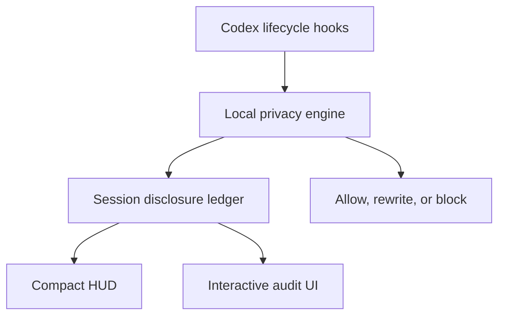

# Codex Privacy HUD

> **See what your agent knows. Control where it goes.**

A local-first Codex plugin that maintains a live **disclosure ledger** for every Codex session, minimizes sensitive context **before** tool execution, and lets you inspect exactly what data reached the model, subagents, MCP tools, or external services.

```text
Token HUD:    How much context has been consumed?
Privacy HUD:  How much sensitive context has been disclosed?
```

**Status:** design phase. Specs are written; implementation has not started.

---

## The problem

Coding agents read your filesystem, run shell commands, call MCP servers, and spawn subagents on your behalf. You can find out how much of your context window is used. You cannot find out:

- Which of your files' contents actually entered the model context?
- Did that GitHub MCP call carry a customer email in its arguments?
- Did the subagent inherit the `.env` you read twenty minutes ago?
- Did that `curl` pipe your support log to an external host?

Secret scanners are pre-commit, not pre-inference. DLP products are server-side and require shipping the very data you want to protect. Permission prompts are about *capability*, not *content*.

## What it does

```text
PRIVACY  Disclosure ███░░░░░░░ 28%  ›
```

**Level 1 — Ambient.** One line. Never interrupts.

**Level 2 — Session audit** (`$privacy`). Summary tiles and a tabbed table of every flow:

```text
SENSITIVE DATA        SOURCE           DESTINATION      STATUS
Customer email ×12    support.log      model context    [EXPOSED]
Full name ×1          user prompt      model context    [EXPOSED]
Repository path ×4    tool input       GitHub MCP       [EXPOSED]
API credential ×1     .env             none             [PREVENTED]
```

Tabs: `Exposed` · `Prevented` · `All events`.

**Level 3 — Exposure detail.** One flow, its masked evidence, and forward-looking remedies (`Protect future occurrences`, `Block this source`). Never an undo — already disclosed data cannot be recalled.

## Detection is not disclosure

The distinction the product is built on:

| Event | Counts toward the disclosure budget |
|---|---|
| A local scanner detects an email in a file | **No** |
| File content enters model context | **Yes** |
| Data is passed to a subagent | **Yes** — new destination |
| Arguments sent to an MCP tool | **Yes** |
| A shell command sends data to an external host | **Yes** |
| Content redacted or blocked before send | **No** — counted as *prevented* |

So the audit shows **flows**, not findings:

```text
support.log → main agent → GitHub MCP
```

## How it works



The ledger is **event-sourced from hook boundaries**, never by asking a model what is in context. Every byte that can enter model context passes through a small set of chokepoints — `UserPromptSubmit`, `PostToolUse`, `SubagentStart`, `PreToolUse` — which together form a cut of the data-flow graph. We observe the transactions and reconstruct the balance.

There is **no second LLM call to audit the first one.** That would re-transmit the sensitive data being audited, cost a round trip per turn, and produce a non-deterministic ledger. See `architecture.md` §3.

## Privacy of the privacy tool

- Detection runs **entirely locally**. No content is sent anywhere for classification.
- The ledger stores **metadata only** — types, counts, sources, destinations, timestamps, masked exemplars. There is no `content` column, no `prompt` column, no `raw_value` column. The schema *is* the guarantee.
- Value identity uses a session-scoped salted HMAC held in memory and destroyed at session end, so cross-session correlation is impossible by construction.
- No telemetry. No analytics. No network calls except `127.0.0.1`.
- Running Privacy HUD on its own development session must yield zero exposures. This is a test, not an aspiration.

## Known limits

Stated up front, because a privacy tool that overclaims is worse than none:

1. **Hosted tools bypass hooks.** WebSearch and similar do not trigger local function-tool hook paths. This is a practical guardrail, not a complete enforcement boundary.
2. **No `ask` decision in Codex hooks.** Interactive consent is a deny → review → one-shot-token → retry loop rather than a modal.
3. **No custom status item.** `tui.status_line` accepts only built-in identifiers, so Level 1 ships as an optional terminal companion, not a native footer.
4. **Detection is heuristic.** A determined adversary can encode around regex and NER.
5. **Nothing recalls disclosed data.** Ever.

## Documentation

| Doc | Contents |
|---|---|
| [`.claude/docs/PRD.md`](.claude/docs/PRD.md) | Problem, disclosure model, budget formula, scope, success criteria |
| [`.claude/docs/design.md`](.claude/docs/design.md) | Three-level UX, visual language, copy rules, consent flow |
| [`.claude/docs/architecture.md`](.claude/docs/architecture.md) | Process model, context accounting, schema, enforcement, testing |

## Prior art

- [`jarrodwatts/claude-hud`](https://github.com/jarrodwatts/claude-hud) — the token HUD for Claude Code that inspired the ambient layer.

## References

- [Codex Hooks](https://learn.chatgpt.com/docs/hooks) · [Build plugins](https://learn.chatgpt.com/docs/build-plugins) · [Config reference](https://learn.chatgpt.com/docs/config-file/config-reference) · [App Server](https://learn.chatgpt.com/docs/app-server)
