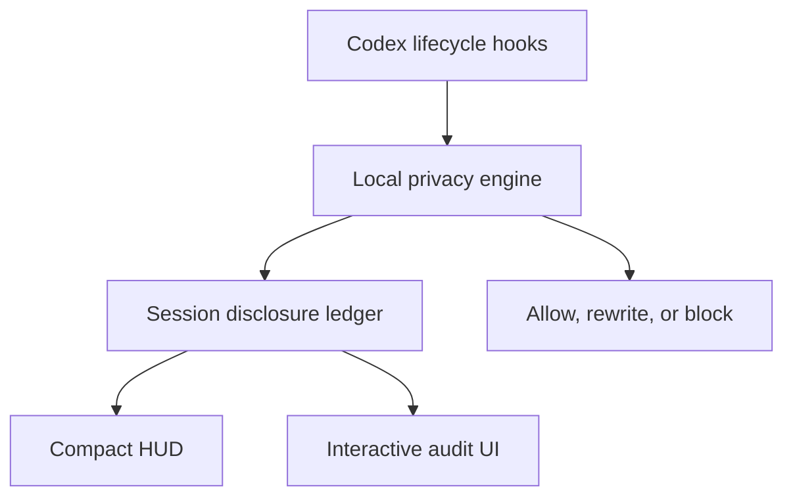

# Codex Privacy HUD

[](https://github.com/inin-zou/codex-privacy-hud/actions/workflows/ci.yml)

> Trace your privacy disclosure the same way you already trace your token usage — live, in every conversation.

> **See what your agent knows. Control where it goes.**

A local-first Codex plugin that maintains a live **disclosure ledger** for every Codex session, minimizes sensitive context **before** tool execution, and lets you inspect exactly what data reached the model, subagents, MCP tools, or external services.

Detection runs on your own machine, via [`openai/privacy-filter`](https://huggingface.co/openai/privacy-filter) loaded locally through `transformers` — no prompt, file, or secret is ever sent anywhere to be scanned. The plugin makes no outbound network calls at all; the only socket it opens is a local one to its own daemon on `127.0.0.1`.

```text
Token HUD:    How much context has been consumed?
Privacy HUD:  How much sensitive context has been disclosed?
```


**Status:** implementation complete (all 13 planned tasks + post-hoc fixes, 437 tests passing) and whole-branch reviewed. **Verified end-to-end against a real Codex session** — including `codex exec` runs where sensitive text (e.g. a street address) is correctly detected by the real `openai/privacy-filter` model and recorded in the disclosure ledger. The daemon now starts itself on the first tool call of a session, which costs the **first few seconds of a session, during which nothing is monitored** — see [Known limits](#known-limits). See [`.claude/docs/plans/2026-09-03-implementation.md`](.claude/docs/plans/2026-09-03-implementation.md).

---

## The problem

Coding agents read your filesystem, run shell commands, call MCP servers, and spawn subagents on your behalf. You can find out how much of your context window is used. You cannot find out:

- Which of your files' contents actually entered the model context?
- Did that GitHub MCP call carry a customer email in its arguments?
- Did the subagent inherit the `.env` you read twenty minutes ago?
- Did that `curl` pipe your support log to an external host?

Secret scanners are pre-commit, not pre-inference. DLP products are server-side and require shipping the very data you want to protect. Permission prompts are about *capability*, not *content*.

## What it does

```text
PRIVACY  Disclosure ███░░░░░░░ 28%  ›
```

**Level 1 — Ambient.** One line. Never interrupts. Codex has no plugin-owned status renderer, so this line does not live inside the Codex TUI — it is a companion process you run in a second terminal pane (`python -m privacy_hud.ambient --watch`, [step 3](#using-it-in-codex)), which polls the ledger and redraws in place.

**Level 2 — Session audit** (`$privacy`). Summary tiles and a tabbed table of every flow:

```text
SENSITIVE DATA        SOURCE           DESTINATION      STATUS
Customer email ×12    support.log      model context    [EXPOSED]
Full name ×1          user prompt      model context    [EXPOSED]
Repository path ×4    tool input       GitHub MCP       [EXPOSED]
API credential ×1     .env             none             [PREVENTED]
```

Tabs: `Exposed` · `Prevented` · `All events`.

**Level 3 — Exposure detail.** One flow, its masked evidence, and forward-looking remedies (`Protect future occurrences`, `Block this source`). Never an undo — already disclosed data cannot be recalled.

## Detection is not disclosure

The distinction the product is built on:

| Event | Counts toward the disclosure budget |
|---|---|
| A local scanner detects an email in a file | **No** |
| File content enters model context | **Yes** |
| Data is passed to a subagent | **Yes** — new destination |
| Arguments sent to an MCP tool | **Yes** |
| A shell command sends data to an external host | **Yes** |
| Content redacted or blocked before send | **No** — counted as *prevented* |

So the audit shows **flows**, not findings:

```text
support.log → main agent → GitHub MCP
```

## How it works



The ledger is **event-sourced from hook boundaries**, never by asking a model what is in context. Every byte that can enter model context passes through a small set of chokepoints — `UserPromptSubmit`, `PostToolUse`, `SubagentStart`, `PreToolUse` — which together form a cut of the data-flow graph. We observe the transactions and reconstruct the balance.

There is **no second LLM call to audit the first one.** That would re-transmit the sensitive data being audited, cost a round trip per turn, and produce a non-deterministic ledger. See `architecture.md` §3.

## Privacy of the privacy tool

- Detection runs **entirely locally**. No content is sent anywhere for classification.
- The ledger stores **metadata only** — types, counts, sources, destinations, timestamps, masked exemplars. There is no `content` column, no `prompt` column, no `raw_value` column. The schema *is* the guarantee.
- Value identity uses a session-scoped salted HMAC held in memory and destroyed at session end, so cross-session correlation is impossible by construction.
- No telemetry. No analytics. No network calls except `127.0.0.1`.
- Running Privacy HUD on its own development session must yield zero exposures. This is a test, not an aspiration.

## Using it in Codex

Verified end-to-end against a real Codex CLI install (Task 9's smoke test on 0.145.0; re-checked on 0.153.0).

### Prerequisites

Tier 3 detection (person, address, date, account number — the categories no regex can shape-match) runs the `openai/privacy-filter` model locally. It is not optional equipment: without it the engine still runs, but only tiers 0–2, which means credentials and paths are still caught and **names and addresses are not**.

- **Python 3.11+** (developed and verified on 3.12).
- **`transformers >= 5.16`.** Earlier versions fail with `does not recognize this architecture` — the `openai_privacy_filter` model type was not yet known to them. This is a real wall, not a warning.
- **`torch >= 2.5`** (what `transformers` 5.16 itself requires). Note that torch is one of *transformers'* optional extras, so installing `transformers` alone leaves you with no torch and a silently disabled tier 3 — the `[detectors]` extra below names both. If `torchvision` / `torchaudio` are also installed, they must be built against the same torch, or importing the pipeline dies with `operator torchvision::nms does not exist`.

> **Use a dedicated virtualenv.** Upgrading torch inside a shared environment is how you break every other ML package in it — during development this took out `vllm`, `facenet-pytorch`, and `sentence-transformers` in one command. Isolate this install.

```bash
python3 -m venv .venv && source .venv/bin/activate
pip install -e ".[detectors]"
```

**Then fetch the model weights (~2.8 GB).** Download only the files the pipeline actually loads — the full repo is ~17 GB because it also ships ONNX export variants and a duplicate `original/` checkpoint, neither of which this project ever touches:

```bash
python3 -c "
from huggingface_hub import snapshot_download
snapshot_download('openai/privacy-filter', allow_patterns=[
    'config.json', 'model.safetensors', 'tokenizer.json',
    'tokenizer_config.json', 'viterbi_calibration.json'])
"
```

That exact file set is verified sufficient. Everything afterwards runs offline: the plugin sets `HF_HUB_OFFLINE=1` before importing `transformers`, so nothing reaches the network once the weights are on disk (Global Constraint I2).

All three prerequisites fail quietly rather than loudly — an old `transformers`, a missing torch and absent weights all leave you with a running engine that is simply blind to names and addresses. `privacy-hud-doctor` (below) checks each of them by version and by file, and `privacy-hud-doctor --check-model` goes further and constructs the detector to read its real availability.

**Keep the environment you just built.** Step 2 below records *this* interpreter as the one the daemon runs in, and the recording is done by running a command from inside it. Nothing else needs to know where it is afterwards.

**1. Install the plugin.** `codex plugin marketplace add` takes `owner/repo`, so no clone is needed for this half:

```bash
codex plugin marketplace add inin-zou/codex-privacy-hud
codex plugin add codex-privacy-hud@codex-privacy-hud
```

From a local checkout instead (what you want if you are editing the plugin — note that Codex installs a *copy*, so re-run these after changing anything under `hooks/`):

```bash
codex plugin marketplace add /path/to/codex-privacy-hud --json
codex plugin add codex-privacy-hud@codex-privacy-hud --json
```

The manifest lives at `.claude-plugin/plugin.json` (not `.codex-plugin/` — the OpenAI docs describe that path, but real Codex CLI does not recognize it; `codex plugin marketplace add` fails outright against it. `.claude-plugin/` is what Codex actually loads, confirmed by installing both ways. See `.claude/docs/architecture.md` §7 for the divergence.)

**2. Run the setup step once — from the environment that has `transformers` and `torch`.** This is the whole of the daemon's configuration. It records which Python interpreter the daemon must run in, into the plugin-data directory Codex assigns, and after that Codex's hooks start the daemon themselves.

```bash
source .venv/bin/activate            # the env from Prerequisites, whatever it is
privacy-hud-setup                    # or: PYTHONPATH=src python3 -m privacy_hud.runtime
```

```text
privacy-hud setup

  interpreter    ~/.venvs/privacy-hud/bin/python3
  transformers   5.16.1
  torch          2.14.0
  plugin data    ~/.codex/plugins/data/codex-privacy-hud-codex-privacy-hud

  recorded       ~/.codex/plugins/data/codex-privacy-hud-codex-privacy-hud/runtime.json
```

**Why an interpreter has to be recorded at all, and why from that shell.** Codex runs `hooks/handler.py` through its `#!/usr/bin/env python3` shebang against Codex's own minimal `PATH` — typically a *system* Python with no `transformers` in it. A daemon started from that interpreter would come up, bind its socket, answer every health check, and detect no names or addresses at all, with nothing anywhere saying so. So the interpreter is recorded once from a process that demonstrably has the stack, and `privacy-hud-setup` **refuses to record one that cannot import `transformers` and `torch`** rather than pinning a blind daemon. (`--allow-degraded` records it anyway if tiers 0–2 are what you want; it says so in the output and in `privacy-hud-doctor`.)

You do not need to know what `PLUGIN_DATA` is, find it, or export it: setup reads the directory Codex assigned from Codex's own state, and the hook that later starts the daemon passes it its own value — so the daemon and the hooks cannot end up pointed at different directories, which used to be this project's most expensive misconfiguration. (`--plugin-data DIR` overrides it for a scratch setup.)

**What the first tool call of a session now costs.** The daemon loads ~2.8 GB of model weights *before* it binds its socket — about seven seconds. The hook that starts it does not wait for it, and neither do the hooks that fire during the load: they get the same answer as a missing daemon (fail open on ingress with an "unverified" note, fail closed on egress). **The first few seconds of a session are unmonitored, and disclosures in that window are not recorded.** After that the daemon stays up for as long as *any* Codex session is open and exits five minutes after the last one closes; the next session's first hook starts a new one and pays the load again.

**How long the daemon stays up, exactly.** One daemon serves every concurrent Codex session, so it counts them rather than watching a clock: `SessionStart` adds a session, `SessionEnd` removes it, and any other hook event counts as that session's keep-alive. While at least one session is open it will not exit no matter how long you leave it idle — an interactive session where nothing has run for half an hour is a person reading a diff, not a session that is over, and taking the daemon away there would put the session back through the unmonitored cold-start window mid-flight. Five minutes after the last session ends, it exits. Two fallbacks bound it if `SessionEnd` never arrives (Codex crashed, was `kill -9`'d, the terminal closed): a session with no hook event for four hours stops counting, and four hours with no connection of any kind exits the daemon regardless of the count. So a leaked session reference costs at most four hours of a resident process, not an unbounded one — and leaving a Codex window open overnight will outlive its daemon, with the next morning's first hook paying one seven-second restart.

**Starting one by hand still works** and is the way to have a daemon up *before* the session — worth it if you want the ambient HUD in step 3 to have something to read immediately, or you are debugging:

```bash
export PLUGIN_DATA=~/.codex/plugins/data/codex-privacy-hud-codex-privacy-hud
PYTHONPATH=src python3 -m privacy_hud.daemon &
```

Start Codex within five minutes of it: a hand-started daemon that no session ever connects to is indistinguishable from one whose last session ended, and it exits on the same grace.

Only one daemon can own the socket: whichever starts first wins an exclusive lock and any other exits immediately without disturbing it, so a hand-started daemon and an auto-started one cannot fight or clobber each other's socket.

To turn auto-start off entirely (a sandboxed box where the spawn cannot succeed and paying a fork on every hook is worse than having no HUD), set `PRIVACY_HUD_NO_SPAWN=1` in the environment Codex runs in.

**Check the whole setup in one shot — `privacy-hud-doctor`.** Every moving part above fails *silently*, and they all look identical from the outside: nothing happens. A setup step that was never run, so no hook will start a daemon. A recorded interpreter that has since been deleted along with its virtualenv. A `PLUGIN_DATA` a hand-started daemon and the hook client disagree on. Model weights that were never downloaded, so tier 3 reports `available = False` and person/address detection quietly stops. A `transformers` older than 5.16, or a `transformers` with no torch beside it. A stale copy of the plugin in Codex's cache, because Codex installs a *copy* and your edited `hooks/handler.py` is not what runs. One command tells you which of those it is:

```bash
export PLUGIN_DATA=~/.codex/plugins/data/codex-privacy-hud-codex-privacy-hud
privacy-hud-doctor            # or: PYTHONPATH=src python3 -m privacy_hud.doctor
```

```text
privacy-hud doctor

  [ OK ] Python               3.12.10 (requires >= 3.11)
  [ OK ] PLUGIN_DATA          ~/.codex/plugins/data/codex-privacy-hud-codex-privacy-hud
  [ OK ] Ledger               6 sessions, 44 events recorded
  [ OK ] Runtime pin          ~/.venvs/privacy-hud/bin/python3 (1.4s import probe)
  [ OK ] Daemon               responsive (4 ms round trip)
  [ OK ] Detector deps        transformers 5.16.1, torch 2.14.0
  [ OK ] Tier 3 model         weights present on disk (not loaded)
  [ OK ] Plugin install       installed, version 0.1.0, matches this checkout

Summary: 8 ok, 0 warning(s), 0 failure(s).
Setup is healthy.
```

The daemon check is a real round trip, not a look at the socket file — a unix socket outlives the process that bound it, so a stale one and a running daemon are indistinguishable until something connects. The `Runtime pin` check is a real import in a real subprocess of the recorded interpreter (~1.4 s), for the same reason: "`transformers` is installed there" and "`transformers` imports there" are different claims, and this project has hit the gap between them (a torch/torchvision mismatch surfacing as `operator torchvision::nms does not exist`). A missing or stale pin is a `[FAIL]`, never a quiet fallback to some other Python. Every failing check prints what to do about it.

`Daemon` reporting `[WARN] not running` between sessions is the correct state of a healthy setup, not a fault — the daemon exits once your last session ends, and the next hook starts it. It is a `[FAIL]` only when there is no pin, because then nothing will.

Note that the doctor and the daemon need not be the same interpreter any more. Run `privacy-hud-doctor` from anywhere; where its own `transformers` view differs from the daemon's, the report says so rather than passing one off as the other.

**Exit code 0 when the setup is usable, 1 only when something is genuinely broken.** Degraded-but-working is a warning, not a failure: with no model weights the engine still runs tiers 0–2, so that is reported as `[WARN]` with the consequence spelled out — *names and addresses will not be detected* — and the command still exits 0, which is what makes it usable in a setup script. `[FAIL]` is reserved for states where nothing this plugin promises can happen at all: no runtime pin, so nothing will ever start a daemon; a recorded interpreter that is gone or cannot import the package; a daemon that is listening and not answering; no `PLUGIN_DATA`; no installed plugin; an interpreter below the floor.

It reads the ledger read-only and never creates it, and it reports counts, versions, timestamps and the paths of its own machinery — never a prompt, a file, a detected value, or anything from a session. `--check-model` swaps the cheap on-disk weights check for actually constructing the tier 3 detector (~2.8 GB, about 7 s); by default it says the weights are present and that it did not load them, rather than claiming to know.

**3. Optional — start the ambient Level 1 HUD in a second terminal pane.** It is a separate process, not a Codex status item: it polls `$PLUGIN_DATA/ledger.db` read-only and redraws one line in place, so give it its own pane or split beside the pane running Codex. It reads what the daemon records, so it only moves while a daemon is up: with none running, nothing new is recorded and the HUD shows either nothing at all (no ledger exists yet) or the last session's number, unchanging. Codex's first tool call starts one — but if you want it live before that, start one by hand as shown in step 2. It never reports 0% for a session that is simply unmonitored.

```bash
export PLUGIN_DATA=~/.codex/plugins/data/codex-privacy-hud-codex-privacy-hud
PYTHONPATH=src python3 -m privacy_hud.ambient --watch
```

```text
PRIVACY  Disclosure ███░░░░░░░ 30%  ›
```

`--watch` redraws every 2 seconds; `--watch N` sets the interval. With no flags (or `--once`) it prints a single line and exits, which is what you want from a shell prompt or another status bar. `--session-id <id>` overrides session resolution. If the package is installed, the same entry point is available as `privacy-hud-ambient`.

`--once` is also the quickest way to confirm the whole stack is live: if it prints a line, the daemon is recording and the ledger is readable. If it prints nothing, nothing has been recorded yet — and `privacy-hud-doctor` is what tells you *why* not.

**4. Use Codex normally.** The plugin's hooks (`hooks/hooks.json`) fire on every `SessionStart`, `UserPromptSubmit`, `PreToolUse`, `PostToolUse`, `SubagentStart`/`Stop`, and `SessionEnd` — no per-command action needed. The first hook of the session starts the daemon if nothing is listening; that hook and the ones during the ~7 s model load are answered without detection.

**5. Run `$privacy` at any point** to see the session audit — the ASCII table always works; it also starts a local browser UI at a `127.0.0.1` URL it prints (never a link to anything else).

Real output from a live Codex session (not a mockup) — a fresh session with nothing yet disclosed, and the same audit after a few turns that sent addresses, names, URLs, and a credential to the model:


**6. When a call is blocked**, Codex surfaces the reason via `systemMessage`. Run `$privacy` to review the exposure, then choose to minimize and retry, allow once, or leave it blocked — see [`design.md` §8](.claude/docs/design.md) for the full consent flow.

**7. Uninstall** (also stop any daemon still running — an auto-started one exits by itself five minutes after your last Codex session ends — and the ambient HUD from step 3 if you started it):

```bash
codex plugin remove codex-privacy-hud@codex-privacy-hud
codex plugin marketplace remove codex-privacy-hud
```

## Known limits

Stated up front, because a privacy tool that overclaims is worse than none:

1. **The start of a session is unmonitored.** The daemon starts itself now (`architecture.md`'s lazy auto-spawn, built), but it loads ~2.8 GB of model weights before it binds its socket — about seven seconds. The hook that starts it does not wait, and the hooks that fire during the load get the same answer as a missing daemon: fail open on ingress with an "unverified" note, fail closed on egress. **Whatever is disclosed in those first seconds is not in the ledger, and the ledger does not know it is missing.** Measured: a `codex exec` one-shot that finished in 8.2 s from a cold start recorded *nothing at all* — the daemon it started was still loading when the session ended, so for short non-interactive runs this is not "the first few seconds" but the whole session. An interactive session is a different story, since typing the first prompt already outlasts the load. Starting a daemon by hand before the session (step 2) is the only way to close that window. It reopens whenever the daemon exits and a later hook has to start a new one — which now happens five minutes after your last session ends, rather than in the middle of a session that merely went quiet for half an hour.

   The other half of the trade: auto-start works only if `privacy-hud-setup` has recorded an interpreter that can load the model. It refuses to record one that cannot, and with no recorded interpreter no daemon is started at all — deliberately, since guessing one produces a daemon that detects nothing while looking healthy. `privacy-hud-doctor` is the detector for both states: it round-trips the socket, and it re-imports the recorded interpreter's stack.
2. **Hosted tools bypass hooks.** WebSearch and similar do not trigger local function-tool hook paths. This is a practical guardrail, not a complete enforcement boundary.
3. **No `ask` decision in Codex hooks.** Interactive consent is a deny → review → one-shot-token → retry loop rather than a modal.
4. **No custom status item — Level 1 is not inside Codex.** `tui.status_line` accepts only built-in identifiers, and stock Codex has no plugin-owned renderer, so nothing this plugin produces can appear under the Codex input area. Level 1 is therefore a *separate process*: `privacy-hud-ambient` (`python -m privacy_hud.ambient --watch`), which you start yourself in a second terminal pane, and which polls the ledger and redraws one line in place there. It is a companion window next to Codex, not part of the Codex TUI — and if you do not start it, there is no ambient line at all. (Prior art confirms the cost of the alternative: both [`anhannin/codex-hud`](https://github.com/anhannin/codex-hud) and [`brandonwie/codex-hud`](https://github.com/brandonwie/codex-hud) get a real in-TUI footer only by patching Codex's own Rust source to add a `tui.status_line_command` config key, compiling a forked Codex, and installing that patched binary — which then goes stale on every upstream Codex release. Notably, `brandonwie/codex-hud`'s *default* mode avoids patching entirely and is exactly the second-pane companion pattern this project adopts.)
5. **Detection is heuristic.** A determined adversary can encode around regex and NER.
6. **Nothing recalls disclosed data.** Ever.

## Documentation

| Doc | Contents |
|---|---|
| [`.claude/docs/PRD.md`](.claude/docs/PRD.md) | Problem, disclosure model, budget formula, scope, success criteria |
| [`.claude/docs/design.md`](.claude/docs/design.md) | Three-level UX, visual language, copy rules, consent flow |
| [`.claude/docs/architecture.md`](.claude/docs/architecture.md) | Process model, context accounting, schema, enforcement, testing |

## Prior art

- [`jarrodwatts/claude-hud`](https://github.com/jarrodwatts/claude-hud) — the token HUD for Claude Code that inspired the ambient layer.

## References

- [Codex Hooks](https://learn.chatgpt.com/docs/hooks) · [Build plugins](https://learn.chatgpt.com/docs/build-plugins) · [Config reference](https://learn.chatgpt.com/docs/config-file/config-reference) · [App Server](https://learn.chatgpt.com/docs/app-server)
