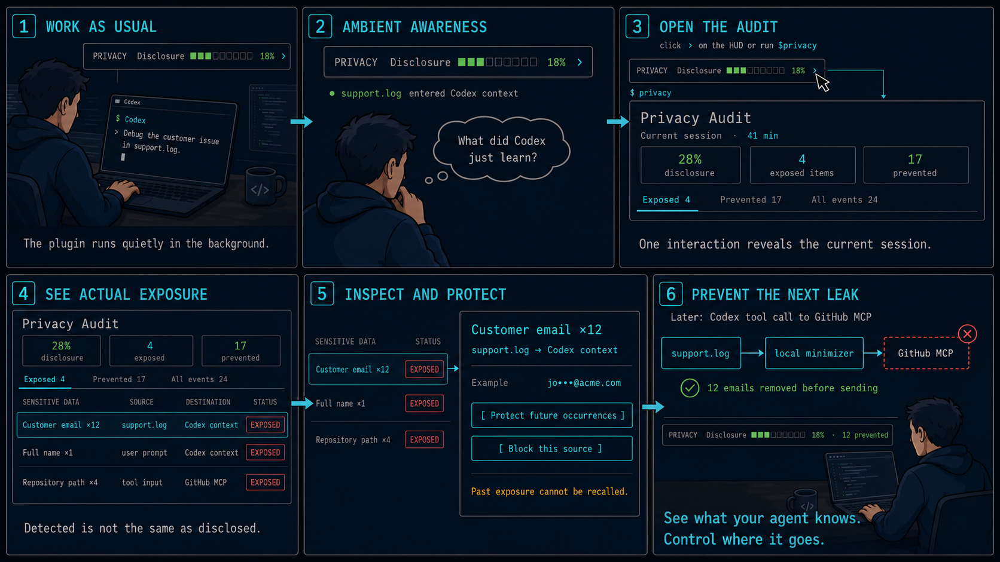
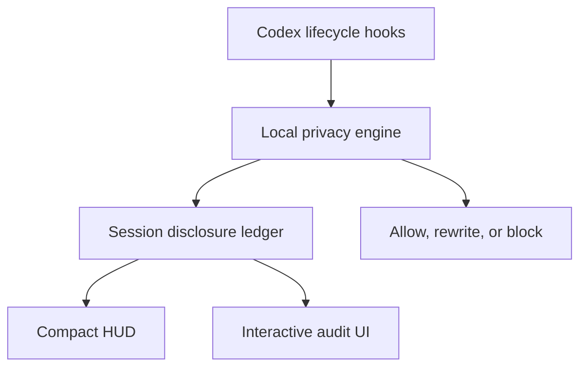

# Codex Privacy HUD

> **See what your agent knows. Control where it goes.**

A local-first Codex plugin that maintains a live **disclosure ledger** for every Codex session, minimizes sensitive context **before** tool execution, and lets you inspect exactly what data reached the model, subagents, MCP tools, or external services.

```text
Token HUD:    How much context has been consumed?
Privacy HUD:  How much sensitive context has been disclosed?
```



**Status:** implementation complete (all 13 planned tasks + post-hoc fixes, 211 tests passing) and whole-branch reviewed. **Verified end-to-end against a real Codex session** — including `codex exec` runs where sensitive text (e.g. a street address) is correctly detected by the real `openai/privacy-filter` model and recorded in the disclosure ledger. The daemon does not yet auto-start — see [Known limits](#known-limits). See [`.claude/docs/plans/2026-09-03-implementation.md`](.claude/docs/plans/2026-09-03-implementation.md).

---

## The problem

Coding agents read your filesystem, run shell commands, call MCP servers, and spawn subagents on your behalf. You can find out how much of your context window is used. You cannot find out:

- Which of your files' contents actually entered the model context?
- Did that GitHub MCP call carry a customer email in its arguments?
- Did the subagent inherit the `.env` you read twenty minutes ago?
- Did that `curl` pipe your support log to an external host?

Secret scanners are pre-commit, not pre-inference. DLP products are server-side and require shipping the very data you want to protect. Permission prompts are about *capability*, not *content*.

## What it does

```text
PRIVACY  Disclosure ███░░░░░░░ 28%  ›
```

**Level 1 — Ambient.** One line. Never interrupts.

**Level 2 — Session audit** (`$privacy`). Summary tiles and a tabbed table of every flow:

```text
SENSITIVE DATA        SOURCE           DESTINATION      STATUS
Customer email ×12    support.log      model context    [EXPOSED]
Full name ×1          user prompt      model context    [EXPOSED]
Repository path ×4    tool input       GitHub MCP       [EXPOSED]
API credential ×1     .env             none             [PREVENTED]
```

Tabs: `Exposed` · `Prevented` · `All events`.

**Level 3 — Exposure detail.** One flow, its masked evidence, and forward-looking remedies (`Protect future occurrences`, `Block this source`). Never an undo — already disclosed data cannot be recalled.

## Detection is not disclosure

The distinction the product is built on:

| Event | Counts toward the disclosure budget |
|---|---|
| A local scanner detects an email in a file | **No** |
| File content enters model context | **Yes** |
| Data is passed to a subagent | **Yes** — new destination |
| Arguments sent to an MCP tool | **Yes** |
| A shell command sends data to an external host | **Yes** |
| Content redacted or blocked before send | **No** — counted as *prevented* |

So the audit shows **flows**, not findings:

```text
support.log → main agent → GitHub MCP
```

## How it works



The ledger is **event-sourced from hook boundaries**, never by asking a model what is in context. Every byte that can enter model context passes through a small set of chokepoints — `UserPromptSubmit`, `PostToolUse`, `SubagentStart`, `PreToolUse` — which together form a cut of the data-flow graph. We observe the transactions and reconstruct the balance.

There is **no second LLM call to audit the first one.** That would re-transmit the sensitive data being audited, cost a round trip per turn, and produce a non-deterministic ledger. See `architecture.md` §3.

## Privacy of the privacy tool

- Detection runs **entirely locally**. No content is sent anywhere for classification.
- The ledger stores **metadata only** — types, counts, sources, destinations, timestamps, masked exemplars. There is no `content` column, no `prompt` column, no `raw_value` column. The schema *is* the guarantee.
- Value identity uses a session-scoped salted HMAC held in memory and destroyed at session end, so cross-session correlation is impossible by construction.
- No telemetry. No analytics. No network calls except `127.0.0.1`.
- Running Privacy HUD on its own development session must yield zero exposures. This is a test, not an aspiration.

## Using it in Codex

Verified end-to-end against a real Codex CLI install (Task 9's smoke test on 0.145.0; re-checked on 0.153.0).

**1. Install the plugin from this repo.**

```bash
codex plugin marketplace add /path/to/codex-privacy-hud --json
codex plugin add codex-privacy-hud@codex-privacy-hud --json
```

The manifest lives at `.claude-plugin/plugin.json` (not `.codex-plugin/` — the OpenAI docs describe that path, but real Codex CLI does not recognize it; `codex plugin marketplace add` fails outright against it. `.claude-plugin/` is what Codex actually loads, confirmed by installing both ways. See `.claude/docs/architecture.md` §7 for the divergence.)

**2. Start the daemon once, before the session.** The daemon does not yet start itself — this is a known gap, not an oversight (see [Known limits](#known-limits) below). Start it manually, pointed at the same `PLUGIN_DATA` directory Codex passes to the plugin:

```bash
PLUGIN_DATA=<the plugin's data directory> PYTHONPATH=src python3 -m privacy_hud.daemon &
```

Leave it running for the session. Without it, hooks still fire but every call fails open (ingress) or closed (egress) to the default with no detection actually running.

**3. Use Codex normally.** The plugin's hooks (`hooks/hooks.json`) fire on every `SessionStart`, `UserPromptSubmit`, `PreToolUse`, `PostToolUse`, `SubagentStart`/`Stop`, and `SessionEnd` — no per-command action needed once the daemon from step 2 is running.

**4. Run `$privacy` at any point** to see the session audit — the ASCII table always works; it also starts a local browser UI at a `127.0.0.1` URL it prints (never a link to anything else).

Real output from a live Codex session (not a mockup) — a fresh session with nothing yet disclosed, and the same audit after a few turns that sent addresses, names, URLs, and a credential to the model:


**5. When a call is blocked**, Codex surfaces the reason via `systemMessage`. Run `$privacy` to review the exposure, then choose to minimize and retry, allow once, or leave it blocked — see [`design.md` §8](.claude/docs/design.md) for the full consent flow.

**6. Uninstall** (also stop the daemon process from step 2):

```bash
codex plugin remove codex-privacy-hud@codex-privacy-hud
codex plugin marketplace remove codex-privacy-hud
```

## Known limits

Stated up front, because a privacy tool that overclaims is worse than none:

1. **The daemon does not start itself yet.** `architecture.md` describes lazy auto-spawn from the hook client on first use; that piece was never built. Start it manually before a session — see [Using it in Codex](#using-it-in-codex) above. Without it, hooks still fire but every call falls through to the fail-open/fail-closed default with no detection running.
2. **Hosted tools bypass hooks.** WebSearch and similar do not trigger local function-tool hook paths. This is a practical guardrail, not a complete enforcement boundary.
3. **No `ask` decision in Codex hooks.** Interactive consent is a deny → review → one-shot-token → retry loop rather than a modal.
4. **No custom status item.** `tui.status_line` accepts only built-in identifiers, so Level 1 ships as an optional terminal companion, not a native footer. (Confirmed by prior art: [`codex-hud`](https://github.com/anhannin/codex-hud) achieves a persistent inline status line only by patching the Codex binary itself — a path this project deliberately does not take.)
5. **Detection is heuristic.** A determined adversary can encode around regex and NER.
6. **Nothing recalls disclosed data.** Ever.

## Documentation

| Doc | Contents |
|---|---|
| [`.claude/docs/PRD.md`](.claude/docs/PRD.md) | Problem, disclosure model, budget formula, scope, success criteria |
| [`.claude/docs/design.md`](.claude/docs/design.md) | Three-level UX, visual language, copy rules, consent flow |
| [`.claude/docs/architecture.md`](.claude/docs/architecture.md) | Process model, context accounting, schema, enforcement, testing |

## Prior art

- [`jarrodwatts/claude-hud`](https://github.com/jarrodwatts/claude-hud) — the token HUD for Claude Code that inspired the ambient layer.

## References

- [Codex Hooks](https://learn.chatgpt.com/docs/hooks) · [Build plugins](https://learn.chatgpt.com/docs/build-plugins) · [Config reference](https://learn.chatgpt.com/docs/config-file/config-reference) · [App Server](https://learn.chatgpt.com/docs/app-server)
