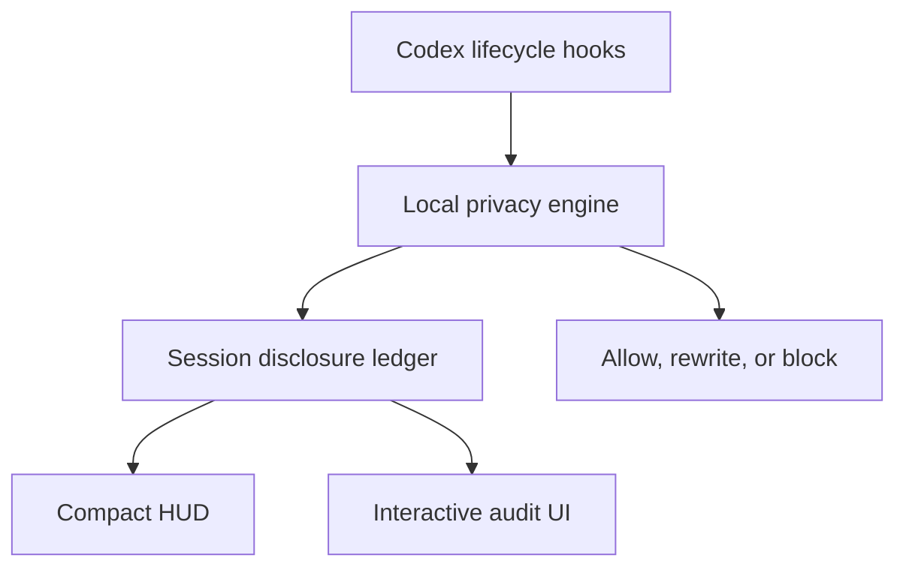

# Codex Privacy HUD


Historical screenshot from the snapshot-v1 HUD. Its percentage uses legacy accounting; the image predates the explicit legacy label.

[](https://github.com/inin-zou/codex-privacy-hud/actions/workflows/ci.yml)
[](LICENSE)
[](https://github.com/inin-zou/codex-privacy-hud/stargazers)

English | [简体中文](README.zh-CN.md)

> Trace your privacy disclosure the same way you already trace your token usage — live, in every conversation.

> **See what your agent knows. Control where it goes.**

A local-first Codex plugin that records hook observations in a session ledger and can return denials or rewritten input before tool execution.

New sessions observed from a genuine SessionStart use evidence-based accounting: confirmed points, distinct disclosures, confirmed recipients, and denials issued. A percentage is shown only when the recorded evidence supports it. Current hooks do not confirm model-context admission, transmission, or host application of a denial or rewrite, so a session may show zero confirmed points alongside unresolved actions and an unavailable percentage. Zero confirmed points does not mean no disclosure occurred.

Existing sessions and sessions attached after their start retain their legacy permitted-crossing score and its limitations. Historical rows are preserved without backfill or rescoring. An unrecorded session has no percentage or numeric counts.

Recipient identity is separate from boundary category. Supported, unambiguous MCP names and simple network commands can identify intended recipients; ambiguous identities remain unresolved. This does not establish delivery, downstream forwarding, or what a subagent inherited.

Detection runs locally; the plugin sends no prompt, file, or secret to a remote scanner. Runtime communication is limited to Unix-domain sockets and the local browser UI on 127.0.0.1.

Version 0.9.5 activates evidence-based accounting for new sessions observed from a genuine SessionStart, using the selected runtime and fenced ledger introduced in 0.8.0. Existing and late-attached sessions retain legacy accounting; historical records are not backfilled or rescored.

Version 0.9.2 adds a default-on lexical network guard. Recognized network commands containing known-sensitive-path references receive a denial independently of the local read guard. No file contents are opened or rewritten. Shell-derived file identities and host enforcement remain unresolved; see known limit 6.

```text
Token HUD:    How much context has been consumed?
Privacy HUD:  What is confirmed, and what remains unresolved?
```


Design-intent illustration. It predates the explicit legacy labels; its bar and intervention imagery are not the current display or evidence contract.

**Before you rely on it:** the start of a session is not monitored while the model loads, hosted tools bypass hooks, and detection is heuristic. The HUD marks a session whose record has a known hole rather than showing it as a clean 0%, but it cannot tell you what it missed. Read the [known limits](#known-limits).

---

- [News](#news)
- [Install](#install)
- [What you see](#what-you-see)
- [How it works](#how-it-works)
- [Known limits](#known-limits)
- [Configuration](#configuration)
- [Troubleshooting](#troubleshooting)
- [Uninstall](#uninstall)
- [Installing by hand](#installing-by-hand)
- [Documentation](#documentation)
- [License](#license)

## News

- 2026-09-15: patched Codex 0.154.0 builds for `aarch64-apple-darwin` and `x86_64-apple-darwin` are published on the GitHub release `codex-0.154.0-hud` and on the rolling `latest`. `install.sh` finds them.
- 2026-09-15: the `privacy` status-line item now renders inside a patched Codex, and the macOS install is one command.
- 2026-09-21: the self-audit claim was withdrawn and replaced. Three read-only source-review sessions measured 88%, 100% and 100% of budget, against an invariant that said zero. What replaces it is a committed corpus with both controls — see [`docs/self-audit.md`](docs/self-audit.md), which also records the four entries it does not satisfy — two clean strings the model reports personal data in, and two addresses it misses or fragments.
- 2026-09-05: verified by hand against Codex CLI 0.153.0 that one session reading `src/privacy_hud/budget.py` recorded zero events, budget 0.0/120.0. That run was real; the general claim drawn from it was not.

## Install

Privacy HUD 0.9.5 retains snapshot version 2. New sessions observed from a genuine SessionStart use version-2 accounting; existing sessions and late attachments retain legacy accounting. Snapshot-v2 readers accept version 1 as explicitly legacy and version 2 with nullable accounting fields. Older snapshot-v1-only readers reject version 2 and show no Privacy item. Matching Codex version numbers do not establish snapshot compatibility.

The snapshot-v2 patched Codex builds for 0.154.0, 0.155.0, and 0.155.1 were re-released on 2026-09-22. An earlier installation of one of those versions may still contain the older reader. Updating the plugin does not replace that binary. No additional patched-Codex release is required solely for Privacy HUD 0.9.5.

The native Privacy item displays accounting snapshots; it does not verify runtime alignment. Before repair, an old daemon may continue refreshing a legacy reading. Use the bundled doctor command to check alignment. The bundled ambient launcher reports runtime failure instead of displaying a percentage.

Privacy HUD loads Python code from the selected plugin bundle. The recorded Python environment supplies dependencies. Run $privacy repair to obtain the exact recovery command for another terminal. Explicit installation may download dependencies and model weights; runtime checks and offline repair do not.

The active ledger is $PLUGIN_DATA/ledger/active.db after repair. $PLUGIN_DATA/ledger.db is a directory that fences the historical pathname. Do not replace it with a file or symlink. Repair preserves the accounting generation and recorded values; it does not activate version-2 accounting. The selected daemon activates accounting only when it receives a genuine SessionStart for an absent session.

Generation 5402 requires the activated-accounting implementation introduced in Privacy HUD 0.9.0. A live client must also match the selected runtime build and activation epoch. Unsupported or altered schemas are preserved and refused. No downgrade migration is provided.

Runtime mismatches produce an unverified warning on ingress and a denial for outbound calls the hook cannot verify. These are plugin decisions, not confirmation of host enforcement. Monitoring gaps and lost in-memory detection state cannot be reconstructed. Open version-2 sessions whose accounting keys were lost remain unavailable for the rest of those sessions.

```bash
PRIVACY_HUD_BUNDLE='/absolute/path/to/installed/0.9.5/plugin'
PRIVACY_HUD_DATA='/absolute/path/to/plugin/data'

python3 "$PRIVACY_HUD_BUNDLE/scripts/runtime.py" \
  --plugin-data "$PRIVACY_HUD_DATA" doctor

python3 "$PRIVACY_HUD_BUNDLE/scripts/runtime.py" \
  --plugin-data "$PRIVACY_HUD_DATA" repair --print-command

python3 "$PRIVACY_HUD_BUNDLE/scripts/runtime.py" \
  --plugin-data "$PRIVACY_HUD_DATA" ambient --watch
```

Privacy HUD 0.7.1 does not alter the schema of a valid prepared generation-5401 ledger during initialization: `events` already contains `source_kind`. It can nevertheless open the historical ledger pathname without participating in the selected runtime's handshake or writer lease. On a prepared ledger, historical session and coverage writes can succeed even though legacy event recording fails against the new `events` layout. On a generation-0 ledger, historical event writes remain possible, and initialization adds `source_kind` only when that column is absent. Explicit repair therefore quiesces legacy users, preserves the ledger at `$PLUGIN_DATA/ledger/active.db`, and replaces `$PLUGIN_DATA/ledger.db` with a directory fence that prevents subsequent historical-path opens. The fence does not revoke already-open connections or protect against same-user code deliberately opening the active pathname.

Verified end-to-end against a real Codex CLI install on 0.145.0 and 0.153.0.

### Before you start

- **macOS** on Apple Silicon or Intel. (Linux and Windows are not packaged; see [Installing by hand](#installing-by-hand) for the fallback pane.)
- **Codex CLI** already installed and signed in — `codex --version` prints something like `codex-cli 0.154.0`. The installer needs that number to pick the matching patched build.
- **Python 3.11 or newer** on your `PATH` (`python3 --version`). On a Mac without one: `brew install python@3.12`.
- About **3 GB of disk** if you want name and address detection (that is the size of the `openai/privacy-filter` weights), and a few minutes.

### Run it

```bash
curl -fsSL https://raw.githubusercontent.com/inin-zou/codex-privacy-hud/main/install.sh | sh
```

The script asks exactly one question — whether to download the detection
model. Everything else is automatic. This is what it does, in the order it
prints:

| step | what happens | where it lands |
|---|---|---|
| 1 | Finds your `codex`, reads its version, checks `python3 >= 3.11` | — |
| 2 | Creates a private virtualenv and installs the plugin package into it (a few minutes; this pulls `torch` and `transformers`) | `~/.local/share/codex-privacy-hud/venv/` |
| 3 | **Asks** before downloading the `openai/privacy-filter` weights (~2.8 GB, from Hugging Face, once). Answer `y` for full detection. Answer `n` and you still get credential and path detection, but **names and addresses go undetected** — `privacy-hud-doctor` will say so. | `~/.cache/huggingface/hub/` |
| 4 | Installs the plugin into Codex (`codex plugin marketplace add` + `codex plugin add`) | Codex's plugin directory |
| 5 | Records which Python interpreter the daemon must run in | `~/.codex/plugins/data/codex-privacy-hud-…/runtime.json` |
| 6 | Downloads the patched Codex build for **your exact version**, verifies its SHA-256, unpacks it, and links your official `codex-code-mode-host` beside it (the tarball carries only `codex`; Code Mode needs that sibling, and the official one of the same version is the right one) | `~/.local/share/codex-privacy-hud/<version>/` |
| 7 | Writes a small forwarder named `codex` and, if needed, adds `~/.local/bin` to your shell `PATH` | `~/.local/bin/codex` |
| 8 | Adds `privacy` to `[tui].status_line` in your Codex config, creating the key with Codex's defaults if you never set one | `~/.codex/config.toml` |
| 9 | Runs `privacy-hud-doctor` and prints its table — every line should read `OK` or `WARN`, never `FAIL` | — |

The binary CI publishes is **unsigned and unnotarized**; the installer removes
the quarantine attribute itself, and the SHA-256 it verifies protects against
a corrupted download, not against a compromised release.

Flags: `--yes` answers the model question with yes; `--no-model` skips the
download without asking. Both are useful for scripted installs, and the
script needs one of them when there is no terminal to ask on.

Installation downloads packages and the patched Codex build; model weights are downloaded only through the explicit model-download step. Runtime, setup probes and doctor checks enforce offline mode regardless of inherited environment values and never download missing weights. Missing or incomplete model weights leave tier 3 unavailable; the plugin does not fetch replacements. A process that already imported the ML stack in online mode also leaves tier 3 unavailable and must be restarted to load it offline.

### Plugin only, from the Codex CLI

The plugin itself installs like any other Codex plugin, with nothing to
clone:

```bash
codex plugin marketplace add inin-zou/codex-privacy-hud
codex plugin add codex-privacy-hud@codex-privacy-hud
```

The first command clones this repository into Codex's marketplace store;
the second copies it into the plugin cache,
`~/.codex/plugins/cache/codex-privacy-hud/codex-privacy-hud/<version>/`.
That gives Codex the `$privacy` skill, the hooks, and the MCP server, and
it puts `install.sh` on your machine, but it does not run it: the daemon's
Python environment, the detection model, and the patched Codex build are
still missing, so every hook answers
`Privacy HUD unavailable — disclosure unverified` and `$privacy` reports no
daemon.

From here:

1. Run `codex`. Codex 0.154 opens with **Hooks need review** for the
   plugin's eight hooks; choose **Trust all and continue**. Nothing from
   the plugin runs before that.
2. Send any message. The first turn shows a one-line reminder. Type
   `$privacy setup`: Codex runs the installer from the plugin cache
   (`sh ~/.codex/plugins/cache/codex-privacy-hud/codex-privacy-hud/<version>/install.sh --yes`)
   and asks once for permission to run it outside the sandbox, since it
   writes to your home directory and downloads. Approve, and wait; the
   model download takes a few minutes. The reminder prints the same path,
   so you can also run it in another terminal. It is the same script as
   the one-liner above and is safe to run over an existing plugin install;
   `--yes` downloads the model without asking, `--no-model` skips it.
3. Restart Codex so the patched build and the status item are picked up.

[docs/installing-by-hand.md](docs/installing-by-hand.md) has every step
the script performs, if you would rather do them yourself.

### First launch

Open a new terminal (so the `PATH` change is picked up) and run `codex`.
The status line looks unchanged at first: Codex fires its `SessionStart`
hook with the first turn, not at boot, so nothing reaches the daemon until
you send a message. After your first prompt the item appears under the
composer next to the usual ones, as in the [screenshot below](#what-you-see):

```text
Privacy legacy 0% · gpt-5.4 · ~/proj · Context 96% left
```

A recorded legacy session starts at `legacy 0%`; its number follows the
existing score arithmetic. Zero does not establish that nothing was disclosed. (On a machine where the
daemon is not yet running, that first prompt also starts it, which takes
about seven seconds to load the model — the reply to that first hook says
`Privacy HUD unavailable — disclosure unverified`, the item shows up a
moment later, and that load window is unmonitored: see
[Known limits](#known-limits).) Then:

- `/statusline` — Codex's own picker; tick or untick `privacy` to add or
  remove the item for good. It is saved in `config.toml`.
- `$privacy hud off` / `$privacy hud on` — hide or show it for now, without
  touching your config. `$privacy hud status` tells you which of
  `absent | stale | hidden | shown` it is in.
- `$privacy` — the full session audit (Level 2).

## What you see

For a new session whose outcomes remain unresolved:

Privacy —% · 3 unresolved · 2 denials issued

The native Privacy item is available only in a snapshot-v2-compatible patched Codex build. The ambient pane provides the fallback.

The audit shows confirmed points, distinct disclosures, confirmed recipients, and denials issued. It also shows unresolved actions and why a percentage is unavailable. The compact HUD omits points; open $privacy for the full accounting explanation.

Tabs are Confirmed crossings, Interventions, and All finding events. Rows describe evidence at one observation point. Repeated exposure events can share one charged disclosure. Actions without findings are included in the summary.

Detail shows the subject, intended or evidenced recipient, outcome evidence, occurrences, and contribution charged at that event. Opaque file labels distinguish subject records without storing sensitive path components. For shell reads, these records have unresolved file identities: different IDs do not prove different files, and repeated observations of one path can receive different IDs. The audit shows `local file` and `file <opaque-id>`, without the filename or a suffix. These labels cannot be used as source-rule selectors.

Legacy sessions retain their explicit legacy labels and tab meanings. Unrecorded sessions have no numeric accounting.

**Level 1 — Ambient.** One item in Codex's own status line, under the composer:

```text
gpt-5.4 · ~/proj · Privacy legacy 28% · 2 prevented rows
```

Historical screenshot from the snapshot-v1 HUD. Its percentage uses legacy accounting; the image predates the explicit legacy label.


Stock Codex has no plugin-owned status item, so this needs a Codex build
with a small patch (`patches/privacy-status-line.patch`, one added item,
nothing else). `install.sh` fetches that build for your exact Codex version
and places it beside your official binary — it never modifies the official
one — and `codex` then resolves to the patched build only while the versions
match. Toggle the item with `/statusline` inside Codex, or hide it for now
with `$privacy hud off`. Without a matching build, the fallback is a
companion pane: `privacy-hud-ambient --watch` in a second terminal.

The companion pane uses the same accounting labels:

```text
Privacy legacy 30%
Privacy legacy 0% ⚠unverified
Privacy —% · No session on record
Privacy —% · unattributed hook gaps
```

These distinguish legacy accounting, incomplete legacy coverage, an explicitly unrecorded session, and daemon-reported gaps without a resolved session. The pane selects a complete width candidate, retaining `legacy` beside any legacy percentage and a warning for incomplete coverage. If no candidate fits, it renders nothing. Missing, malformed, stale, or hidden snapshots also render nothing.

**Level 2 — Session audit** (`$privacy`). Four tiles show `legacy permitted-crossing score`, `legacy permitted-crossing rows`, `legacy boundary kinds`, and `legacy prevented rows`, with the accounting caveat. An unrecorded session shows unavailable quantities.

Tabs: `Legacy permitted crossings` · `Legacy prevented rows` · `All legacy events`. Rows show stored classifications, repetition counts, and recorded source/destination associations; they do not establish delivery or host enforcement.

**Level 3 — Exposure detail.** One public legacy row, its masked exemplar, and its legacy intervention label. The terminal detail view does not save policy rules. The local audit browser has buttons that POST to `/api/policy`; the MCP `privacy.update_policy` tool is a separate policy-writing surface. Report a rule as saved only after that surface returns success, and include its returned conditions. Host application of a later denial or rewritten input is not confirmed.

A mask rule is scoped to the session and selects a detected data type across sources. If it selects an otherwise eligible outbound call, rewriting uses all findings from that call, including other detected types. Origin-rule denials take precedence, and mask rules do not weaken the built-in handling of hard-blocked types. Detection and host application remain conditional. Already disclosed data cannot be recalled from this session.

`$privacy <session_id>` selects a session audit. It is not an event or flow deep link. Select a row in the local browser to inspect that event; the terminal detail launcher requires separate session and event IDs. Denial messages contain no event deep link.

No shipped surface offers `Allow once`, `Minimize & retry`, a minimization preview or a consent-token-driven tool retry. Internal token primitives do not make those actions available.

The deep detector is local `openai/privacy-filter`, not Presidio. Installing its dependencies and weights is optional; without them, its detection categories are unavailable. Runtime does not download missing weights. There is no findings cache across reads or sessions: reading unchanged content can repeat scanning even when legacy accounting deduplicates the resulting row.

Compaction does not add timeline events or reverse disclosure. At session end, the plugin returns a text receipt through hook `systemMessage`; it does not save a Markdown receipt file or confirm that the host displayed the receipt. Transcript retention remains outside this ledger's account.

**The MCP tools.** Codex also gets five tools the model can call: a session summary, the exposure list, one exposure's detail, the read-guard state, and writing a policy rule. The server registers them as `privacy.<name>`; Codex presents them to the model with underscores, so what you will see in a transcript is `privacy_get_session_summary`, `privacy_list_exposures`, `privacy_get_exposure_detail`, `privacy_read_guard_status` and `privacy_update_policy`. The first four read; the fifth can only tighten, because the engine keeps its one unconditional block — a credential on an outbound call — ahead of every rule you or the model can write: a call carrying a credential is decided by the built-in default, and a mask rule on it is not consulted at all. That holds whatever the rule names, which is the point — a rule written about something innocuous, like a file path, can still land on a call that happens to carry a credential too. A mask rule naming a blocked type outright is refused when written, because it would now decide nothing while looking like protection you applied. Turning the read guard off and hiding the HUD are not among the five at all, because an MCP tool is called by the model, and a switch that loosens protection is not one to hand to the thing being enforced against; those two stay behind `$privacy`, which you type. Allowing a blocked call once is not among them either, but for a different reason: it has no surface at all — not `$privacy`, not the audit UI, not an MCP tool — see [known limit 13](docs/known-limits.md#13-no-policy-rule-can-be-removed-within-the-session-that-wrote-it).

**Upgrading from 0.7.4 or earlier.** With MCP SDK 2.2.0, the four ledger-backed MCP tools fail because their SQLite connection is used from a worker thread. Tool discovery and the read-guard status tool still work, so the old doctor check can pass despite this failure. Version 0.7.5 enables cross-thread connection use, serializes access, and adds a ledger-backed MCP read to the doctor check. Reinstall the plugin at version 0.7.5 or later and start a new Codex session.

## How it works

### The problem

Coding agents read your filesystem, run shell commands, call MCP servers, and spawn subagents on your behalf, and you cannot find out:

- Which of your files' contents actually entered the model context?
- Did that GitHub MCP call carry a customer email in its arguments?
- Did the subagent inherit the `.env` you read twenty minutes ago?
- Did that `curl` pipe your support log to an external host?

Secret scanners are pre-commit, not pre-inference. DLP products are server-side and require shipping the very data you want to protect. Permission prompts are about *capability*, not *content*.

### Detection is not disclosure

The distinction the product is built on:

| Observation | V2 accounting |
|---|---|
| Local scanner finding | Detection; zero points |
| Permission to attempt a crossing | Permission; zero points |
| Privacy HUD issues a denial | Denial issued; zero points |
| Privacy HUD returns rewritten input | Rewrite issued; zero points; application unresolved |
| Evidence identifies a subject crossing to a concrete recipient | First distinct disclosure is charged |
| Evidence identifies a subject excluded by an applied rewrite | Prevention for that subject; zero points |
| Observed persistence | Retention; zero points |
| Supported explicit delegation pre-hook | B2 observation; finding recipients unresolved; no confirmed disclosure charge |

The audit contains finding events with explicit outcome evidence. Observations also record actions with no findings. Disclosure identities and charges are separate from event rows. Source-to-recipient associations do not reconstruct causal multi-hop flows.

### Credential prompts

Privacy HUD 0.9.1 can request a hold before a user prompt enters model context when its text matches a supported credential format. To allow a held credential, wait at least 2 seconds, paste or type the message again, and submit it within 5 minutes. Editing the surrounding text is allowed. Every credential must be eligible for confirmation; a new credential holds the whole submission again.

Confirmation is case-sensitive and lasts for this session while the daemon runs. Restarting the daemon loses it. Entropy findings, tier-3 NER findings, and private-key headers do not trigger prompt holds. Images and attachments are not scanned. If the daemon does not answer, including during cold startup, prompts fail open with an unverified warning.

The inspected Codex 0.154.0 and 0.155.1 source clears the composer on submission and does not restore it after a hook hold; this has not been verified in a live TUI. A hold does not prevent Codex from retaining local input history. When recording succeeds, the ledger records a denial issued, not confirmed host enforcement. A recording failure after the hold decision still returns a block, with a warning that the hold may be missing from the audit. The in-memory confirmation window remains usable for a fresh eligible submission while the session and daemon remain active; replaying the same delivery stays held. Confirmation becomes reusable only after its own observation records successfully. If no usable reply reaches the client, ingress still fails open. See [limit 22](docs/known-limits.md#22-credential-prompt-holds-have-a-narrow-scope).

### The read guard

The read guard can issue a denial on `PreToolUse` for a recognized shell read of a known-sensitive path, such as `.env` or `deploy/key.pem`. It checks the command text before execution; current hooks do not confirm that the host enforced the denial.

The shell is the whole of it, because that is how Codex reads a file: it has no native file-read tool, so the model runs `cat`. Any other tool is allowed unexamined — limit 14.

It is **off by default**. As installed, a recognised read of such a path is recorded and the guard mentions itself once per session; nothing is blocked. The commands:

```text
$privacy read on        # deny recognised reads of known-sensitive paths
$privacy read off       # go back to recording them
$privacy read status    # prints `on` or `off`
```

The setting is written to `~/.codex/plugins/data/codex-privacy-hud-…/settings.json`, not `config.toml`. A change applies to a running session with no restart. That file is not one you see from inside Codex, so `$privacy read status` and `privacy-hud-doctor` are how you find out what it says.

The guard remains limited to recognized shell reads and is off by default. Template-file exemptions remain. All shell-derived accounting file identities remain unresolved, including ordinary `cat .env` reads. Separate observations retain separate unresolved file subjects; they do not establish which files were read. The extracted path remains available to the guard and its immediate denial message, but the audit does not name that file. A denial request is not proof that the host stopped the read.

### The ledger



The ledger records delivered local hooks; it does not reconstruct the model's complete context. Missing hooks, hosted tools, discarded results, and unconfirmed host outcomes remain outside what those observations establish. Accounting keeps that uncertainty explicit instead of charging an assumed crossing.

There is **no second LLM call to audit the first one.** That would re-transmit the sensitive data being audited, cost a round trip per turn, and produce a non-deterministic ledger. See `architecture.md` §3.

### Privacy of the privacy tool

- Detection runs **entirely locally**. No content is sent anywhere for classification.
- New accounting stores allowlisted metadata, opaque identities, and masked examples. Column names alone do not make arbitrary labels safe.
- At session end, new-accounting identity hashes are nulled and the matching in-memory key is discarded. Opaque IDs and accounting joins remain. This is logical erasure, not secure overwriting of SQLite pages, WAL files, backups, swap, or Python memory; other metadata can still correlate records.
- No telemetry or analytics. Plugin runtime makes no outbound network requests, regardless of inherited environment values.
- The self-audit is a committed corpus with both controls, and it is a **requirement the tool does not yet meet**: four of its entries fail — two ordinary development strings the model reports personal data in, and two addresses it misses or fragments. Each is recorded rather than tolerated. [`docs/self-audit.md`](docs/self-audit.md) has them, and says what a passing run does not prove. The older, wider promise — that a development session yields zero exposures — was withdrawn when measurement contradicted it.

### What the forwarder is, and what it is not

Your official `codex` binary is **never modified, moved, or replaced.**
`~/.local/bin/codex` is a ten-line shell script: it finds the official
binary on your `PATH`, asks it for its version, and runs the patched build
of that same version if one is installed — otherwise it runs the official
binary unchanged. Upgrade Codex with `brew` or `npm` and the forwarder simply
falls through to the new official version until a matching patched build
exists; nothing breaks, you just lose the status-line item in the meantime.

If the installer prints a block starting with `!! PATH:`, another `codex`
comes earlier on your `PATH` than `~/.local/bin`. Put the line it shows
first in your shell rc file and open a new shell, or the status item will
never appear.

## Known limits

Stated up front, because a privacy tool that overclaims is worse than none:

1. **The start of a session is unmonitored.** **Whatever is disclosed in those first seconds is not in the ledger, and no later reading can say what it was.** ([details](docs/known-limits.md#1-the-start-of-a-session-is-unmonitored))
2. **"Unverified" marks the gaps it can see, and there are gaps it cannot.** So `⚠unverified` means "the ledger holds evidence of a hole"; its absence means "nothing on record contradicts a complete account", which is a weaker claim than "complete" and must not be read as the stronger one. ([details](docs/known-limits.md#2-unverified-marks-the-gaps-it-can-see-and-there-are-gaps-it-cannot))
3. **Hosted tools bypass hooks.** WebSearch and similar do not trigger local function-tool hook paths. ([details](docs/known-limits.md#3-hosted-tools-bypass-hooks))
4. **No `ask` decision in Codex hooks, and no interactive tool-call consent surface.** Internal token primitives exist, but no browser button, `$privacy` branch or exposed MCP tool issues consent tokens or offers a consent-driven retry. Prompt resubmission is separate; see limit 22. ([details](docs/known-limits.md#4-no-ask-decision-in-codex-hooks-and-no-interactive-consent-at-all))
5. **The status-line item lives in a separately built Codex — never in your official one.** **The plugin never modifies your official Codex binary.** ([details](docs/known-limits.md#5-the-status-line-item-lives-in-a-separately-built-codex--never-in-your-official-one))
6. **Network-file contents are not inspected.** A default-on lexical guard denies recognized network commands containing known-sensitive-path references. It can overblock unrelated references and misses paths hidden by expansion or configuration. Ordinary non-sensitive uploads remain eligible. ([details](docs/known-limits.md#6-a-command-that-reads-a-file-itself-is-not-inspected))
7. **Detection is heuristic.** A determined adversary can encode around regex and NER. ([details](docs/known-limits.md#7-detection-is-heuristic))
8. **Which session is being shown is inferred, not read — and the skill's terminal audit says so when it cannot be sure.** The browser labels the selected session as `Session <full ID>`. The fallback pane carries no such marker; pin it with `--session-id` when it matters. ([details](docs/known-limits.md#8-which-session-is-being-shown-is-inferred-not-read--and-the-audit-says-so-when-it-cannot-be-sure))
9. **Nothing recalls disclosed data.** Ever. ([details](docs/known-limits.md#9-nothing-recalls-disclosed-data))
10. **A source rule matches the whole value, normalised.** A model that summarizes or rewrites what it read defeats it. The value must be detected on ingress and again on egress. When either detection depends on the deep scan, a scan gap can prevent this rule from matching (known limit 21). Detection is heuristic and can miss values, and hosted tools never reach this plugin at all. Matching keys on an HMAC of `value.strip().lower()`, so it is not a byte comparison either. ([details](docs/known-limits.md#10-a-source-rule-matches-the-whole-value-normalised--not-a-summary-of-it-and-not-a-byte-comparison-either))
11. **Origin extraction is best-effort.** `cat .env` is recognised; `python -c "open('.env')"` is not. A row with no origin offers no rule, rather than one that would not work. ([details](docs/known-limits.md#11-origin-extraction-is-best-effort))
12. **The taint map dies with the daemon.** A daemon replaced mid-session loses it, and source rules stop matching with no error. ([details](docs/known-limits.md#12-the-taint-map-dies-with-the-daemon))
13. **No policy rule can be removed within the session that wrote it.** True of the mask action since long before source rules existed. A new Codex conversation is the only clean slate. ([details](docs/known-limits.md#13-no-policy-rule-can-be-removed-within-the-session-that-wrote-it))
14. **The optional local read guard recognizes only some shell reads.** Its origin-extraction limits remain; the independent default-on network guard is described in limit 6. ([details](docs/known-limits.md#14-only-a-shell-command-whose-read-the-extractor-recognises-is-stopped))
15. **Template suffixes exempt path-based denial.** Other findings, including literal credentials in command arguments, can still cause denial. Referenced file contents are not inspected. ([details](docs/known-limits.md#15-a-template-file-is-never-blocked))
16. **The optional read guard is off by default.** This setting controls recognized shell reads. Credential prompt holds, the default-on network guard, and existing credential-based egress policy operate independently of it. Returned holds and denials do not confirm host enforcement. ([details](docs/known-limits.md#16-nothing-is-blocked-until-you-turn-it-on))
17. Legacy rows can still collapse different outcomes. New accounting appends independent outcome evidence and counts denials issued by action. Historical rows are not reconstructed, and issued denials do not establish host enforcement. ([details](docs/known-limits.md#17-a-blocked-read-can-leave-a-record-that-says-the-opposite-in-one-sequence))
18. Legacy rows can still merge files matching one pattern. Version-2 accounting removes pattern-based merging and counts denials issued by action, but all shell-derived file identities remain unresolved, including ordinary `cat .env` reads. Separate opaque subject IDs do not establish distinct files, and the audit does not name the denied file. Confirmed stopped reads require enforcement evidence. #44 remains open for guard-target identity and I1-safe display; 0.10.0 is a proposed target, not a commitment. ([details](docs/known-limits.md#18-a-blocked-reads-row-does-not-name-the-file))
19. **Explicit delegation is observed; inherited content is not.** Parent `PreToolUse` hooks scan string `message` arguments for `spawn_agent`, `multi_agent_v1send_input`, `send_message`, and `followup_task`, plus V1 text items. New accounting records B2 observations and findings with unresolved intended recipients; legacy findings are zero-cost detections. This path does not deny or rewrite delegation, even when a mask rule exists. It does not confirm delivery or charge confirmed disclosure. `SubagentStart` still supplies no delegated or inherited text. Fork-mode storage, child accounting activation and identity correlation, stop-message scanning, attachments, inherited history, model admission, parent receipt of child output, internal agents, and missing-hook intervals remain outside this coverage. ([details](docs/known-limits.md#19-what-a-subagent-inherited-is-not-recorded))
20. Concrete recipients are identified only where the hook and supported parser provide an unambiguous identity. Other recipients remain unresolved. Identity alone does not establish delivery or forwarding. ([details](docs/known-limits.md#20-a-destination-is-a-boundary-category-not-a-recipient))
21. **On an outbound call, the deep scan is best-effort.** The model is serial, and a missed hook deadline on an outbound call becomes a deny (I6). Egress uses a requested timeout based on the remaining budget and an inclusive completion cutoff; neither guarantees elapsed time. See `engine.TIER3_EGRESS_BUDGET`. Measured: a call under the 1.0 s budget returned at 1.25 s. At most one egress scan worker is admitted at a time. Admission is nonblocking; the worker retains its slot until it exits, including after caller abandonment. A scan gap means an applicable deep scan supplied no accepted result; the call then proceeds on the fast tiers, the same as every outbound call before this existed. A scan gap can omit findings that would otherwise cause blocking or masking. Each observed scan gap is recorded per observation and counted per session, including observations with no event row, so the session stops reading as fully verified — but the audit cannot tell you which calls they were. ([details](docs/known-limits.md#21-on-an-outbound-call-the-deep-scan-is-best-effort))
22. **Credential prompt holds have a narrow scope.** Only supported credential formats in prompt text can hold a submission. Confirm by resubmitting after 2 seconds and within 5 minutes. Images, attachments, entropy findings, private-key headers, and tier-3 NER findings do not trigger this hold. No daemon reply means ingress fails open. ([details](docs/known-limits.md#22-credential-prompt-holds-have-a-narrow-scope))

## Configuration

| knob | what it does |
|---|---|
| `/statusline` inside Codex | Ticks or unticks the `privacy` item for good. The choice is saved in `config.toml`. |
| `$privacy hud on\|off\|status` | Hides or shows the item for now, without touching your config. `status` prints `absent`, `stale`, `hidden`, or `shown`. |
| `$privacy read on\|off\|status` | Turns the read guard on or off — see [The read guard](#the-read-guard). On, Privacy HUD issues denial requests for recognised matching reads; off (the default), this guard does not request a denial. Neither setting confirms host enforcement or complete observation. `status` prints `on` or `off`. Saved in `settings.json` under `~/.codex/plugins/data/codex-privacy-hud-…/`, and applies to a running session immediately. |
| `$privacy setup` | Runs the installer that came with the plugin, for an install made with `codex plugin add` alone. Asks once to run outside the sandbox. |
| `[tui].status_line` in `~/.codex/config.toml` | The list of status-line items Codex renders. The installer adds `"privacy"` to it. |
| `install.sh --yes` / `--no-model` / `--release-base-url URL` / `--uninstall` / `--purge` | `--yes` answers the model question with yes, `--no-model` skips the download, `--release-base-url` fetches the patched build from somewhere other than this repository's GitHub releases, `--uninstall` removes what the installer created, `--purge` also removes the ledger and the weights. |
| `PRIVACY_HUD_NO_SPAWN=1` | Turns daemon auto-start off entirely, for a sandbox where the spawn cannot succeed. |
| `~/.local/share/codex-privacy-hud/bin/privacy-hud-ambient --watch [N]` / `--once` / `--session-id <id>` | Runs the fallback pane: redraw every N seconds, print one line and exit, or pin the pane to one session. |

## Troubleshooting

- **`no patched build published for codex <ver> yet`** — there is no
  release for your Codex version. Everything else installed; the status
  item will appear once a build for that version is published (rerun the
  installer then). Until then the fallback pane works:
  `~/.local/share/codex-privacy-hud/bin/privacy-hud-ambient --watch`
  in a second terminal.
- **The status line shows no `privacy` item after upgrading Codex** — the
  forwarder found no patched build for the new version and ran your official
  binary unchanged, so nothing broke and the item is simply gone for now.
  A workflow checks for new Codex releases every six hours and publishes a
  build when the patch still applies, so a version that has been out for a
  day usually has one; rerun the installer (or `$privacy setup`) to pick it
  up. If there is none, an issue says why:
  `patch needs rebasing for Codex <version>` when the patch no longer
  applies, or `release build failed for Codex <version>` when it applied
  but the build did not finish.
- **`!! config.toml: …`** — your `config.toml` has a `[tui]` table or a
  `status_line` key in a shape the installer will not edit blind. It changed
  nothing; add `"privacy"` to `[tui].status_line` yourself, using the line
  it prints.
- **Doctor shows `FAIL`** — read its fix line; it names the exact command.
  the bundled `doctor --load-model` goes further and loads the
  detector for real. Every command runs through the selected bundle's
  bootstrap: `python3 "$PRIVACY_HUD_BUNDLE/scripts/runtime.py"
  --plugin-data "$PRIVACY_HUD_DATA" doctor`.
- To start over: run the [uninstaller](#uninstall), then install again.

## Uninstall

Run the script from the exact installed 0.9.5 plugin bundle. Replace the
placeholder below with that bundle's absolute directory, containing both
`install.sh` and `scripts/runtime.py`.

```bash
PRIVACY_HUD_BUNDLE='/absolute/path/to/installed/0.9.5/plugin'
sh "$PRIVACY_HUD_BUNDLE/install.sh" --uninstall
```

The stop operation needs the rest of the bundle; a standalone script
download piped into `sh` does not supply it.

Successful uninstall removes installer-managed files recorded in
`~/.local/share/codex-privacy-hud/manifest.json` and restores `codex` to
the official binary. Your disclosure ledger and model weights stay unless
you add `--purge`.

Uninstall requires a usable Python 3.11+ interpreter to run the bundled
stop operation. It checks the recorded interpreter, the installer-owned
environments, and a host interpreter on `PATH`. A host with none cannot
complete uninstall until a usable interpreter is available again. There
is no Python-free uninstall or force override.

If shutdown cannot be confirmed, uninstall exits 1, preserves the runtime
environment and uninstall manifest, and skips both data and model purge.
The forwarder and some installer-managed shell or Codex configuration may
already have been removed. Once a usable interpreter is available, rerun
the same bundle-local command; the stop checks still apply.

After successful uninstall, remove the plugin separately with
`codex plugin remove codex-privacy-hud`.

## Installing by hand

You want this if there is no `install.sh` for your platform, if you are on Linux, or if you are repairing a broken install. Every step the installer performs is written out in [docs/installing-by-hand.md](docs/installing-by-hand.md).

## Documentation

| doc | what it covers | read it when |
|---|---|---|
| [`docs/installing-by-hand.md`](docs/installing-by-hand.md) | Each install step run by hand, the `privacy-hud-setup` and `privacy-hud-doctor` commands, and the fallback pane. | You cannot use `install.sh`, or you want to control each step. |
| [`docs/known-limits.md`](docs/known-limits.md) | All twenty-two limits in full, with the measurements behind them. | You are deciding how far to trust a number the HUD shows. |
| [`patches/README.md`](patches/README.md) | The one-item Codex status-line patch and how to regenerate it against a new tag. | You want to audit or rebuild the patched Codex binary. |
| [`.claude/docs/architecture.md`](.claude/docs/architecture.md) | Component map, process model, ledger schema, hook dispatch, and the limits of the unshipped consent workflow. | You are working on the plugin itself. |

## License

[MIT](LICENSE).
