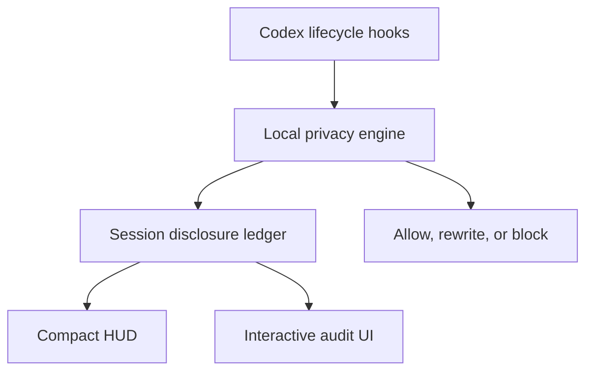

# Codex Privacy HUD


这是 snapshot v1 HUD 的历史截图。图中的百分比采用旧版记账，截图早于显式 legacy 标签的加入。

[](https://github.com/inin-zou/codex-privacy-hud/actions/workflows/ci.yml)
[](LICENSE)
[](https://github.com/inin-zou/codex-privacy-hud/stargazers)

[English](README.md) | 简体中文

> 在每次对话中实时查看隐私披露情况，就像查看 token 用量一样。

> **看清智能体知道什么。掌控数据去向。**

Codex Privacy HUD 是一个本地优先的 Codex 插件。它把收到的 hook 观测记录在会话账本中，并可在工具执行前返回拒绝决定或改写后的输入。

只有在收到真正的 SessionStart 时首次建立记录的新会话，才使用基于证据的新版记账。摘要显示已确认披露分数、不同披露数、已确认接收方数，以及插件发出的拒绝次数。只有记录中的证据足以支持计算时，才显示百分比。当前 hook 无法确认内容是否进入模型上下文、数据是否完成传输，或宿主是否执行了拒绝或改写。因此，会话可能同时显示已确认披露分数为 0、结果尚未确定的操作，以及不可用的百分比。已确认披露分数为 0，不代表没有发生披露。

已有会话，以及开始后才被插件接入的会话，继续使用旧版许可跨界评分，并保留其原有限制。历史记录原样保留，不补造证据，也不重新计分。没有会话记录时，不显示百分比或数字统计。

接收方身份与边界类别分开记录。受支持且没有歧义的 MCP 名称和简单网络命令，可以标识预期接收方；无法确定的身份保留为未解析状态。这不能证明实际送达、后续转发，也不能说明子智能体继承了哪些内容。

检测在本机执行；插件不会把提示词、文件或秘密信息发送到远程扫描服务。运行时通信仅使用 Unix 域套接字，以及绑定到 127.0.0.1 的本地浏览器界面。

0.9.4 为收到真正 SessionStart 的新会话启用基于证据的记账，并继续使用 0.8.0 引入的运行时选择机制和隔离后的账本。已有会话和开始后才接入的会话仍采用旧版记账；历史记录不会被回填或重新计分。

**插件更新后，需要显式修复运行时。** Codex 可能删除旧插件包，而由该插件包启动的守护进程或 MCP 服务器仍在运行。如果新 hook 与已记录的运行时选择不一致，入站事件会继续执行并显示未经验证的提示；对于识别出的出站调用，插件会返回拒绝决定。hook 的提示或拒绝原因会给出完整的修复命令，请在另一个终端运行。`$privacy repair` 也只打印该命令，不执行修复。该命令可能下载依赖和模型权重。修复成功后，请重启加载此插件的 Codex 应用、CLI 或 IDE 集成。修复会保留账本记录，但无法恢复监测空档或丢失的内存状态。这些拒绝决定不能证明宿主实际阻止了调用。

显式修复和共用的停止操作可以识别从同一缓存插件目录下的规范版本路径启动的 MCP 服务器和守护进程，包括版本目录已被删除的情况。识别仍要求相同用户、精确启动参数、已记录的解释器，以及解析后相同的插件数据目录，并在发送停止信号前重新检查进程身份和账本占用情况。此机制基于同一用户的信任模型；已删除的路径、回执中的构建标识或解释器路径，都不能证明进程实际加载的 Python 代码。无法验证的进程仍会导致修复拒绝继续，不会升级为 SIGKILL。

原生 Privacy 状态项不验证运行时是否一致，旧守护进程在修复前仍可能刷新快照。请使用当前插件包的 doctor 命令检查运行时；当前插件包的 ambient 启动器在运行时检查失败时也会给出修复命令。已经运行的旧进程不会自动获得新版本的提示行为。

0.9.2 新增默认开启的网络命令词法防护。已识别的网络命令如果包含已知敏感路径引用，会收到拒绝决定，不受本地读取防护开关影响。插件不会打开或改写文件内容。从 shell 命令推断的文件身份以及宿主是否执行拒绝仍保持未确定状态；详见已知限制第 6 条。

```text
Token HUD:    How much context has been consumed?
Privacy HUD：哪些事实已确认，哪些结果仍未确定？
```


这张手绘图用于说明设计意图，绘制于显式 legacy 标签加入之前。图中的进度条和干预流程不代表当前显示格式或已确认的宿主行为。

**使用前请先了解：**模型加载期间，会话开头没有监控。托管工具绕过 hook。检测采用启发式方法。如果 HUD 已知某个会话的记录有缺口，则会标记该会话，不会只显示一个看似无事发生的 0%。但 HUD 无法告诉你漏掉了什么。请阅读[已知限制](#已知限制)。

---

- [动态](#动态)
- [安装](#安装)
- [界面概览](#界面概览)
- [工作原理](#工作原理)
- [已知限制](#已知限制)
- [配置](#配置)
- [排障](#排障)
- [卸载](#卸载)
- [手动安装](#手动安装)
- [文档](#文档)
- [许可证](#许可证)

## 动态

- 2026-09-15：补丁版 Codex 0.154.0 已发布 `aarch64-apple-darwin` 和 `x86_64-apple-darwin` 构建。构建位于 GitHub release `codex-0.154.0-hud` 和滚动更新的 `latest` 中。`install.sh` 能找到这些构建。
- 2026-09-15：`privacy` 状态行项现已能在补丁版 Codex 内显示。macOS 安装只需一条命令。
- 2026-09-05：已使用 Codex CLI 0.153.0 手动验证：在插件自身的开发会话中运行插件，暴露数为零（事件数为零，预算为 0.0/120.0）。这**不是**自动化测试。验证需要真实运行的 Codex 会话，而 CI 既没有相应二进制，也没有所需的网络条件。

## 安装

Privacy HUD 0.9.4 继续使用 snapshot v2。收到真正 SessionStart 的新会话采用新版记账；已有会话和开始后才接入的会话仍采用旧版记账。支持 v2 的读取器会将 v1 明确标为旧版，并支持 v2 中可为空的记账字段。仅支持 snapshot v1 的旧读取器会拒绝 v2，不显示 Privacy 状态项。Codex 版本号相同并不代表快照兼容。

支持 snapshot v2 的 Codex 0.154.0、0.155.0 和 0.155.1 补丁构建已于 2026-09-22 重新发布。此前安装的同版本二进制文件可能仍包含旧读取器。更新插件不会替换该二进制文件；仅发布 Privacy HUD 0.9.4 不需要再次发布 Codex 补丁构建。

原生 Privacy 状态项只显示记账快照，不验证运行时是否一致。修复之前，旧守护进程可能仍在刷新旧版读数。请使用插件内置启动器的 doctor 命令检查一致性。独立 ambient 启动器在运行时检查失败时显示错误，不显示百分比。

Privacy HUD 从所选插件包加载 Python 代码，已记录的 Python 环境只提供依赖。运行 $privacy repair 可获取在另一个终端执行的完整修复命令。显式安装可能下载依赖和模型权重；运行时检查和离线修复不会下载。

修复后的当前账本位于 $PLUGIN_DATA/ledger/active.db。$PLUGIN_DATA/ledger.db 是用于隔离旧路径的目录，请勿将其替换为文件或符号链接。修复保留账本代次和已记录的值，不启用新版记账。只有所选守护进程收到尚无记录会话的真正 SessionStart 时，才会启用新版记账。

账本代次 5402 需要 Privacy HUD 0.9.0 引入的已启用记账实现。运行中的客户端还必须与所选运行时构建及激活纪元一致。结构不受支持或被改动的账本会被保留并拒绝使用。本项目不提供降级迁移。

运行时不匹配时，入站事件继续执行并显示未经验证的提示；对于 hook 无法验证的出站调用，插件会返回拒绝决定。这些决定不能证明宿主实际执行了干预。监测空档和丢失的内存检测状态无法恢复。尚未结束的新版会话如果丢失记账密钥，其记账会在该会话余下时间保持不可用。

```bash
PRIVACY_HUD_BUNDLE='/absolute/path/to/installed/0.9.4/plugin'
PRIVACY_HUD_DATA='/absolute/path/to/plugin/data'

python3 "$PRIVACY_HUD_BUNDLE/scripts/runtime.py" \
  --plugin-data "$PRIVACY_HUD_DATA" doctor

python3 "$PRIVACY_HUD_BUNDLE/scripts/runtime.py" \
  --plugin-data "$PRIVACY_HUD_DATA" repair --print-command

python3 "$PRIVACY_HUD_BUNDLE/scripts/runtime.py" \
  --plugin-data "$PRIVACY_HUD_DATA" ambient --watch
```

已在真实的 Codex CLI 0.145.0 和 0.153.0 安装环境中完成端到端验证。

### 准备工作

- **macOS**，搭载 Apple Silicon 或 Intel 处理器。Linux 和 Windows 尚无安装包；伴随窗格的安装方式见[手动安装](#手动安装)。
- **Codex CLI**，已安装并登录。运行 `codex --version`，应输出类似 `codex-cli 0.154.0` 的版本信息。安装脚本需要这个版本号来选择匹配的补丁版构建。
- **Python 3.11 或更新版本**，且位于 `PATH` 中。运行 `python3 --version` 检查版本。如果 Mac 尚未安装，则运行 `brew install python@3.12`。
- 如果需要检测姓名和地址，则需准备约 **3 GB 磁盘空间**，并留出几分钟。`openai/privacy-filter` 权重会占用这些空间。

### 运行安装脚本

```bash
curl -fsSL https://raw.githubusercontent.com/inin-zou/codex-privacy-hud/main/install.sh | sh
```

脚本只询问一个问题：是否下载检测模型。其余步骤全部自动完成。脚本按以下顺序执行并输出进度：

| 步骤 | 执行内容 | 存放位置 |
|---|---|---|
| 1 | 查找 `codex`，读取版本，检查 `python3 >= 3.11` | — |
| 2 | 创建专用虚拟环境，并在其中安装插件包。此过程需要几分钟，会下载 `torch` 和 `transformers`。 | `~/.local/share/codex-privacy-hud/venv/` |
| 3 | 下载 `openai/privacy-filter` 权重前**先询问**。权重约 2.8 GB，来自 Hugging Face，只需下载一次。选择 `y` 启用完整检测。选择 `n` 仍可检测凭据和路径，但**无法检测姓名和地址**。`privacy-hud-doctor` 会说明这一点。 | `~/.cache/huggingface/hub/` |
| 4 | 将插件安装到 Codex（`codex plugin marketplace add` + `codex plugin add`） | Codex 插件目录 |
| 5 | 记录守护进程必须使用的 Python 解释器 | `~/.codex/plugins/data/codex-privacy-hud-…/runtime.json` |
| 6 | 下载与**你的版本完全一致**的补丁版 Codex 构建，校验 SHA-256 并解压，再将官方 `codex-code-mode-host` 链接到同一目录。压缩包只包含 `codex`；Code Mode 需要同目录下的这个程序，应使用相同版本的官方程序。 | `~/.local/share/codex-privacy-hud/<version>/` |
| 7 | 写入名为 `codex` 的小型转发脚本（forwarder）。如果需要，则将 `~/.local/bin` 加入 shell 的 `PATH`。 | `~/.local/bin/codex` |
| 8 | 在 Codex 配置的 `[tui].status_line` 中加入 `privacy`。如果你从未设置过这个键，则以 Codex 默认值创建。 | `~/.codex/config.toml` |
| 9 | 运行 `privacy-hud-doctor` 并输出检查表。每一行都应为 `OK` 或 `WARN`，不应出现 `FAIL`。 | — |

CI 发布的二进制**未经签名，也未经公证**。安装脚本会自行移除隔离属性。SHA-256 校验只能防止下载损坏，无法防范发布内容遭篡改。

参数说明：`--yes` 自动同意下载模型；`--no-model` 不询问，直接跳过下载。这两个参数都适用于脚本化安装。如果没有终端可供交互询问，则必须提供其中一个。

安装过程会下载软件包和补丁版 Codex；模型权重仅通过明确执行的模型下载步骤获取。无论继承的环境变量如何设置，运行时、安装配置探测和诊断检查都会强制离线，绝不下载缺失的权重。模型权重缺失或不完整时，第三级检测不可用，插件不会自动下载替代文件。如果当前进程已在在线模式下导入模型依赖，第三级检测同样不可用；必须重启该进程，才能以离线模式加载模型。

### 只安装插件：直接用 Codex 命令

插件本身的安装方式与其他 Codex 插件相同，无需手动克隆仓库：

```bash
codex plugin marketplace add inin-zou/codex-privacy-hud
codex plugin add codex-privacy-hud@codex-privacy-hud
```

第一条命令会将本仓库克隆到 Codex 的插件市场存储目录。
第二条命令会将其复制到插件缓存目录 `~/.codex/plugins/cache/codex-privacy-hud/codex-privacy-hud/<version>/`。
这样会为 Codex 安装 `$privacy` 技能、hook 和 MCP 服务器。
`install.sh` 也会随之保存到本机，但不会自动运行。
此时仍缺少守护进程的 Python 环境、检测模型和补丁版 Codex。
因此，所有 hook 都会回复 `Privacy HUD unavailable — disclosure unverified`。
`$privacy` 则会报告未找到守护进程。

接下来，请按以下步骤操作：

1. 运行 `codex`。Codex 0.154 启动时会显示 **Hooks need review**（需要审核 hook），提示你审核插件的八个 hook。选择 **Trust all and continue**（信任全部并继续）。在此之前，插件中的任何内容都不会运行。
2. 发送任意消息。第一轮交互会显示一行提醒。输入 `$privacy setup`，让 Codex 运行插件缓存中的安装脚本（`sh ~/.codex/plugins/cache/codex-privacy-hud/codex-privacy-hud/<version>/install.sh --yes`）。脚本需要向你的主目录写入文件并下载内容，因此 Codex 会请求一次在沙箱外运行的权限。批准请求后，等待安装完成。模型下载需要几分钟。提醒中也会显示同一路径，你可以在另一个终端中运行该命令。这与上方一行安装命令使用的是同一个脚本。已有插件安装也可以安全地再次运行该脚本。`--yes` 会直接下载模型，不再询问。`--no-model` 会跳过模型下载。
3. 重启 Codex，让补丁版 Codex 和状态行项生效。

如果你希望手动操作，[docs/installing-by-hand.md](docs/installing-by-hand.md) 列出了脚本执行的每一个步骤。

### 首次启动

打开新终端，让 `PATH` 变更生效。运行 `codex`。

起初状态行看起来没有变化。Codex 在第一轮交互时才触发 `SessionStart` hook，启动时不会触发。因此，在你发送消息之前，守护进程收不到任何内容。发送第一条提示词后，状态行项会出现在输入框下方，与常规状态行项并排显示，见[下方截图](#界面概览)：

```text
Privacy legacy 0% · gpt-5.4 · ~/proj · Context 96% left
```

已记录的旧版会话从 `legacy 0%` 开始，数值沿用现有评分算法。零分不能证明没有发生披露。

如果本机守护进程尚未运行，则第一条提示词也会启动守护进程。加载模型大约需要七秒。第一个 hook 的回复会显示 `Privacy HUD unavailable — disclosure unverified`，状态行项稍后才出现。加载期间没有监控，详见[已知限制](#已知限制)。接下来可以使用：

- `/statusline`：打开 Codex 自带的选择器。勾选或取消勾选 `privacy`，即可持久添加或移除状态行项。选择会保存到 `config.toml`。
- `$privacy hud off` / `$privacy hud on`：临时隐藏或显示状态行项，不改动配置。运行 `$privacy hud status`，可查看当前属于 `absent | stale | hidden | shown` 中的哪种状态。
- `$privacy`：打开完整的会话审计（Level 2）。

## 界面概览

对于操作结果尚未确定的新会话，HUD 可能显示：

Privacy —% · 3 unresolved · 2 denials issued

原生 Privacy 状态项只在支持 snapshot v2 的 Codex 补丁版构建中提供；独立的 ambient 窗格可作为替代。

审计页显示已确认披露分数、不同披露数、已确认接收方数和发出的拒绝次数，并说明结果尚未确定的操作以及百分比不可用的原因。紧凑 HUD 不显示分数；运行 $privacy 可查看完整说明。

三个标签页分别是 Confirmed crossings、Interventions 和 All finding events。每行描述一个观察时点的证据。多次确认的跨越可以对应同一个已计分披露；没有检测结果的操作仍计入摘要。

详情显示主体、预期或有送达证据的接收方、结果证据、匹配次数，以及该行新增的分数。不透明文件标签用于区分主体记录，避免保存敏感路径片段。对于 shell 读取，文件身份始终未解析：不同 ID 不能证明是不同文件，对同一路径的多次观察也可能得到不同 ID。审计中显示 `local file` 和 `file <opaque-id>`，不显示文件名或后缀。这些标签不能用作来源规则的选择条件。

旧版会话继续使用显式旧版标签和原有标签页含义。没有会话记录时，不显示数字统计。

**Level 1：常驻显示。** 支持 snapshot v2 的补丁版 Codex 在输入框下方显示一个状态行项：

```text
gpt-5.4 · ~/proj · Privacy legacy 28% · 2 prevented rows
```

这是 snapshot v1 HUD 的历史截图。图中的百分比采用旧版记账，截图早于显式 legacy 标签的加入。


原版 Codex 不支持插件自有的状态行项，因此需要带有小补丁的 Codex 构建。补丁为 `patches/privacy-status-line.patch`，只新增一个状态行项，没有其他改动。`install.sh` 下载与你的 Codex 版本完全一致的构建，将其放在官方二进制旁边，绝不修改官方二进制。只有版本匹配时，`codex` 才指向补丁版构建。

运行 Codex 内的 `/statusline`，可切换状态行项的显示。运行 `$privacy hud off`，可临时隐藏。如果没有匹配的构建，则使用伴随窗格：在第二个终端运行 `privacy-hud-ambient --watch`。

伴随窗格使用相同的记账标签：

```text
Privacy legacy 30%
Privacy legacy 0% ⚠unverified
Privacy —% · No session on record
Privacy —% · unattributed hook gaps
```

以上分别表示旧版记账、旧版记录存在缺口、明确未记录的会话，以及守护进程报告了缺口但尚未解析出会话。窗格只选择能完整放下的候选文本；旧版百分比始终保留 `legacy`，记录不完整时保留警告。没有候选文本能放下时不显示。快照缺失、格式错误、过期或隐藏时也不显示。

**Level 2：会话审计**（`$privacy`）。四张卡片分别标为 `legacy permitted-crossing score`、`legacy permitted-crossing rows`、`legacy boundary kinds` 和 `legacy prevented rows`，并显示记账说明。未记录的会话显示不可用，不以零替代。

标签页为 `Legacy permitted crossings`、`Legacy prevented rows` 和 `All legacy events`。每行展示保存的旧版分类、重复计数及来源与目的地的记录关联，不能证明实际送达或宿主执行了干预。

**Level 3：暴露详情。** 展示一条公开的旧版记录、脱敏示例及旧版干预标签。终端详情不保存策略规则。本地审计浏览器的按钮通过 `/api/policy` 保存规则；MCP `privacy.update_policy` 是另一个写入入口。只有入口返回成功后，才能报告规则已保存，并应同时说明返回的适用条件。后续拒绝决定或改写输入是否由宿主实际应用，仍未确认。

掩码规则以会话为范围，按检测到的数据类型匹配，不限定来源。如果规则选中了符合处理条件的出站调用，改写会使用该次调用的全部检测结果，其中也包括其他类型。来源规则的拒绝决定优先，掩码规则不会放宽内置策略对硬拦截类型的处理。后续能否检测到数据、宿主是否应用改写，仍有条件限制。已经披露的数据无法从本次会话中收回。

`$privacy <session_id>` 选择要审计的会话，不是事件或数据流的详情链接。在本地浏览器中选择一行可查看该事件；终端详情命令需要分别提供会话 ID 和事件 ID。拒绝消息不包含事件详情链接。

没有已发布的入口提供工具调用的 `Allow once`、`Minimize & retry`、脱敏预览或基于授权令牌的重试。内部存在令牌逻辑，并不代表用户能够执行这些操作。

深度检测使用本地运行的 `openai/privacy-filter`，不使用 Presidio。可以选择不安装其依赖和权重，但这样就无法检测该模型负责的数据类型。运行时不会下载缺失的权重。插件没有跨读取或跨会话的检测结果缓存：再次读取未变化的内容仍可能重新扫描，即使旧版记账随后将结果合并到已有行。

上下文压缩不会新增时间线事件，也不会逆转已经发生的披露。会话结束时，插件通过 hook 的 `systemMessage` 返回文本回执；它不会保存 Markdown 回执文件，也无法确认宿主是否显示了回执。转录内容的保留情况仍不在本账本的记录范围内。

**MCP 工具。** Codex 还提供五个可由模型调用的工具：查看会话摘要、暴露列表、单次暴露的详情和读取防护状态，以及写入策略规则。服务器以 `privacy.<name>` 注册这些工具，Codex 向模型提供的名称则使用下划线，因此会话记录中显示的是 `privacy_get_session_summary`、`privacy_list_exposures`、`privacy_get_exposure_detail`、`privacy_read_guard_status` 和 `privacy_update_policy`。前四个只提供查询，第五个只能收紧防护，因为引擎会优先执行唯一的无条件硬拦截——拦截携带凭据的出站调用——再考虑你或模型能写入的任何规则：携带凭据的调用直接由内置默认策略决定，即予以拦截，完全跳过用户掩码规则。无论规则的选择器指定什么，这一点都成立，而这正是关键所在：即使规则针对的是文件路径这类无害类型，它也可能匹配到同时携带凭据的调用。选择器直接指定被硬拦截类型的掩码规则仍会在写入时被拒绝，因为这样的规则如今无法决定任何处理结果，却会让人误以为已经施加了防护。关闭读取防护和隐藏 HUD 不在这五个工具之中，因为 MCP 工具由模型调用，而放宽防护的开关不能交给防护所约束的模型。这两项操作只能通过你亲自输入的 `$privacy` 执行。临时放行一次被拦截的调用也不在其中，但原因不同：这项操作根本没有任何入口——`$privacy` 不提供，审计界面不提供，MCP 工具也不提供——见[已知限制第 13 条](docs/known-limits.md#13-no-policy-rule-can-be-removed-within-the-session-that-wrote-it)。

**从 0.7.4 或更早版本升级。** 使用 MCP SDK 2.2.0 时，四个依赖账本的 MCP 工具会因工作线程使用了其他线程创建的 SQLite 连接而失败。工具发现和读取防护状态工具仍可正常工作，因此旧版 doctor 检查可能在这些工具调用失败时仍然通过。0.7.5 版允许跨线程使用连接，将访问串行化，并在 doctor 检查中加入一次通过 MCP 读取账本的实际调用。请重新安装 0.7.5 或更新版本的插件，并启动新的 Codex 会话。

## 工作原理

### 要解决的问题

编程智能体会代你读取文件系统、运行 shell 命令、调用 MCP 服务器和启动子智能体。但你无法查清：

- 哪些文件内容实际进入了模型上下文？
- 那次 GitHub MCP 调用的参数里是否带有客户邮箱？
- 子智能体是否继承了二十分钟前读取的 `.env`？
- 那条 `curl` 命令是否将支持日志通过管道传给了外部主机？

秘密信息扫描器在代码提交前检查，不在模型推理前检查。DLP 产品在服务端运行，需要你先传出本想保护的数据。权限提示询问的是*能做什么*，不是*会涉及什么内容*。

### 检测不等于披露

产品的基础是以下区分：

| 观察到的事实 | 新版记账 |
|---|---|
| 本地扫描发现敏感内容 | 检测记录；零分 |
| 允许尝试跨越边界 | 允许记录；零分 |
| Privacy HUD 发出拒绝 | 已发出拒绝；零分 |
| Privacy HUD 返回改写后的输入 | 已发出改写；零分；是否应用仍未确认 |
| 证据确认某个主体跨越边界并到达具体接收方 | 首次不同披露计分 |
| 证据确认宿主应用改写，且某个主体未包含在发送内容中 | 仅该主体记为已防止；零分 |
| 观察到持久化 | 留存记录；零分 |
| 子智能体启动，但没有继承内容的证据 | 只记录观察；继承情况仍未确定 |

审计页展示带有明确结果证据的检测事件；观察记录也包括没有检测结果的操作。披露身份和计分与事件行分开保存。来源与接收方的关联不能还原因果上的多跳传播链。

### 提示词中的凭据

Privacy HUD 0.9.1 可在用户提示词进入模型上下文前，对文本中匹配受支持凭据格式的内容请求暂缓提交。若要允许暂缓的凭据，请至少等待 2 秒，再次粘贴或输入消息，并在 5 分钟内提交。可以修改凭据周围的文字。所有凭据都必须满足确认条件；出现新凭据时，整条消息会再次暂缓。

确认按大小写敏感的完整凭据匹配，仅在本次会话且当前守护进程持续运行期间有效。守护进程重启后，确认状态丢失。第三级 NER 检测结果、熵检测结果和单独的私钥头部不会触发提示词暂缓。图片和附件不在扫描范围内。守护进程没有响应时，包括冷启动期间，提示词仍会放行，并显示未经验证的提示。

对 Codex 0.154.0 和 0.155.1 源码的检查表明，提交时输入框会被清空，hook 暂缓后不会自动恢复；这尚未通过真实 TUI 验证。暂缓不阻止 Codex 保留本地输入历史。记账成功时，账本记录的是已发出拒绝，不能证明宿主实际执行了拒绝。暂缓决定作出后，即使记账失败，守护进程仍会返回阻止提交的决定，并提示审计记录中可能缺少此次暂缓。只要本次会话和当前守护进程仍在运行，新的、满足确认条件的提交仍可使用保留在内存中的确认窗口；重放同一次投递仍会被暂缓。确认只有在其自身的观察记录成功写入后，才可用于后续提交。客户端未收到可用回复时，入站提示词仍会放行。详见[限制 22](docs/known-limits.md#22-credential-prompt-holds-have-a-narrow-scope)。

### 读取防护

读取防护可在 `PreToolUse` 阶段，对能识别出的敏感路径 shell 读取发出拒绝决定，例如读取 `.env` 或 `deploy/key.pem`。它在执行前检查命令文本；当前 hook 无法确认宿主是否执行了拒绝决定。

读取防护只检查 shell，因为 Codex 通过 shell 读取文件：它没有原生的文件读取工具，模型会运行 `cat` 来读取。其他工具一律不经检查直接放行，见已知限制第 14 条。

读取防护**默认关闭**。刚安装时，能识别出的这类路径读取只会被记录，防护功能会在每个会话中提示一次自身的存在，不会拦截任何操作。可用命令如下：

```text
$privacy read on        # 拒绝对已知敏感路径的可识别读取
$privacy read off       # 恢复为只记录这些读取
$privacy read status    # 输出 `on` 或 `off`
```

设置保存在 `~/.codex/plugins/data/codex-privacy-hud-…/settings.json` 中，不在 `config.toml` 中。修改后会直接对当前运行的会话生效，无需重启。在 Codex 内看不到这个文件，要确认设置状态，需要使用 `$privacy read status` 或 `privacy-hud-doctor`。

读取防护仍只处理能够识别的 shell 读取，默认关闭，并继续豁免模板文件。所有从 shell 命令推断的记账文件身份均保持未解析，包括普通的 `cat .env` 读取。不同观察保留各自未解析的文件主体，但这不能证明实际读取了哪些文件。提取出的路径仍用于防护判断和即时拒绝消息，审计记录却不显示该文件名。发出拒绝请求不能证明宿主已经停止读取。

### 账本



账本记录实际收到的本地 hook，不会还原模型的完整上下文。缺失的 hook、托管工具、被丢弃的结果，以及尚未确认的宿主处理结果，都超出了这些观察能够证明的范围。记账会明确保留这种不确定性，而不是假定发生跨越后计分。

插件**不会用第二次 LLM 调用来审计第一次调用。** 那样做会再次传输待审计的敏感数据。每轮交互还会多一次请求往返，而且账本结果无法保持确定性。详见 `architecture.md` §3。

### 隐私工具自身的隐私保护

- 检测**完全在本机运行**。插件不向任何地方发送内容来进行分类。
- 新版记账只保存经过允许列表限制的元数据、不透明身份和遮盖后的示例。仅仅没有内容字段，并不能保证任意标签都是安全的。
- 会话结束时，新版记账的身份哈希会被置空，对应的内存密钥也会被丢弃；不透明 ID 和记账关联仍保留。这是逻辑擦除，不是对 SQLite 页面、WAL 文件、备份、交换空间或 Python 内存的安全覆写；其他元数据仍可能关联记录。
- 无遥测，无分析数据收集。无论继承的环境变量如何设置，插件运行时都不发起出站网络请求。
- 自我审计是一套已提交到仓库、包含正反两类对照的语料，也是**工具尚未满足的一项要求**：其中四个条目未通过——两个普通开发字符串被模型检出个人数据，另两个地址则被漏检或仅识别出片段。每个失败条目都被记录在案，而非被视为可以容忍。[`docs/self-audit.md`](docs/self-audit.md) 收录了这些条目，并说明一次通过的运行不能证明什么。此前更宽泛的承诺——开发会话中的暴露数为零——已在测量结果与之矛盾时撤回。

### 转发脚本的作用与边界

插件**绝不修改、移动或替换**官方 `codex` 二进制。`~/.local/bin/codex` 是一个十行的 shell 脚本。转发脚本先在 `PATH` 中查找官方二进制，再查询版本。如果已安装相同版本的补丁版构建，则运行补丁版；否则原样运行官方二进制。

通过 `brew` 或 `npm` 升级 Codex 后，转发脚本会直接运行新版官方二进制，直到有匹配的补丁版构建。升级不会导致功能损坏，只是在此期间没有状态行项。

如果安装脚本输出以 `!! PATH:` 开头的提示块，则说明另一个 `codex` 在 `PATH` 中排在 `~/.local/bin` 前面。将提示中的那一行放到 shell rc 文件最前面，再打开新 shell。否则状态行项绝不会出现。

## 已知限制

这些限制必须提前说明。隐私工具如果夸大能力，比没有工具更糟：

1. **会话开始阶段没有监控。** **最初几秒内披露的任何内容都不在账本中，之后无论何时查看都无法确定当时披露了什么。**（[详情](docs/known-limits.md#1-the-start-of-a-session-is-unmonitored)）
2. **“未验证”只标记能够识别的记录缺口，还有一些缺口无法识别。** `⚠unverified` 表示“账本中有证据表明记录存在缺口”。没有这个标记，只表示“现有记录中没有证据否定记录的完整性”。后者比“记录完整”弱，绝不能将其理解为“记录完整”。（[详情](docs/known-limits.md#2-unverified-marks-the-gaps-it-can-see-and-there-are-gaps-it-cannot)）
3. **托管工具绕过 hook。** WebSearch 等工具不触发本地函数工具的 hook 路径。（[详情](docs/known-limits.md#3-hosted-tools-bypass-hooks)）
4. **Codex hook 不支持 `ask` 决策，插件也没有工具调用的交互式授权入口。** 内部已实现令牌逻辑，但浏览器按钮、`$privacy` 分支和已公开的 MCP 工具都不能签发授权令牌，也不提供基于令牌的重试。提示词重新提交确认是独立机制，见限制 22。（[详情](docs/known-limits.md#4-no-ask-decision-in-codex-hooks-and-no-interactive-consent-at-all)）
5. **状态行项只存在于单独构建的 Codex 中，绝不出现在你的官方版本中。** **插件绝不修改你的官方 Codex 二进制。**（[详情](docs/known-limits.md#5-the-status-line-item-lives-in-a-separately-built-codex--never-in-your-official-one)）
6. **不会检查网络发送所引用文件的内容。** 默认开启的词法防护会拒绝包含已知敏感路径引用的已识别网络命令。它可能因无关的路径引用而误拦截，也无法识别隐藏在展开结果或配置中的路径。普通非敏感文件的上传仍可进入现有策略检查。（[详情](docs/known-limits.md#6-a-command-that-reads-a-file-itself-is-not-inspected)）
7. **检测采用启发式方法。** 有意规避检测的攻击者可以通过编码绕过正则表达式和命名实体识别（NER）。（[详情](docs/known-limits.md#7-detection-is-heuristic)）
8. **展示哪个会话靠推断，不靠直接读取；无法确定时，技能会在终端审计中明确提示。** 浏览器以“Session <完整会话 ID>”标明所选会话。 伴随窗格没有这种标记；需要时用 `--session-id` 钉住会话。（[详情](docs/known-limits.md#8-which-session-is-being-shown-is-inferred-not-read--and-the-audit-says-so-when-it-cannot-be-sure)）
9. **任何手段都无法收回已经披露的数据。** 永远无法收回。（[详情](docs/known-limits.md#9-nothing-recalls-disclosed-data)）
10. **来源规则匹配的是规范化后的完整值，不是摘要，也不是逐字节比较。** 模型对读取的内容进行总结、改写或仅引用一部分后，规则就无法匹配。规则已保存不代表后续调用一定会被拦截。该值必须在进入会话时被检测到，并在向外发送时再次被检测到。任一次检测依赖深度扫描时，扫描缺口都可能导致规则无法匹配（已知限制第 21 条）。检测采用启发式方法，可能漏检；托管工具的调用完全不会经过本插件。匹配依据是 `value.strip().lower()` 的 HMAC，因此只在大小写或首尾空白上有差异的值也会匹配，匹配范围比“逐字节相同”更宽。（[详情](docs/known-limits.md#10-a-source-rule-matches-the-whole-value-normalised--not-a-summary-of-it-and-not-a-byte-comparison-either)）
11. **来源提取会尽力识别，但不保证成功。** 能识别 `cat .env`，但不能识别 `python -c "open('.env')"`。没有来源的行不提供规则，以免提供无法生效的规则。（[详情](docs/known-limits.md#11-origin-extraction-is-best-effort)）
12. **污点映射随守护进程终止而丢失。** 如果在会话中途替换守护进程，映射就会丢失，来源规则会停止匹配，且不会报错。（[详情](docs/known-limits.md#12-the-taint-map-dies-with-the-daemon)）
13. **任何策略规则都无法在写入它的会话中移除。** 早在来源规则出现之前，脱敏规则就已如此。只有新建 Codex 对话才能从没有这些规则的状态开始。（[详情](docs/known-limits.md#13-no-policy-rule-can-be-removed-within-the-session-that-wrote-it)）
14. **可选的本地读取防护只能识别部分 shell 读取。** 来源提取的限制仍然存在；独立且默认开启的网络防护见第 6 条。（[详情](docs/known-limits.md#14-only-a-shell-command-whose-read-the-extractor-recognises-is-stopped)）
15. **模板后缀只豁免基于路径的拒绝。** 其他发现仍可能触发拒绝，包括命令参数中直接出现的凭据。插件不会检查所引用文件的内容。（[详情](docs/known-limits.md#15-a-template-file-is-never-blocked)）
16. **可选的读取防护默认关闭。** 此设置控制能够识别的 shell 读取。提示词中的凭据暂缓、默认开启的网络防护，以及现有的基于凭据的出站策略，均独立于此设置运行。返回的暂缓或拒绝决定不能证明宿主实际执行了干预。（[详情](docs/known-limits.md#16-nothing-is-blocked-until-you-turn-it-on)）
17. 旧版记录仍可能合并不同结果。新版记账会追加独立的结果证据，并按操作统计发出的拒绝。历史记录不会重建，发出拒绝也不能证明宿主执行了拒绝。（[详情](docs/known-limits.md#17-a-blocked-read-can-leave-a-record-that-says-the-opposite-in-one-sequence)）
18. 旧版记录仍可能合并匹配同一模式的文件。新版记账不再按模式合并，并按操作统计发出的拒绝，但所有从 shell 命令推断的文件身份均保持未解析，包括普通的 `cat .env` 读取。不同的不透明主体 ID 不能证明是不同文件，审计记录也不显示被拒绝读取的文件名。确认读取已停止需要执行证据。#44 仍保持开放，后续需要实现防护目标的身份识别和符合 I1 的审计展示；0.10.0 只是建议目标，不是发布承诺。（[详情](docs/known-limits.md#18-a-blocked-reads-row-does-not-name-the-file)）
19. **子智能体继承了什么，没有记录。** `SubagentStart` 的观测事件不携带文本，因此不会运行任何检测器，也不会产生账本记录。“子智能体是否继承了 `.env`？”这个问题在账本中没有答案。（[详情](docs/known-limits.md#19-what-a-subagent-inherited-is-not-recorded)）
20. 只有 hook 和受支持的解析器提供明确身份时，才区分具体接收方。其他接收方保留为未解析状态。知道身份本身不能证明数据已送达或继续转发。（[详情](docs/known-limits.md#20-a-destination-is-a-boundary-category-not-a-recipient)）
21. **出站调用的深度扫描尽力而为。** 模型串行执行，而出站调用一旦错过 hook 时限就会被判为拒绝（I6）。出站扫描使用基于剩余预算的请求超时，并以完成时间不晚于截止点作为采纳结果的必要条件；两者都不保证实际耗时。详见 `engine.TIER3_EGRESS_BUDGET`。（实测：在 1.0 秒预算下，一次调用到 1.25 秒才返回。）同一时间最多允许一个出站扫描工作线程运行。准入是非阻塞的；工作线程会一直占用其名额直到退出，即使调用方已放弃等待也是如此。扫描缺口是指本应适用的深度扫描未提供被采纳的结果。此时调用仅依据快速检测层的结果继续处理，与引入这项功能之前的所有出站调用相同。扫描缺口可能漏掉原本会触发拦截或脱敏的发现。每次观测中的扫描缺口都会记录，并按会话计数，包括未产生事件行的观测。因此会话不再显示为已完全验证，但审计无法指出具体是哪些调用。（[详情](docs/known-limits.md#21-on-an-outbound-call-the-deep-scan-is-best-effort)）
22. **提示词凭据暂缓的范围有限。** 只有提示词文本中受支持的凭据格式才会触发暂缓。等待至少 2 秒，并在 5 分钟内重新提交，即可确认。图片、附件、熵检测结果、私钥头部和第三级 NER 检测结果不会触发此暂缓。守护进程没有响应时，入站提示词仍会放行。（[详情](docs/known-limits.md#22-credential-prompt-holds-have-a-narrow-scope)）

## 配置

| 配置项或命令 | 作用 |
|---|---|
| Codex 内的 `/statusline` | 勾选或取消勾选 `privacy` 状态行项，持久生效。选择保存到 `config.toml`。 |
| `$privacy hud on\|off\|status` | 临时隐藏或显示状态行项，不改动配置。`status` 输出 `absent`、`stale`、`hidden` 或 `shown`。 |
| `$privacy read on\|off\|status` | 开启或关闭读取防护，见[读取防护](#读取防护)。开启时，Privacy HUD 对可识别的匹配读取发出拒绝请求；关闭时（默认），此防护不请求拒绝。两种设置都不能证明宿主执行了拒绝，也不能证明所有操作均被观察到。`status` 输出 `on` 或 `off`。设置保存在 `~/.codex/plugins/data/codex-privacy-hud-…/` 下的 `settings.json` 中，对正在运行的会话立即生效。 |
| `$privacy setup` | 运行插件自带的安装脚本，适用于仅通过 `codex plugin add` 安装插件的情况。会请求一次在沙箱外运行的权限。 |
| `~/.codex/config.toml` 中的 `[tui].status_line` | 指定 Codex 显示的状态行项列表。安装脚本会在其中加入 `"privacy"`。 |
| `install.sh --yes` / `--no-model` / `--release-base-url URL` / `--uninstall` / `--purge` | `--yes` 自动同意下载模型。`--no-model` 跳过下载。`--release-base-url` 从本仓库 GitHub releases 之外的位置获取补丁版构建。`--uninstall` 移除安装脚本创建的内容。`--purge` 还会移除账本和模型权重。 |
| `PRIVACY_HUD_NO_SPAWN=1` | 完全关闭守护进程自动启动，适用于无法成功启动进程的沙箱。 |
| `privacy-hud-ambient --watch [N]` / `--once` / `--session-id <id>` | 运行伴随窗格：每 N 秒重绘、输出一行后退出，或将窗格钉住到一个会话。 |

## 排障

- **`no patched build published for codex <ver> yet`**：你的 Codex 版本尚无对应发布。其余内容均已安装。如果该版本的构建发布了，则重新运行安装脚本，状态行项就会出现。在此之前，可在第二个终端运行 `~/.local/share/codex-privacy-hud/venv/bin/privacy-hud-ambient --watch`，使用伴随窗格。
- **升级 Codex 后，状态行中没有 `privacy` 状态行项**：转发脚本未找到新版本对应的补丁版构建，因此原样运行了官方二进制。功能没有损坏，只是状态行项暂时消失。自动化工作流每六小时检查一次 Codex 新版本。只要补丁仍然适用，就会发布对应的补丁版 Codex。因此，发布已有一天的版本通常已有对应构建。重新运行安装脚本（或 `$privacy setup`）即可获取。如果仍无对应构建，可以查看说明原因的 issue：补丁无法继续应用时，标题为 `patch needs rebasing for Codex <version>`；补丁已成功应用但构建未完成时，标题为 `release build failed for Codex <version>`。
- **`!! config.toml: …`**：你的 `config.toml` 中，`[tui]` 表或 `status_line` 键的结构不适合安装脚本直接修改。脚本没有改动配置。按照脚本输出的那一行，自行将 `"privacy"` 加入 `[tui].status_line`。
- **Doctor 显示 `FAIL`**：阅读对应的修复提示，其中给出了确切命令。运行 `privacy-hud-doctor --check-model`，可进一步实际加载检测器进行检查。
- 重新开始：运行[卸载脚本](#卸载)，然后重新安装。

## 卸载

运行已安装的 0.9.4 插件包中的脚本。将下面的占位路径替换为该插件包的绝对目录；该目录必须同时包含 `install.sh` 和 `scripts/runtime.py`。

```bash
PRIVACY_HUD_BUNDLE='/absolute/path/to/installed/0.9.4/plugin'
sh "$PRIVACY_HUD_BUNDLE/install.sh" --uninstall
```

停止运行时需要插件包中的其余文件；仅下载独立脚本并通过管道交给 `sh` 不会提供这些文件。

卸载成功后，会移除 `~/.local/share/codex-privacy-hud/manifest.json` 中记录的安装脚本所管理的文件，并让 `codex` 恢复指向官方二进制。如果不添加 `--purge`，则保留披露账本和模型权重。

卸载需要可用的 Python 3.11+ 解释器来运行插件包中的停止操作。脚本会检查已记录的解释器、安装脚本创建的环境，以及 `PATH` 中的主机解释器。如果这些解释器都不可用，则必须等到有可用解释器后才能完成卸载。没有不依赖 Python 的卸载入口，也没有强制跳过检查的选项。

如果无法确认运行时已停止，卸载会以状态码 1 退出，保留运行时环境和卸载清单，并跳过数据和模型权重清理。转发脚本以及部分由安装脚本管理的 shell 或 Codex 配置可能已经移除。有可用解释器后，重新运行同一条插件包内的卸载命令；停止检查仍然适用。

卸载成功后，再单独移除插件：运行 `codex plugin remove codex-privacy-hud`。

## 手动安装

如果你的平台没有可用的 `install.sh`、你使用 Linux，或需要修复损坏的安装，则采用手动安装。[docs/installing-by-hand.md](docs/installing-by-hand.md) 列出了安装脚本执行的每一个步骤。

## 文档

| 文档 | 内容 | 适用情况 |
|---|---|---|
| [`docs/installing-by-hand.md`](docs/installing-by-hand.md) | 手动执行各安装步骤，使用 `privacy-hud-setup` 和 `privacy-hud-doctor` 命令，以及使用伴随窗格。 | 无法使用 `install.sh`，或希望控制每一步。 |
| [`docs/known-limits.md`](docs/known-limits.md) | 二十二条限制的完整说明，以及相应的测量依据。 | 判断 HUD 显示的数值在多大程度上可信。 |
| [`patches/README.md`](patches/README.md) | 只增加一个 Codex 状态行项的补丁，以及如何针对新 tag 重新生成补丁。 | 审计或重新构建补丁版 Codex 二进制。 |
| [`.claude/docs/architecture.md`](.claude/docs/architecture.md) | 组件关系、进程模型、账本结构、hook 分发，以及尚未提供的交互式授权流程及其限制。 | 开发插件本身。 |

## 许可证

[MIT](LICENSE)。
