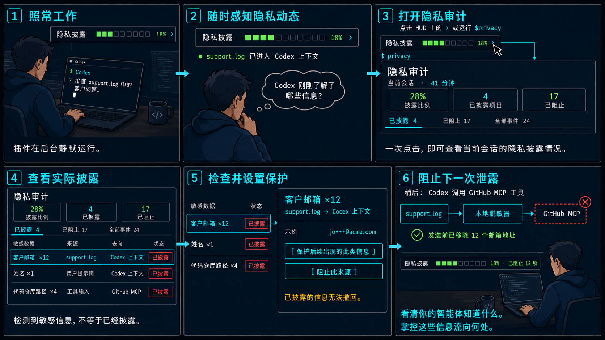
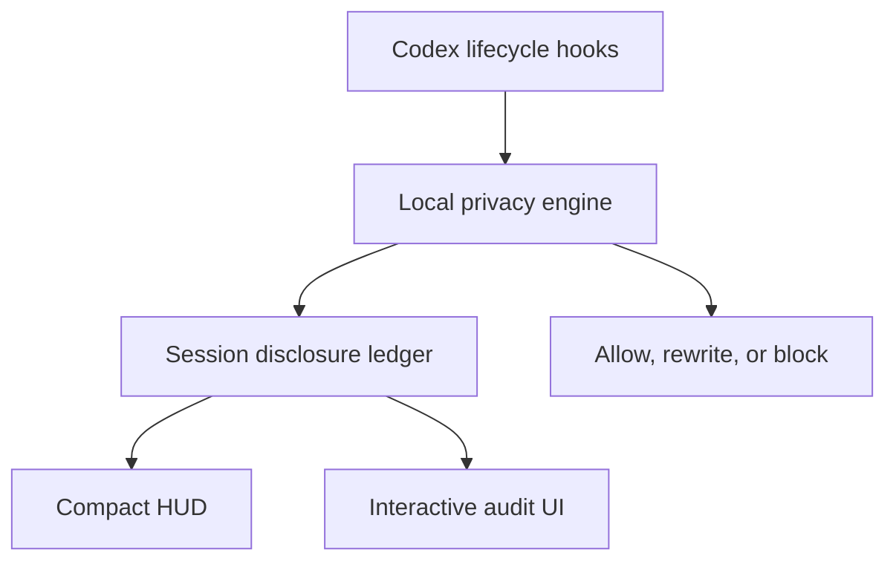

# Codex Privacy HUD


[](https://github.com/inin-zou/codex-privacy-hud/actions/workflows/ci.yml)
[](LICENSE)
[](https://github.com/inin-zou/codex-privacy-hud/stargazers)

[English](README.md) | 简体中文

> 在每次对话中实时查看隐私披露情况，就像查看 token 用量一样。

> **看清智能体知道什么。掌控数据去向。**

Codex Privacy HUD 是一个本地优先的 Codex 插件。插件为每个 Codex 会话实时维护一份**披露账本**，在工具执行**之前**尽量减少敏感上下文。你可以查看插件实际观察到的数据跨越边界的记录：进入模型上下文、发送给 MCP 工具，或发送到外部主机。

这里的“目的地”指边界类别，不代表具体接收方：目前，第二个 MCP 服务器不算新的目的地，子智能体启动时继承了什么则完全没有记录，见已知限制第 19、20 条。

检测在本机执行；插件不会将提示词、文件或秘密信息发送到远程扫描服务。运行时通信仅使用 Unix 域套接字，以及绑定到 `127.0.0.1` 的本地浏览器界面。

```text
Token HUD:    How much context has been consumed?
Privacy HUD:  How much sensitive context has been disclosed?
```



**使用前请先了解：**模型加载期间，会话开头没有监控。托管工具绕过 hook。检测采用启发式方法。如果 HUD 已知某个会话的记录有缺口，则会标记该会话，不会只显示一个看似无事发生的 0%。但 HUD 无法告诉你漏掉了什么。请阅读[已知限制](#已知限制)。

---

- [动态](#动态)
- [安装](#安装)
- [界面概览](#界面概览)
- [工作原理](#工作原理)
- [已知限制](#已知限制)
- [配置](#配置)
- [排障](#排障)
- [卸载](#卸载)
- [手动安装](#手动安装)
- [文档](#文档)
- [许可证](#许可证)

## 动态

- 2026-09-15：补丁版 Codex 0.154.0 已发布 `aarch64-apple-darwin` 和 `x86_64-apple-darwin` 构建。构建位于 GitHub release `codex-0.154.0-hud` 和滚动更新的 `latest` 中。`install.sh` 能找到这些构建。
- 2026-09-15：`privacy` 状态行项现已能在补丁版 Codex 内显示。macOS 安装只需一条命令。
- 2026-09-05：已使用 Codex CLI 0.153.0 手动验证：在插件自身的开发会话中运行插件，暴露数为零（事件数为零，预算为 0.0/120.0）。这**不是**自动化测试。验证需要真实运行的 Codex 会话，而 CI 既没有相应二进制，也没有所需的网络条件。

## 安装

已在真实的 Codex CLI 0.145.0 和 0.153.0 安装环境中完成端到端验证。

### 准备工作

- **macOS**，搭载 Apple Silicon 或 Intel 处理器。Linux 和 Windows 尚无安装包；伴随窗格的安装方式见[手动安装](#手动安装)。
- **Codex CLI**，已安装并登录。运行 `codex --version`，应输出类似 `codex-cli 0.154.0` 的版本信息。安装脚本需要这个版本号来选择匹配的补丁版构建。
- **Python 3.11 或更新版本**，且位于 `PATH` 中。运行 `python3 --version` 检查版本。如果 Mac 尚未安装，则运行 `brew install python@3.12`。
- 如果需要检测姓名和地址，则需准备约 **3 GB 磁盘空间**，并留出几分钟。`openai/privacy-filter` 权重会占用这些空间。

### 运行安装脚本

```bash
curl -fsSL https://raw.githubusercontent.com/inin-zou/codex-privacy-hud/main/install.sh | sh
```

脚本只询问一个问题：是否下载检测模型。其余步骤全部自动完成。脚本按以下顺序执行并输出进度：

| 步骤 | 执行内容 | 存放位置 |
|---|---|---|
| 1 | 查找 `codex`，读取版本，检查 `python3 >= 3.11` | — |
| 2 | 创建专用虚拟环境，并在其中安装插件包。此过程需要几分钟，会下载 `torch` 和 `transformers`。 | `~/.local/share/codex-privacy-hud/venv/` |
| 3 | 下载 `openai/privacy-filter` 权重前**先询问**。权重约 2.8 GB，来自 Hugging Face，只需下载一次。选择 `y` 启用完整检测。选择 `n` 仍可检测凭据和路径，但**无法检测姓名和地址**。`privacy-hud-doctor` 会说明这一点。 | `~/.cache/huggingface/hub/` |
| 4 | 将插件安装到 Codex（`codex plugin marketplace add` + `codex plugin add`） | Codex 插件目录 |
| 5 | 记录守护进程必须使用的 Python 解释器 | `~/.codex/plugins/data/codex-privacy-hud-…/runtime.json` |
| 6 | 下载与**你的版本完全一致**的补丁版 Codex 构建，校验 SHA-256 并解压，再将官方 `codex-code-mode-host` 链接到同一目录。压缩包只包含 `codex`；Code Mode 需要同目录下的这个程序，应使用相同版本的官方程序。 | `~/.local/share/codex-privacy-hud/<version>/` |
| 7 | 写入名为 `codex` 的小型转发脚本（forwarder）。如果需要，则将 `~/.local/bin` 加入 shell 的 `PATH`。 | `~/.local/bin/codex` |
| 8 | 在 Codex 配置的 `[tui].status_line` 中加入 `privacy`。如果你从未设置过这个键，则以 Codex 默认值创建。 | `~/.codex/config.toml` |
| 9 | 运行 `privacy-hud-doctor` 并输出检查表。每一行都应为 `OK` 或 `WARN`，不应出现 `FAIL`。 | — |

CI 发布的二进制**未经签名，也未经公证**。安装脚本会自行移除隔离属性。SHA-256 校验只能防止下载损坏，无法防范发布内容遭篡改。

参数说明：`--yes` 自动同意下载模型；`--no-model` 不询问，直接跳过下载。这两个参数都适用于脚本化安装。如果没有终端可供交互询问，则必须提供其中一个。

安装过程会下载软件包和补丁版 Codex；模型权重仅通过明确执行的模型下载步骤获取。无论继承的环境变量如何设置，运行时、安装配置探测和诊断检查都会强制离线，绝不下载缺失的权重。模型权重缺失或不完整时，第三级检测不可用，插件不会自动下载替代文件。如果当前进程已在在线模式下导入模型依赖，第三级检测同样不可用；必须重启该进程，才能以离线模式加载模型。

### 只安装插件：直接用 Codex 命令

插件本身的安装方式与其他 Codex 插件相同，无需手动克隆仓库：

```bash
codex plugin marketplace add inin-zou/codex-privacy-hud
codex plugin add codex-privacy-hud@codex-privacy-hud
```

第一条命令会将本仓库克隆到 Codex 的插件市场存储目录。
第二条命令会将其复制到插件缓存目录 `~/.codex/plugins/cache/codex-privacy-hud/codex-privacy-hud/<version>/`。
这样会为 Codex 安装 `$privacy` 技能、hook 和 MCP 服务器。
`install.sh` 也会随之保存到本机，但不会自动运行。
此时仍缺少守护进程的 Python 环境、检测模型和补丁版 Codex。
因此，所有 hook 都会回复 `Privacy HUD unavailable — disclosure unverified`。
`$privacy` 则会报告未找到守护进程。

接下来，请按以下步骤操作：

1. 运行 `codex`。Codex 0.154 启动时会显示 **Hooks need review**（需要审核 hook），提示你审核插件的八个 hook。选择 **Trust all and continue**（信任全部并继续）。在此之前，插件中的任何内容都不会运行。
2. 发送任意消息。第一轮交互会显示一行提醒。输入 `$privacy setup`，让 Codex 运行插件缓存中的安装脚本（`sh ~/.codex/plugins/cache/codex-privacy-hud/codex-privacy-hud/<version>/install.sh --yes`）。脚本需要向你的主目录写入文件并下载内容，因此 Codex 会请求一次在沙箱外运行的权限。批准请求后，等待安装完成。模型下载需要几分钟。提醒中也会显示同一路径，你可以在另一个终端中运行该命令。这与上方一行安装命令使用的是同一个脚本。已有插件安装也可以安全地再次运行该脚本。`--yes` 会直接下载模型，不再询问。`--no-model` 会跳过模型下载。
3. 重启 Codex，让补丁版 Codex 和状态行项生效。

如果你希望手动操作，[docs/installing-by-hand.md](docs/installing-by-hand.md) 列出了脚本执行的每一个步骤。

### 首次启动

打开新终端，让 `PATH` 变更生效。运行 `codex`。

起初状态行看起来没有变化。Codex 在第一轮交互时才触发 `SessionStart` hook，启动时不会触发。因此，在你发送消息之前，守护进程收不到任何内容。发送第一条提示词后，状态行项会出现在输入框下方，与常规状态行项并排显示，见[下方截图](#界面概览)：

```text
Privacy ░░░░░░░░░░  0% · gpt-5.4 · ~/proj · Context 96% left
```

在敏感内容进入模型上下文之前，数值保持 0%。随着文件、提示词和工具参数进入上下文，数值会相应变化。

如果本机守护进程尚未运行，则第一条提示词也会启动守护进程。加载模型大约需要七秒。第一个 hook 的回复会显示 `Privacy HUD unavailable — disclosure unverified`，状态行项稍后才出现。加载期间没有监控，详见[已知限制](#已知限制)。接下来可以使用：

- `/statusline`：打开 Codex 自带的选择器。勾选或取消勾选 `privacy`，即可持久添加或移除状态行项。选择会保存到 `config.toml`。
- `$privacy hud off` / `$privacy hud on`：临时隐藏或显示状态行项，不改动配置。运行 `$privacy hud status`，可查看当前属于 `absent | stale | hidden | shown` 中的哪种状态。
- `$privacy`：打开完整的会话审计（Level 2）。

## 界面概览

**Level 1：常驻显示。** 在 Codex 输入框下方的原生状态行中显示一个状态行项：

```text
gpt-5.4 · ~/proj · Privacy ███░░░░░░░ 28% ⚠2
```

下面是补丁版 Codex 0.154 真实会话的输出，不是效果图。发送一条含街道地址的提示词后，输入框下方的 `Privacy` 状态行项已显示 5%，旁边是 Codex 自带的模型和目录状态行项：


原版 Codex 不支持插件自有的状态行项，因此需要带有小补丁的 Codex 构建。补丁为 `patches/privacy-status-line.patch`，只新增一个状态行项，没有其他改动。`install.sh` 下载与你的 Codex 版本完全一致的构建，将其放在官方二进制旁边，绝不修改官方二进制。只有版本匹配时，`codex` 才指向补丁版构建。

运行 Codex 内的 `/statusline`，可切换状态行项的显示。运行 `$privacy hud off`，可临时隐藏。如果没有匹配的构建，则使用伴随窗格：在第二个终端运行 `privacy-hud-ambient --watch`。

伴随窗格以三种形式显示同一条状态信息。常规形式如下：

```text
PRIVACY  Disclosure ███░░░░░░░ 30%  ›
```

如果账本已知会话记录有缺口，则显示以下形式，明确提示缺口，不会只给出一个看似完整的数值：

```text
PRIVACY  Disclosure ░░░░░░░░░░  0% ⚠unverified ›
```

如果宽度不足 28 列，则无法容纳这个单词，状态行会改为 `⚠ 0%`。警告符号取代表示区间的圆点，确保截断后绝不会只剩一个百分比。

**Level 2：会话审计**（`$privacy`）。界面包含汇总卡片，以及按标签页展示每条数据流的表格：

```text
SENSITIVE DATA        SOURCE           DESTINATION      STATUS
Customer email ×12    support.log      model context    [EXPOSED]
Full name ×1          user prompt      model context    [EXPOSED]
Repository path ×4    tool input       GitHub MCP       [EXPOSED]
API credential ×1     .env             none             [PREVENTED]
```

标签页：`Exposed`（已暴露）· `Prevented`（已阻止）· `All events`（全部事件）。

**Level 3：暴露详情。** 查看单条数据流、脱敏后的证据，以及面向后续披露的补救措施（`Mask detected <type> in future calls`；对于标明真实来源的行，还可使用 `Block values read from <file>`）。这些措施无法撤销披露——已经披露的数据无法收回，且来源规则仅匹配未经改动就向外发送的值。

**MCP 工具。** Codex 还提供五个可由模型调用的工具：查看会话摘要、暴露列表、单次暴露的详情和读取防护状态，以及写入策略规则。服务器以 `privacy.<name>` 注册这些工具，Codex 向模型提供的名称则使用下划线，因此会话记录中显示的是 `privacy_get_session_summary`、`privacy_list_exposures`、`privacy_get_exposure_detail`、`privacy_read_guard_status` 和 `privacy_update_policy`。前四个只提供查询，第五个只能收紧防护，因为引擎会优先执行唯一的无条件硬拦截——拦截携带凭据的出站调用——再考虑你或模型能写入的任何规则：携带凭据的调用直接由内置默认策略决定，即予以拦截，完全跳过用户掩码规则。无论规则的选择器指定什么，这一点都成立，而这正是关键所在：即使规则针对的是文件路径这类无害类型，它也可能匹配到同时携带凭据的调用。选择器直接指定被硬拦截类型的掩码规则仍会在写入时被拒绝，因为这样的规则如今无法决定任何处理结果，却会让人误以为已经施加了防护。关闭读取防护和隐藏 HUD 不在这五个工具之中，因为 MCP 工具由模型调用，而放宽防护的开关不能交给防护所约束的模型。这两项操作只能通过你亲自输入的 `$privacy` 执行。临时放行一次被拦截的调用也不在其中，但原因不同：这项操作根本没有任何入口——`$privacy` 不提供，审计界面不提供，MCP 工具也不提供——见[已知限制第 13 条](docs/known-limits.md#13-no-policy-rule-can-be-removed-within-the-session-that-wrote-it)。

## 工作原理

### 要解决的问题

编程智能体会代你读取文件系统、运行 shell 命令、调用 MCP 服务器和启动子智能体。但你无法查清：

- 哪些文件内容实际进入了模型上下文？
- 那次 GitHub MCP 调用的参数里是否带有客户邮箱？
- 子智能体是否继承了二十分钟前读取的 `.env`？
- 那条 `curl` 命令是否将支持日志通过管道传给了外部主机？

秘密信息扫描器在代码提交前检查，不在模型推理前检查。DLP 产品在服务端运行，需要你先传出本想保护的数据。权限提示询问的是*能做什么*，不是*会涉及什么内容*。

### 检测不等于披露

产品的基础是以下区分：

| 事件 | 是否计入披露预算 |
|---|---|
| 本地扫描器在文件中检测到邮箱 | **否** |
| 文件内容进入模型上下文 | **是** |
| 数据*通过工具调用*传给子智能体 | **是**：到达了新的目的地 |
| 子智能体启动时继承的内容 | **否**：完全未被观察到，见已知限制第 19 条 |
| 参数发送给 MCP 工具 | **是** |
| shell 命令将数据发送给外部主机 | **是** |
| 内容在发送前已脱敏或已拦截 | **否**：计为*已阻止* |

因此，审计展示的是**数据跨越边界的记录**，而非扫描结果：每行对应观察到的某个值跨越某类边界，目的地记录的是边界类别。这不是一条经过多个节点的完整链路：`flows` 表虽然存在，却没有任何代码向其中写入记录；`×N` 表示同一个去重键 `(session_id, value_hash, destination)` 命中了 N 次，不代表 N 个不同的值，也不代表经过了 N 个节点：

```text
support.log → main agent → GitHub MCP
```

### 读取防护

上面的规则都在数据向外发送时生效。在数据**进入**模型之前，有一类操作可以拦截：读取已知敏感路径（如 `.env`、`id_rsa`、`deploy/key.pem`）的 shell 命令会在运行前触发 `PreToolUse`，此时可以拒绝这次调用。命令不执行，文件中的任何内容就都不会到达模型。

读取防护只检查 shell，因为 Codex 通过 shell 读取文件：它没有原生的文件读取工具，模型会运行 `cat` 来读取。其他工具一律不经检查直接放行，见已知限制第 14 条。

读取防护**默认关闭**。刚安装时，能识别出的这类路径读取只会被记录，防护功能会在每个会话中提示一次自身的存在，不会拦截任何操作。可用命令如下：

```text
$privacy read on        # 拒绝对已知敏感路径的可识别读取
$privacy read off       # 恢复为只记录这些读取
$privacy read status    # 输出 `on` 或 `off`
```

设置保存在 `~/.codex/plugins/data/codex-privacy-hud-…/settings.json` 中，不在 `config.toml` 中。修改后会直接对当前运行的会话生效，无需重启。在 Codex 内看不到这个文件，要确认设置状态，需要使用 `$privacy read status` 或 `privacy-hud-doctor`。

下文已知限制第 14–18 条列出了读取防护的覆盖边界：它只检查 shell 命令，而且只能拦截其中能识别出的读取操作（能识别 `cat .env`，但不能识别 `wc -l .env`）；它从不拦截 `.env.example` 这样的模板文件；它写入的审计记录只注明命中的模式，不注明具体文件。

### 账本



账本**根据 hook 边界上的事件构建**，绝不通过询问模型来判断上下文里有什么。从本机进入模型上下文的每一个字节，都经过少数几个关键入口：`UserPromptSubmit`、`PostToolUse`、`SubagentStart`、`PreToolUse`。这些入口共同构成数据流图中的一个割集。插件记录经过这些入口的事件，并据此汇总披露情况。

插件**不会用第二次 LLM 调用来审计第一次调用。** 那样做会再次传输待审计的敏感数据。每轮交互还会多一次请求往返，而且账本结果无法保持确定性。详见 `architecture.md` §3。

### 隐私工具自身的隐私保护

- 检测**完全在本机运行**。插件不向任何地方发送内容来进行分类。
- 账本**只存元数据**：类型、数量、来源、目的地、时间戳和脱敏示例。表中没有 `content` 列、`prompt` 列或 `raw_value` 列。数据表结构本身就是这一保证。
- 插件使用会话级加盐 HMAC 标识数据值。HMAC 仅保存在内存中，并在会话结束时销毁，因此从设计上就无法跨会话关联数据。
- 无遥测，无分析数据收集。无论继承的环境变量如何设置，插件运行时都不发起出站网络请求。
- 在 Privacy HUD 自身的开发会话中运行 Privacy HUD，暴露数必须为零。

### 转发脚本的作用与边界

插件**绝不修改、移动或替换**官方 `codex` 二进制。`~/.local/bin/codex` 是一个十行的 shell 脚本。转发脚本先在 `PATH` 中查找官方二进制，再查询版本。如果已安装相同版本的补丁版构建，则运行补丁版；否则原样运行官方二进制。

通过 `brew` 或 `npm` 升级 Codex 后，转发脚本会直接运行新版官方二进制，直到有匹配的补丁版构建。升级不会导致功能损坏，只是在此期间没有状态行项。

如果安装脚本输出以 `!! PATH:` 开头的提示块，则说明另一个 `codex` 在 `PATH` 中排在 `~/.local/bin` 前面。将提示中的那一行放到 shell rc 文件最前面，再打开新 shell。否则状态行项绝不会出现。

## 已知限制

这些限制必须提前说明。隐私工具如果夸大能力，比没有工具更糟：

1. **会话开始阶段没有监控。** **最初几秒内披露的任何内容都不在账本中，之后无论何时查看都无法确定当时披露了什么。**（[详情](docs/known-limits.md#1-the-start-of-a-session-is-unmonitored)）
2. **“未验证”只标记能够识别的记录缺口，还有一些缺口无法识别。** `⚠unverified` 表示“账本中有证据表明记录存在缺口”。没有这个标记，只表示“现有记录中没有证据否定记录的完整性”。后者比“记录完整”弱，绝不能将其理解为“记录完整”。（[详情](docs/known-limits.md#2-unverified-marks-the-gaps-it-can-see-and-there-are-gaps-it-cannot)）
3. **托管工具绕过 hook。** WebSearch 等工具不触发本地函数工具的 hook 路径。（[详情](docs/known-limits.md#3-hosted-tools-bypass-hooks)）
4. **Codex hook 不支持 `ask` 决策，也完全没有交互式授权。** hook 只能放行或拒绝，不能询问。设计中的“拒绝 → 审查 → 单次令牌 → 重试”循环根本无法进入：没有任何入口能签发令牌，因此被拒绝的调用在本会话内会一直被拒绝。（[详情](docs/known-limits.md#4-no-ask-decision-in-codex-hooks-and-no-interactive-consent-at-all)）
5. **状态行项只存在于单独构建的 Codex 中，绝不出现在你的官方版本中。** **插件绝不修改你的官方 Codex 二进制。**（[详情](docs/known-limits.md#5-the-status-line-item-lives-in-a-separately-built-codex--never-in-your-official-one)）
6. **如果命令自行读取文件，则引擎不检查所读内容。** 引擎扫描的是*工具调用的文本*，不扫描该调用在运行时将读取的内容。（[详情](docs/known-limits.md#6-a-command-that-reads-a-file-itself-is-not-inspected)）
7. **检测采用启发式方法。** 有意规避检测的攻击者可以通过编码绕过正则表达式和命名实体识别（NER）。（[详情](docs/known-limits.md#7-detection-is-heuristic)）
8. **当前展示哪个会话靠推断，不靠直接读取；如果无法确定，则审计界面会明确提示。** 伴随窗格没有这种标记；需要时用 `--session-id` 钉住会话。（[详情](docs/known-limits.md#8-which-session-is-being-shown-is-inferred-not-read--and-the-audit-says-so-when-it-cannot-be-sure)）
9. **任何手段都无法收回已经披露的数据。** 永远无法收回。（[详情](docs/known-limits.md#9-nothing-recalls-disclosed-data)）
10. **来源规则匹配的是规范化后的完整值，不是摘要，也不是逐字节比较。** 模型对读取的内容进行总结、改写或仅引用一部分后，规则就无法匹配。规则保证的是“这个值不会原样传出”，而不是“这个文件的任何信息都不会传出”。匹配依据是 `value.strip().lower()` 的 HMAC，因此只在大小写或首尾空白上有差异的值也会匹配，匹配范围比“逐字节相同”更宽。（[详情](docs/known-limits.md#10-a-source-rule-matches-the-whole-value-normalised--not-a-summary-of-it-and-not-a-byte-comparison-either)）
11. **来源提取会尽力识别，但不保证成功。** 能识别 `cat .env`，但不能识别 `python -c "open('.env')"`。没有来源的行不提供规则，以免提供无法生效的规则。（[详情](docs/known-limits.md#11-origin-extraction-is-best-effort)）
12. **污点映射随守护进程终止而丢失。** 如果在会话中途替换守护进程，映射就会丢失，来源规则会停止匹配，且不会报错。（[详情](docs/known-limits.md#12-the-taint-map-dies-with-the-daemon)）
13. **任何策略规则都无法在写入它的会话中移除。** 早在来源规则出现之前，脱敏规则就已如此。只有新建 Codex 对话才能从没有这些规则的状态开始。（[详情](docs/known-limits.md#13-no-policy-rule-can-be-removed-within-the-session-that-wrote-it)）
14. **只有提取器能识别出读取操作的 shell 命令才会被拦截。** 防护只检查 shell 这一种工具，因为 Codex 通过它读取文件；其他工具一律不经检查直接放行。即使是 shell 命令，也只有 `cat .env` 这样的读取会被拦截；`wc -l .env`、`source .env`、`cp .env /tmp/x`、`strings id_rsa`、`head -5 .env` 和 `python -c "open('.env')"` 都不会被拦截：不拒绝、不提示、不写入记录。具体机制见第 11 条。（[详情](docs/known-limits.md#14-only-a-shell-command-whose-read-the-extractor-recognises-is-stopped)）
15. **模板文件永远不会被拦截。** 即使其中确实包含密钥也一样，但检测仍会将其标记出来。（[详情](docs/known-limits.md#15-a-template-file-is-never-blocked)）
16. **只有手动开启防护后，读取才会被拦截。** 默认只记录读取，并在每个会话中提示一次防护功能，不会拦截任何读取。（[详情](docs/known-limits.md#16-nothing-is-blocked-until-you-turn-it-on)）
17. **在特定操作顺序下，被拦截的读取可能留下与实际情况相反的记录。** 先在防护关闭时读取，再开启防护并再次读取：账本按 `(session_id, value_hash, destination)` 去重，因此这次拒绝只会增加原有行的 `count`。最终保留的是一行 `local_access` 记录，表示第一次读取的文件被读取了两次，且没有任何操作被拦截。由于没有写入 `prevented` 行，即使确实发生了拒绝，状态行项的拦截计数仍为 `0`。（[详情](docs/known-limits.md#17-a-blocked-read-can-leave-a-record-that-says-the-opposite-in-one-sequence)）
18. **被拦截读取的记录不包含文件名。** 记录依据的是匹配到的模式（`.pem`、`.env` 等），因此两个匹配同一模式的不同文件会被去重为一行。你能看到有读取被拦截，但无法知道是哪个文件。计数标记统计的是行数，因此对两个 `.pem` 文件的两次读取均被拒绝时，显示的计数为 `1`。（[详情](docs/known-limits.md#18-a-blocked-reads-row-does-not-name-the-file)）
19. **子智能体继承了什么，没有记录。** `SubagentStart` 的观测事件不携带文本，因此不会运行任何检测器，也不会产生账本记录。“子智能体是否继承了 `.env`？”这个问题在账本中没有答案。（[详情](docs/known-limits.md#19-what-a-subagent-inherited-is-not-recorded)）
20. **目的地表示边界类别，不代表具体接收方。** 所有 MCP 调用都归为 `mcp_tool`；将同一个值发送给第二个 MCP 服务器不算新的目的地，也不会再增加披露预算用量。`destinations` 卡片统计的是类别数，不是服务数。（[详情](docs/known-limits.md#20-a-destination-is-a-boundary-category-not-a-recipient)）
21. **出站调用的深度扫描尽力而为。** 模型串行执行，而出站调用一旦错过 hook 时限就会被判为拒绝（I6）。出站扫描使用基于剩余预算的请求超时，并以完成时间不晚于截止点作为采纳结果的必要条件；两者都不保证实际耗时。详见 `engine.TIER3_EGRESS_BUDGET`。（实测：在 1.0 秒预算下，一次调用到 1.25 秒才返回。）同一时间最多允许一个出站扫描工作线程运行。准入是非阻塞的；工作线程会一直占用其名额直到退出，即使调用方已放弃等待也是如此。扫描缺口是指本应适用的深度扫描未提供被采纳的结果。此时调用仅依据快速检测层的结果继续处理，与引入这项功能之前的所有出站调用相同。扫描缺口可能漏掉原本会触发拦截或脱敏的发现。每次观测中的扫描缺口都会记录，并按会话计数，包括未产生事件行的观测。因此会话不再显示为已完全验证，但审计无法指出具体是哪些调用。（[详情](docs/known-limits.md#21-on-an-outbound-call-the-deep-scan-is-best-effort)）

## 配置

| 配置项或命令 | 作用 |
|---|---|
| Codex 内的 `/statusline` | 勾选或取消勾选 `privacy` 状态行项，持久生效。选择保存到 `config.toml`。 |
| `$privacy hud on\|off\|status` | 临时隐藏或显示状态行项，不改动配置。`status` 输出 `absent`、`stale`、`hidden` 或 `shown`。 |
| `$privacy read on\|off\|status` | 开启或关闭读取防护，见[读取防护](#读取防护)。开启时，对已知敏感路径的可识别读取会在执行前被拒绝；关闭时（默认），只记录读取。`status` 输出 `on` 或 `off`。设置保存在 `~/.codex/plugins/data/codex-privacy-hud-…/` 下的 `settings.json` 中，对正在运行的会话立即生效。 |
| `$privacy setup` | 运行插件自带的安装脚本，适用于仅通过 `codex plugin add` 安装插件的情况。会请求一次在沙箱外运行的权限。 |
| `~/.codex/config.toml` 中的 `[tui].status_line` | 指定 Codex 显示的状态行项列表。安装脚本会在其中加入 `"privacy"`。 |
| `install.sh --yes` / `--no-model` / `--release-base-url URL` / `--uninstall` / `--purge` | `--yes` 自动同意下载模型。`--no-model` 跳过下载。`--release-base-url` 从本仓库 GitHub releases 之外的位置获取补丁版构建。`--uninstall` 移除安装脚本创建的内容。`--purge` 还会移除账本和模型权重。 |
| `PRIVACY_HUD_NO_SPAWN=1` | 完全关闭守护进程自动启动，适用于无法成功启动进程的沙箱。 |
| `privacy-hud-ambient --watch [N]` / `--once` / `--session-id <id>` | 运行伴随窗格：每 N 秒重绘、输出一行后退出，或将窗格钉住到一个会话。 |

## 排障

- **`no patched build published for codex <ver> yet`**：你的 Codex 版本尚无对应发布。其余内容均已安装。如果该版本的构建发布了，则重新运行安装脚本，状态行项就会出现。在此之前，可在第二个终端运行 `~/.local/share/codex-privacy-hud/venv/bin/privacy-hud-ambient --watch`，使用伴随窗格。
- **升级 Codex 后，状态行中没有 `privacy` 状态行项**：转发脚本未找到新版本对应的补丁版构建，因此原样运行了官方二进制。功能没有损坏，只是状态行项暂时消失。自动化工作流每六小时检查一次 Codex 新版本。只要补丁仍然适用，就会发布对应的补丁版 Codex。因此，发布已有一天的版本通常已有对应构建。重新运行安装脚本（或 `$privacy setup`）即可获取。如果仍无对应构建，可以查看说明原因的 issue：补丁无法继续应用时，标题为 `patch needs rebasing for Codex <version>`；补丁已成功应用但构建未完成时，标题为 `release build failed for Codex <version>`。
- **`!! config.toml: …`**：你的 `config.toml` 中，`[tui]` 表或 `status_line` 键的结构不适合安装脚本直接修改。脚本没有改动配置。按照脚本输出的那一行，自行将 `"privacy"` 加入 `[tui].status_line`。
- **Doctor 显示 `FAIL`**：阅读对应的修复提示，其中给出了确切命令。运行 `privacy-hud-doctor --check-model`，可进一步实际加载检测器进行检查。
- 重新开始：运行[卸载脚本](#卸载)，然后重新安装。

## 卸载

```bash
curl -fsSL https://raw.githubusercontent.com/inin-zou/codex-privacy-hud/main/install.sh | sh -s -- --uninstall
```

卸载脚本只移除安装脚本创建的内容，清单见 `~/.local/share/codex-privacy-hud/manifest.json`。卸载后，`codex` 恢复指向官方二进制。如果不添加 `--purge`，则保留披露账本和模型权重。插件本身需要单独移除：运行 `codex plugin remove codex-privacy-hud`。

## 手动安装

如果你的平台没有可用的 `install.sh`、你使用 Linux，或需要修复损坏的安装，则采用手动安装。[docs/installing-by-hand.md](docs/installing-by-hand.md) 列出了安装脚本执行的每一个步骤。

## 文档

| 文档 | 内容 | 适用情况 |
|---|---|---|
| [`docs/installing-by-hand.md`](docs/installing-by-hand.md) | 手动执行各安装步骤，使用 `privacy-hud-setup` 和 `privacy-hud-doctor` 命令，以及使用伴随窗格。 | 无法使用 `install.sh`，或希望控制每一步。 |
| [`docs/known-limits.md`](docs/known-limits.md) | 二十一条限制的完整说明，以及相应的测量依据。 | 判断 HUD 显示的数值在多大程度上可信。 |
| [`patches/README.md`](patches/README.md) | 只增加一个 Codex 状态行项的补丁，以及如何针对新 tag 重新生成补丁。 | 审计或重新构建补丁版 Codex 二进制。 |
| [`.claude/docs/architecture.md`](.claude/docs/architecture.md) | 组件关系、进程模型、账本结构、hook 分发和授权循环。 | 开发插件本身。 |

## 许可证

[MIT](LICENSE)。
